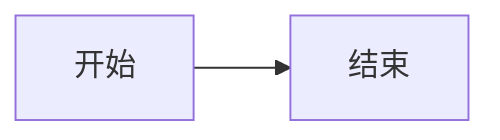

# KnowledgeDocument Markdown Extension Contract

Status: **Frozen for UI-KC-B05**
Product: **系统知识中心 / System Knowledge Hub**

## 1. Storage boundary

`KnowledgeDocument.bodyMarkdown` and every immutable revision store Markdown source. The editor, current read view, unsaved preview, historical read view, restore flow, and raw-source compare must preserve the same source semantics.

- Milkdown remains the editor.
- Raw HTML is disabled in the shared renderer.
- Generated Mermaid SVG/HTML is never persisted.
- Historical revisions are read compatibly and are never rewritten in bulk.

## 2. Standard Markdown

The following features use the stable CommonMark/GFM syntax emitted by the installed Milkdown parser and serializer:

| Feature | Canonical example |
|---|---|
| Paragraph | `正文` |
| H1–H6 | `# H1` through `###### H6` |
| Bold | `**重要内容**` |
| Italic | `*强调内容*` |
| Inline code | `` `ORA-12541` `` |
| Bullet list | `* 项目` |
| Ordered list | `1. 步骤` |
| Blockquote | `> 注意事项` |
| Code block | fenced code such as `````sql`` |
| Link | `[说明](https://example.com/docs)` |
| Horizontal rule | `---` or the serializer's stable equivalent |

Code-block line breaks remain literal source line breaks. The legacy hard-break compatibility boundary does not insert HTML into fenced code.

## 3. Required extensions

### 3.1 Task list

Task lists use GFM source only:

```markdown
- [ ] 未完成
- [x] 已完成
```

Preview checkboxes are read-only. HTML checkbox markup is not canonical storage.

### 3.2 Table

Tables use GFM pipe-table source:

```markdown
| 字段 | 说明 |
| --- | --- |
| ID | 主键 |
| Name | 名称 |
```

The editor supports bounded 2×2 through 10×10 insertion, editable cells, row/column insertion and deletion, and whole-table deletion. Raw `<table>` markup is not canonical storage.

### 3.3 Mermaid

Mermaid diagrams use a fenced code block:

````markdown

````

The shared read component lazy-loads the official Mermaid renderer only when a Mermaid fence exists. It renders with a fixed strict security configuration. Each block is isolated: a failed diagram keeps its escaped source visible and adds a safe error state without breaking the rest of the document.

### 3.4 Text color

Text color uses exactly:

```text
{color:#RRGGBB|文本内容}
```

Example:

```text
{color:#E53935|严重告警}
```

### 3.5 Background color

Background color uses exactly:

```text
{bg:#RRGGBB|文本内容}
```

Example:

```text
{bg:#FFF3B0|请人工确认}
```

The two marks may be nested:

```text
{bg:#FFF3B0|{color:#E53935|重点内容}}
```

Only six-digit hexadecimal RGB values are accepted. Accepted lowercase input is canonicalized to uppercase. Values such as `rgb(...)`, `rgba(...)`, `hsl(...)`, CSS variables, names, `url(...)`, `expression(...)`, and arbitrary styles stay literal and never become styling.

The renderer may emit only a fixed `<span>` whose `color` or `background-color` value has already passed the strict `#RRGGBB` validation. Nested content is parsed and escaped through the normal Markdown boundary.

Color marks are inline-only and cannot span a Markdown line boundary. A toolbar selection that crosses a hard break is serialized as one closed color span on each side of the break. Because the frozen color opener itself contains `|`, range formatting deliberately leaves GFM table-cell text unchanged; this preserves the pipe-table grammar instead of emitting ambiguous or destructive source. Text outside table cells remains formatted normally.

## 4. Image upload placeholder

The toolbar reserves a disabled, labelled action named `图片上传（待接入）`. UI-KC-B05 does not call an upload API, create a fake URL, persist base64 content, insert a local path, or change the backend contract.

## 5. Security invariants

- Markdown-it remains configured with `html: false`.
- Link protocols continue through the existing safe Markdown-it link validation; external HTTP(S) links receive `noopener noreferrer`.
- Color parsing accepts only the frozen syntax and strict hexadecimal whitelist.
- Mermaid is initialized with `startOnLoad: false`, `securityLevel: 'strict'`, HTML labels disabled, and suppressed global error rendering.
- Mermaid source is read from inert escaped text; a rendered SVG is view-only and is never written back to Markdown or revisions.
- Script tags, event-handler HTML, dangerous link protocols, arbitrary CSS, and HTML-like Mermaid labels must not become executable content.

## 6. Revision compatibility

Save creates revisions through the existing content-save use case. Restore copies the historical Markdown source into a new current revision. History uses the shared renderer, while compare continues to compare raw Markdown source. No migration or historical rewrite is part of UI-KC-B05.
