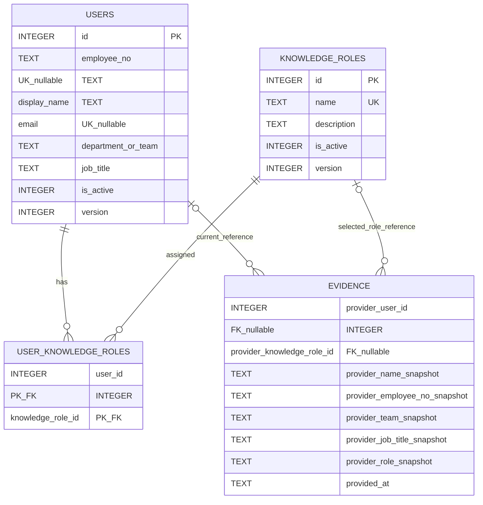

# System Knowledge Hub — User / Person Foundation Design

状态：**PROPOSED / AWAITING DESIGN REVIEW**  
产品：**系统知识中心 / System Knowledge Hub**  
范围：Post-MVP User / Person Foundation 设计；不修改已冻结 MVP UI、Domain、Database、Application、API 或 Solution Structure。

## 1. Executive Decision

采用以下最小、可演进方案：

1. 选择 **方案 A**：一个 `User` 同时表示系统知识中心中的应用参与者身份与人员基础资料；第一阶段不建立独立 `Person`。
2. `User` 不是密码账号，也不是认证主体；它只回答“当前是谁、资料是什么、是否可继续参与知识维护”。
3. Department / Team 使用 User 上的一个可选文本字段 `DepartmentOrTeam`，不建立 Department Entity 或组织树。
4. Job Title 使用 User 上的可选自由文本 `JobTitle`，不建立 JobTitle 主数据。
5. Knowledge Role 是有独立领域价值的受控主数据：建立 `KnowledgeRole` 与 `UserKnowledgeRole`；一个 User 可以有多个 Knowledge Role。
6. Current User 选择 **首次进入选择用户**：浏览器保存所选 `CurrentUserId`，顶栏明确显示并允许切换。它不是登录，也不提供身份可信性保证。
7. HumanConfirmation 继续是现有 `EvidenceType.HumanConfirmation`，不建立第二套确认或审批模型。保存时从 Current User Profile 读取资料，并复制不可变 Snapshot。
8. User 停用优先于删除；已产生业务引用的 User、Knowledge Role 默认不物理删除。
9. 现有 `ActorContext` 可由 Current User 自动预填，但普通 MVP API Body 语义不在本设计中被改写。HumanConfirmation API 的自动快照演进需在 U04 实现前完成受控 Contract Amendment。

## 2. Current Problem

当前实现有一个前端本地 `actorStore`，默认保存姓名与角色；普通写操作把 Actor 放入 Request Body。Evidence、Finding、Resolution、KnowledgeUpdate 与 UnknownItemActivity 则保存完整人员快照。

该方案满足 MVP，但存在以下 Post-MVP 缺口：

- 人员姓名、部门、职位与身份需要重复手工填写。
- HumanConfirmation 不能稳定关联一个已登记人员。
- 同一人员的多个知识身份无法受控选择。
- 顶栏“当前用户”只是静态本地资料，没有正式 Profile 来源。
- 无法停用离岗人员，同时安全保留历史 Evidence Snapshot。

本设计只补齐上述基础能力，不把它扩展为 Identity、HR、Organization 或 Permission 系统。

## 3. User vs Person Decision

### 方案比较

| 方案 | 优点 | 代价 | 结论 |
| --- | --- | --- | --- |
| A. User 同时承担应用身份与人员资料 | 一张主表、一个 ID、Current User 与管理 UI 直接；满足当前“一人一个应用参与者” | 将来若一人需要多个登录身份，需增加外部身份映射 | **推荐** |
| B. User 表示系统身份，Person 表示人员资料 | 可表达多个账号对应一人、非人员账号与复杂身份生命周期 | 当前没有登录、服务账号、多账号或 HR 同步需求；会提前引入 1:1 映射和双重生命周期 | 不采用 |

### 正式定义

`User` 是系统知识中心中的本地参与者 Profile，不保存 Password、LoginName、Session、Permission 或认证凭据。未来接入 SSO 时，认证主体映射到既有 User；只有真实出现“一人多身份”“服务账号”或跨系统人员主档需求时，才重新评估拆分 Person。

因此第一阶段不创建 `Person`、`UserPerson` 或 Identity Account 表。

## 4. Canonical Domain Model

### User

职责：保存当前可选择的应用参与者及其最小人员资料。

| 属性 | Required | Canonical | 决策 |
| --- | --- | --- | --- |
| `Id` | Yes | Yes | 内部稳定标识，SQLite safe integer |
| `EmployeeNo` | No | Yes when present | 员工工号；承包商或外部专家可能没有；非空时唯一 |
| `DisplayName` | Yes | Yes | UI 与历史快照的当前来源 |
| `Email` | No | Yes when present | 仅联系方式，不作为登录名；非空时唯一 |
| `DepartmentOrTeam` | No | Yes | 单一可选文本；UI 文案“部门 / 团队” |
| `JobTitle` | No | Yes | 自由文本职位 |
| `IsActive` | Yes | Yes | 默认 `true`；停用替代物理删除 |
| `CreatedAt` | Yes | Yes | UTC |
| `UpdatedAt` | Yes | Yes | UTC |
| `Version` | Yes | Yes | app-managed integer；API 仍使用 opaque token |

不加入 Username、PasswordHash、TenantId、ManagerId、OrganizationPath、PermissionRoleId、LastLoginAt 或 SSO Subject。

### KnowledgeRole

职责：表达可复用的知识身份词汇，例如“MES 业务专家”“Equipment Integration Expert”“Oracle DBA”。

最小属性：`Id`、`Name`、可选 `Description`、`IsActive`、`CreatedAt`、`UpdatedAt`、`Version`。

### UserKnowledgeRole

职责：表达 User 当前拥有的零到多个 Knowledge Role。

只需要 `UserId + KnowledgeRoleId`。第一阶段不增加 Primary、Scope、Level、ValidFrom、ValidTo、Certification 或 Permission。



图中的 Evidence Snapshot 字段沿用现有 `provider_*` 命名；“snapshot”是语义说明，不要求机械重命名已有列。

## 5. Department / Team Decision

### 方案比较

| 方案 | 一致性 | 复杂度 | 当前价值 | 结论 |
| --- | --- | --- | --- | --- |
| A. 简单文本 | 中；可规范化与历史建议 | 最低 | 足以展示、搜索、自动带入 Snapshot | **推荐** |
| B. Department Entity | 高 | 需要主数据维护、停用与引用规则 | 当前没有部门管理页面或权威来源 | 不采用 |
| C. Department + Team 两层 | 高 | 组织树、层级和迁移成本最高 | 超出当前需求 | 不采用 |

User 保存一个可选 `DepartmentOrTeam` 文本。写入时 trim 并限制合理长度；管理 UI 可基于现有 distinct values 提供建议，但允许新值，不把建议列表升级为主数据。

它是当前 User Profile 的 canonical 值，但不是企业组织架构权威数据。HumanConfirmation 保存当时字符串快照，后续修改 User 不回写历史。

## 6. Job Title Decision

采用可选自由文本 `JobTitle`。

职位当前只用于资料展示、HumanConfirmation 上下文与搜索，不用于权限、流程或统计；独立 JobTitle Master Data 没有足够领域价值。管理 UI 可以显示已有值建议，但不建立 JobTitle 表或管理 Route。

## 7. Knowledge Role Model

`JobTitle ≠ KnowledgeRole`。

- JobTitle 表达组织职位，例如 `Senior Engineer`。
- KnowledgeRole 表达此次知识贡献可以依赖的专业身份，例如“MES 业务专家”。
- 一个 User 可以拥有多个 Knowledge Role。
- KnowledgeRole 名称全局唯一、可停用但默认不物理删除。
- KnowledgeRole 第一阶段不绑定 System；需要系统范围时通过名称表达，避免提前增加复杂 Scope 模型。

HumanConfirmation 选择的是 User 当前拥有且 Active 的 KnowledgeRole。保存时同时记录 nullable Role ID reference 与不可变 Role Name Snapshot。

## 8. Knowledge Role vs Permission Role

三类概念必须隔离：

| 概念 | 回答的问题 | 是否进入本阶段 |
| --- | --- | --- |
| Job Title | “这个人在组织中的职位是什么？” | Yes，User 文本 |
| Knowledge Role | “这次知识确认以什么专业身份进行？” | Yes，独立主数据 + 多选映射 |
| Permission / Admin Role | “这个人允许执行什么操作？” | **No** |

`KnowledgeRole` 不授予 Route、API、Edit、Confirm 或 Admin 权限。`IsActive` 只控制词汇与新选择，不是授权状态。管理员页面的可见性也不等于权限控制。

## 9. Current User Strategy

### 方案比较

| 方案 | 适用性 | 风险 / 代价 | 结论 |
| --- | --- | --- | --- |
| A. 配置 `CurrentUserId` | 单机开发方便 | 部署级全局值无法支持多人浏览器 | 仅允许作为开发默认值 |
| B. 首次进入选择当前用户 | 无登录条件下支持每个浏览器独立选择 | 不能证明真实身份 | **第一阶段推荐** |
| C. Windows Identity 映射 | 企业内网可能便利 | 部署、代理、浏览器与平台耦合 | Deferred |
| D. 正式 Login | 身份可信 | 需要 Auth / Session / SSO | Deferred |

### 推荐行为

1. 首次进入或本地选择失效时，显示 Current User 选择 Overlay。
2. 只列出 Active User；支持姓名、工号、邮箱搜索。
3. 选择结果以 `CurrentUserId` 保存在浏览器 local storage；不保存完整 Profile 作为事实来源。
4. API Client 使用 `X-Current-User-Id` 传递应用上下文；该 Header **不是认证凭据，也不是授权依据**。
5. `GET /api/current-user` 根据该上下文返回最新 Profile；User 已停用或不存在时要求重新选择。
6. 可选 `DefaultCurrentUserId` 只作为本地开发首次预选，不作为服务器全局 Current User。

未来接入 SSO 后，由服务端将 authenticated principal 映射到 User，停止信任浏览器选择 Header；`GET /api/current-user`、TopBar Profile 和 HumanConfirmation 自动快照语义保持不变。

## 10. User Management Scope

新增 Post-MVP Route：`管理 → 用户管理`。该页面是 Administration UI / User Data Management，不是安全边界。

### User List

- 关键字搜索：姓名、工号、邮箱。
- 状态筛选：启用 / 停用。
- 展示：姓名、工号、部门 / 团队、职位、Knowledge Roles、状态、更新时间。
- 行操作：查看 / 编辑、启用 / 停用。
- 不显示 Password、Permission、Login History、Session 或 Last Login。

### Create / Edit

复用单一 Drawer 或 Focused Dialog：

- 基础资料：DisplayName 必填；EmployeeNo、Email、DepartmentOrTeam、JobTitle 可选。
- Knowledge Roles：多选 Active Role。
- Active 状态：编辑中显示，但停用使用独立明确操作和确认提示。
- 不提供物理 Delete。

### Knowledge Role 维护

在同一“用户管理”功能内提供小型管理 Dialog，不新增独立 Route。支持 List、Create、Rename / Description Update、Set Active State；不提供 Delete、Hierarchy 或 Permission Mapping。

## 11. HumanConfirmation Integration

目标交互：

```text
Current User
  → GET Current User Profile
  → 读取当前 Knowledge Roles
  → 用户选择本次确认身份
  → 填写确认事实
  → 服务端重新读取 User / Role
  → 保存 HumanConfirmation Evidence + Snapshot
  → KnowledgeStatus 保持不变
```

Profile 字段在 HumanConfirmation Drawer 中只读。客户端预填用于可见性，服务端保存前必须按 CurrentUserId 重新读取 Profile，避免把陈旧或被修改的显示值当作 canonical Snapshot。

## 12. Snapshot Model

### Identity Snapshot

| 字段 | Required | 决策 |
| --- | --- | --- |
| `UserId` reference | New confirmations: Yes；历史记录: No | nullable FK；便于回溯当前 User，但历史显示不依赖 Join |
| `ConfirmerNameSnapshot` | Yes | 使用现有 `provider_name` |
| `EmployeeNoSnapshot` | No | User 有工号时复制；用于同名消歧，不作为确认有效性门槛 |
| `DepartmentOrTeamSnapshot` | No | 使用现有 `provider_team` |
| `JobTitleSnapshot` | No | 新增 nullable snapshot 字段 |
| `KnowledgeRoleId` reference | No | 有选择的 Active KnowledgeRole 时保存 nullable FK |
| `KnowledgeRoleSnapshot` | Yes | 使用现有 `provider_role`；无角色时保存明确 fallback identity |

### Confirmation Fact

| 字段 | Required | 持久化语义 |
| --- | --- | --- |
| `ConfirmationMethod` | Yes | 固定 code；属于 HumanConfirmation 内容，不属于权限角色 |
| `ConfirmedAt` | Yes | 使用现有 `provided_at`，保存 UTC |
| `Conclusion` | Yes | 复用 Evidence `summary` / HumanConfirmation locator 内容 |
| `SupportingReason` | Yes | 使用现有 `support_reason` |
| `SourceNote` | No | HumanConfirmation locator 中保存 |

建议把 `confirmationMethod` 与 `sourceNote` 保存在 HumanConfirmation 的 `source_locator_json`；`summary` 保存可读确认结论。它们没有独立身份，也不需要跨 Evidence 查询或 FK。现有实现把 Confirmation Method 放在 `provider_source`，U04 应通过兼容读取逐步收口，不能误把方法继续解释为人员资料来源。

### 不可变规则

- 修改 User Profile 不修改历史 Evidence。
- 停用 User 不删除或改写历史 Evidence。
- Rename / Disable KnowledgeRole 不修改历史 Role Snapshot。
- 移除 UserKnowledgeRole 不修改历史 Role Snapshot。
- UI 显示历史 Evidence 时优先显示 Snapshot；User / Role Join 只用于附加“当前已停用 / 已变化”提示。

## 13. User Deactivation

`IsActive=false` 是第一阶段正式结束参与资格的方式。

Inactive User：

- 不出现在新的 Current User 默认候选中。
- 不可用于新 HumanConfirmation 的自动身份来源。
- 已有 Current User 被停用时，下次 Profile 刷新要求重新选择。
- 历史 Evidence、Finding、Resolution、KnowledgeUpdate 与 Activity Snapshot 完整保留。
- 仍可在用户管理中查询并重新启用。

已被 Evidence 或其它业务事实引用的 User 默认不物理删除。本阶段不提供 User Delete API、Soft Delete Framework 或 Archive 模型。

## 14. Evidence Compatibility

HumanConfirmation 继续属于现有 `evidence` 表、`Evidence` Feature 与 `/api/evidence/human-confirmations` 业务操作。

兼容演进原则：

1. 不建立 `UserConfirmation`、`PersonEvidence`、`ApprovalEvidence` 或独立 HumanConfirmation 表。
2. Evidence 仍保持“一条 Evidence 一个 Subject”。
3. 现有 `provider_name / role / team / external_key / source / note / provided_at` 历史列继续有效。
4. 仅为 User reference 与缺失的 EmployeeNo / JobTitle / KnowledgeRole reference 增加 nullable 字段。
5. 旧 Evidence 的 User / Role reference 保持 null；不得依据姓名自动猜测回填。
6. 普通 Evidence Provider 仍可沿用现有完整 Snapshot 输入；本阶段只要求 HumanConfirmation 自动使用 Current User。

## 15. KnowledgeStatus Compatibility

规则完全保持：

- 保存 HumanConfirmation **不自动**改变 Subject KnowledgeStatus。
- 即使选中的 KnowledgeRole 是“MES 业务专家”，也不会自动 Confirmed。
- `Unknown → Inferred → Confirmed` 仍由现有显式 KnowledgeStatus 操作执行。
- `Unknown → Confirmed` 仍禁止。
- `Inferred → Confirmed` 仍要求相关 HumanConfirmation；User / KnowledgeRole 只增强身份上下文，不新增权限门槛。
- 显式回退仍需非空 Reason。

## 16. Database Proposal

这是后续 Migration 的提案，不修改冻结 MVP Database Model。

### `users`

| Column | SQLite Type | Nullable | Constraint / Index |
| --- | --- | --- | --- |
| `id` | INTEGER | No | PK |
| `employee_no` | TEXT | Yes | partial unique，NOCASE |
| `display_name` | TEXT | No | index for search |
| `email` | TEXT | Yes | partial unique，NOCASE |
| `department_or_team` | TEXT | Yes | optional search index only if real query needs it |
| `job_title` | TEXT | Yes | no initial index |
| `is_active` | INTEGER | No | CHECK 0/1；default 1 |
| `created_at` | TEXT | No | UTC |
| `updated_at` | TEXT | No | UTC |
| `version` | INTEGER | No | default 1；CHECK >= 1 |

建议索引：`(is_active, display_name COLLATE NOCASE)`。非空 EmployeeNo / Email 分别唯一。Email 不是登录标识。

### `knowledge_roles`

| Column | SQLite Type | Nullable | Constraint / Index |
| --- | --- | --- | --- |
| `id` | INTEGER | No | PK |
| `name` | TEXT | No | unique NOCASE |
| `description` | TEXT | Yes |  |
| `is_active` | INTEGER | No | CHECK 0/1；default 1 |
| `created_at` | TEXT | No | UTC |
| `updated_at` | TEXT | No | UTC |
| `version` | INTEGER | No | default 1 |

### `user_knowledge_roles`

| Column | SQLite Type | Nullable | Constraint |
| --- | --- | --- | --- |
| `user_id` | INTEGER | No | PK part；FK → users RESTRICT |
| `knowledge_role_id` | INTEGER | No | PK part；FK → knowledge_roles RESTRICT |

不增加 mapping 自身的 active、level、scope 或 audit 列。移除 assignment 是用户资料编辑的一部分，不影响历史 Snapshot。

### `evidence` additive columns

| Column | SQLite Type | Nullable | Constraint |
| --- | --- | --- | --- |
| `provider_user_id` | INTEGER | Yes | FK → users RESTRICT |
| `provider_knowledge_role_id` | INTEGER | Yes | FK → knowledge_roles RESTRICT |
| `provider_employee_no` | TEXT | Yes | Snapshot；不建立 FK |
| `provider_job_title` | TEXT | Yes | Snapshot |

现有 `provider_name`、`provider_team`、`provider_role`、`provided_at` 继续分别保存姓名、部门/团队、KnowledgeRole/fallback identity 与确认时间快照。

并发继续采用 app-managed integer version，HTTP 仍只暴露 opaque `concurrencyToken`。不增加第二套并发机制。

## 17. API Proposal

以下 Route 是 Post-MVP 提案；实施前需独立评审并形成受控 API Amendment。

### User Management

- `GET /api/users` — keyword、isActive、page、pageSize、sort。
- `GET /api/users/{id}` — Profile + Knowledge Roles + opaque token。
- `POST /api/users` — 最小创建；DisplayName 必填。
- `PUT /api/users/{id}` — 完整 Profile Section + KnowledgeRoleIds + token。
- `PUT /api/users/{id}/active-state` — 显式启用 / 停用 + token。

不提供 Delete、Password、Permission 或 Session Route。

### Current User

- `GET /api/current-user` — 根据 `X-Current-User-Id` 返回 Active User Profile。

缺少选择、User 不存在或已停用时返回明确业务错误，前端打开选择器。该 Header 只传应用上下文，不能用于 Authorization。

### Knowledge Role

- `GET /api/knowledge-roles?isActive=true|false`。
- `POST /api/knowledge-roles`。
- `PUT /api/knowledge-roles/{id}`。
- `PUT /api/knowledge-roles/{id}/active-state`。

不提供 Delete、Permission Mapping 或独立 Admin Portal。

### HumanConfirmation

保留 canonical route：`POST /api/evidence/human-confirmations`。

推荐的新请求只提交事实字段：Subject、SubjectDetailKey、nullable `knowledgeRoleId`、ConfirmationMethod、ConfirmedAt、ConfirmationStatement、SupportReason、SourceNote。服务端从 Current User Context 读取 Profile 并生成 Snapshot；客户端不提交可任意改写的姓名、部门、职位。

该请求变化必须在 U04 前形成明确 Contract Amendment；在此之前现有冻结请求保持有效，不能静默改写。

## 18. Frontend / Admin UI Proposal

### Navigation

新增“管理”分组，下设“用户管理”。不增加 Dashboard 卡片或复杂 Admin Portal。

### User List

- 紧凑表格，复用现有浅色 Shell、技术化密度、Loading / Empty / Error 模式。
- 列：姓名、工号、部门 / 团队、职位、Knowledge Roles、状态、更新时间。
- 状态使用平静的“启用 / 停用”，不使用警告型权限文案。

### User Drawer

- Create 与 Edit 复用同一结构。
- “基础资料”与“知识身份”两个 Section。
- Knowledge Roles 使用多选；可从同页打开小型 Role 管理 Dialog。
- 停用是独立确认操作，不与普通保存混淆。

页面必须显示说明：当前管理的是人员资料；没有正式 Authentication / Authorization 时，隐藏页面不等于权限控制。

## 19. Current User UI

TopBar 最小呈现：

- Avatar 首字。
- DisplayName。
- 次要信息优先显示 JobTitle；缺失时显示 DepartmentOrTeam；两者都缺失时显示“当前用户”。
- 点击打开紧凑 Profile / Switcher；支持“切换当前用户”，不提供账户设置、退出登录或密码入口。
- 无 Current User 时显示“选择当前用户”，并阻止需要人员事实的操作；只读浏览是否允许由具体 Slice 决定，推荐继续允许。

当前 `actorStore` 应演进为唯一 Current User / Actor Context 来源；不要并行创建第二个长期存活的 current-user store。现有普通 `actor` 计算值可从 Profile 派生并继续满足现有 Request Body。

## 20. HumanConfirmation UI

推荐 Drawer：

```text
确认人：王敏                         只读
部门 / 团队：Manufacturing IT       只读
职位：Senior Engineer               只读
确认身份：[ MES 业务专家 ▼ ]
确认方式：[ 现场确认 ▼ ]
确认时间：[ 本地日期时间 ]
确认结论：[ ... ]
支持理由：[ ... ]
```

交互规则：

- Profile 字段只读；修改资料需去“用户管理”。
- 一个 Active Knowledge Role 时默认选择。
- 多个时必须明确选择“本次以什么知识身份确认”。
- 没有 Knowledge Role 时不阻止保存，显示 fallback“知识提供者（未配置知识身份）”，并提示管理员可后续完善 Profile。
- Confirmation Method 继续使用当前已稳定的固定 code + 中文标签。
- 本地日期时间在提交边界转换 UTC。
- 保存成功提示“人工确认已记录；知识状态仍需单独推进”。

## 21. Security Boundary

`User Foundation ≠ Authentication ≠ Authorization`。

本阶段解决：

- 用户 / 人员是谁。
- 基础资料与 Active 状态。
- Current User 浏览器上下文。
- Knowledge Role。
- HumanConfirmation identity reference 与历史 Snapshot。

本阶段不解决：

- Login、Password、OAuth / OIDC、SSO、LDAP / AD、MFA。
- Session Framework、Token、Windows Authentication。
- RBAC / ABAC、Permission Matrix、Admin Enforcement、API Authorization。

用户可以在浏览器中选择 Current User，因此身份不可视为安全可信。Administration UI 的显示 / 隐藏只是导航设计，不是权限控制。

## 22. Migration Strategy Proposal

1. U01 新增 User、KnowledgeRole 与 mapping 表；不自动猜测或导入真实人员。
2. U02 提供“创建第一个用户”的空状态和管理 UI；没有用户时系统仍可只读浏览。
3. U03 加入 Current User 选择与 Context Header；现有普通 ActorContext 从 Profile 预填，冻结 MVP Body Contract 暂不移除。
4. U04 为 `evidence` 增加 nullable reference / snapshot 列，并受控修订 HumanConfirmation Contract。
5. 既有 Evidence reference 保持 null；现有 snapshot 原样保留，不按姓名自动关联。
6. 现有 Confirmation Method 若保存在 `provider_source`，读取层提供兼容 fallback；新写入收口到 HumanConfirmation locator。是否批量回填必须依据可判定数据，不能猜测。
7. 未来 SSO 只替换 Current User Resolver，并新增外部身份映射；不得重写历史 Evidence Snapshot。

## 23. Architecture Integration

继续使用单 ASP.NET Core 项目 + Feature-first Modular Monolith。

推荐位置：

```text
SystemKnowledgeHub.Api/Features/Users/
├─ Domain/          User, KnowledgeRole, UserKnowledgeRole
├─ Application/     UserService, UserQueries, CurrentUserQuery
├─ Persistence/     three EF configurations
└─ Api/             UsersController, CurrentUserController, contracts

SystemKnowledgeHub.Web/src/features/users/
├─ api/
├─ components/
├─ composables/
└─ pages/
```

KnowledgeRole 规模很小，第一阶段由 Users Feature 拥有，不单独拆 Feature。Evidence Feature 继续拥有 HumanConfirmation、Evidence Snapshot 写入与 KnowledgeStatus 兼容规则。

不拆 `.csproj`，不建立 Identity Infrastructure Project，不引入 ASP.NET Core Identity、Repository、MediatR、AutoMapper 或权限中间件。

## 24. Deferred

- Password Management、Login、OAuth / OIDC、SSO、LDAP / AD、Windows Identity、MFA。
- Session Framework、RBAC / ABAC、Permission Matrix、Admin Enforcement、API Authorization。
- Tenant / Multi-tenant。
- Person 独立实体、多人多账号、服务账号与外部身份映射。
- Department / Team Entity、组织树、汇报关系、HR 同步与组织管理平台。
- JobTitle Master Data。
- KnowledgeRole 层级、有效期、认证等级、System Scope 或权限含义。
- Login History、Session Management、Password Reset、Account Settings。
- User 物理删除、通用 Soft Delete / Archive。

## 25. Risks / Open Questions

| ID | 问题 | 当前建议 | 是否阻塞设计 |
| --- | --- | --- | --- |
| UQ-01 | EmployeeNo 是否覆盖承包商 / 外部专家 | 保持 optional；非空唯一 | No |
| UQ-02 | 首次选择 Current User 是否满足试点可信度 | 明确为非安全上下文；需要可信身份时进入 SSO 阶段 | No |
| UQ-03 | KnowledgeRole 词汇由谁维护 | 用户管理内的小型 Role Dialog；不等同 Admin Permission | No |
| UQ-04 | Department / Team 是否需要权威组织数据 | 当前使用文本；只有出现一致性 / 层级真实需求再建实体 | No |
| UQ-05 | HumanConfirmation API Contract 何时修订 | U04 前单独批准 Amendment，不能在实现中静默改变 | **Implementation gate** |
| UQ-06 | 历史 Evidence 是否回填 UserId | 默认不回填；只有有可靠 External Key 时另做受控迁移 | No |

当前没有与冻结 MVP 模型的阻塞性冲突。本设计是 Post-MVP additive proposal；冻结 MVP 文档继续保持原状。

## 26. Recommended Implementation Slices

### U01 — User Foundation + Persistence

- User、KnowledgeRole、UserKnowledgeRole canonical model 与 SQLite Migration。
- User / KnowledgeRole 最小 Application Query / Command 与 API。
- 不做 Current User、Evidence 改动或 UI。

### U02 — Admin User Management

- `管理 → 用户管理` List、Create/Edit Drawer、Active State。
- KnowledgeRole 小型管理 Dialog 与 User 多选分配。
- 无 Auth / Permission enforcement。

### U03 — Current User

- 首次选择、local storage、TopBar Profile / Switcher。
- `GET /api/current-user` 与 Current User Context Header。
- 现有 actorStore 演进并预填普通 ActorContext。

### U04 — HumanConfirmation Current User + Snapshot

- 先批准 HumanConfirmation API Amendment。
- Current User Profile 只读自动带入；多 KnowledgeRole 选择与 fallback。
- Evidence additive snapshot columns、服务端 snapshot hydration 与历史兼容。
- 明确验证保存 HumanConfirmation 不推进 KnowledgeStatus。

每个 Slice 都必须单独验证、单独报告并停止；不得在 U01 一次性实现 Auth、Admin、Current User 与 Evidence 全链路。
