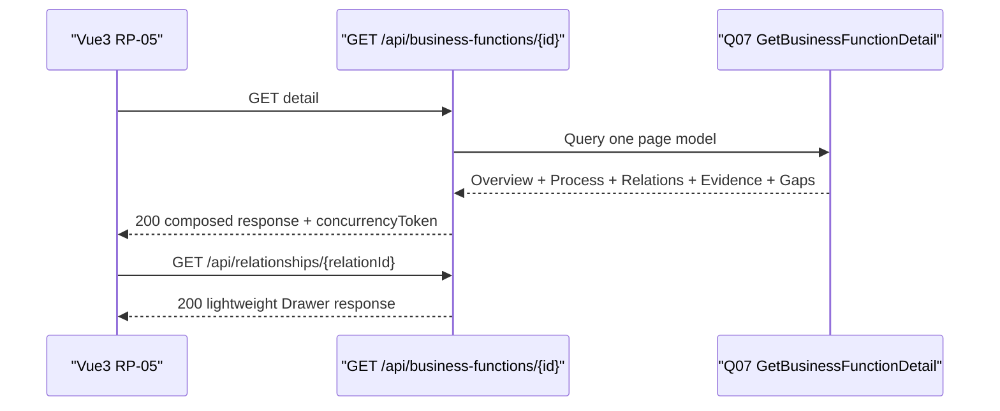
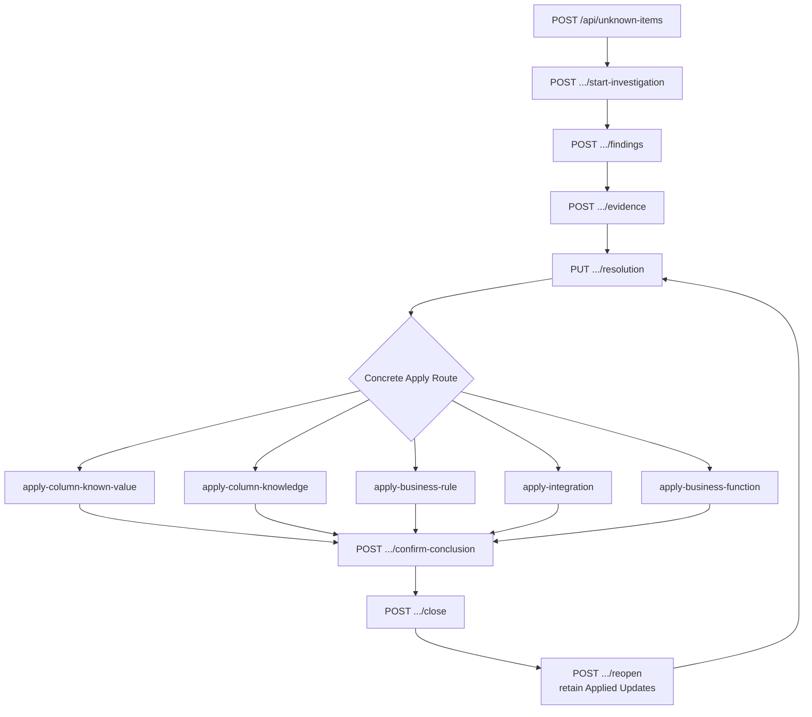
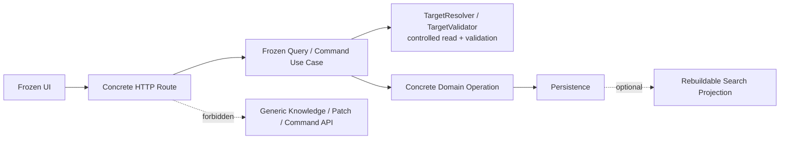

# System Knowledge Hub — MVP API Contract

状态：**CONFIRMED / API CONTRACT FROZEN**  
产品：系统知识中心 / System Knowledge Hub  
Base Path：`/api`  
目标客户端：Vue 3  
目标服务端：.NET 8  

依据：

- `System_Knowledge_Hub_MVP_Final_UI_Inventory.md`
- `System_Knowledge_Hub_MVP_Design_Baseline.md`
- `System_Knowledge_Hub_MVP_Domain_Model.md`
- `System_Knowledge_Hub_MVP_Database_Model.md`
- `System_Knowledge_Hub_MVP_Application_Use_Case_Model.md`

范围：只定义冻结 UI 与 Application Use Cases 之间的 HTTP JSON 契约。不生成 Controller、C# DTO、Service、Repository、EF Core、Migration、SQL、Vue API、OpenAPI 代码、Swagger 配置或 Authentication / Authorization Framework。

## 1. API Design Principles

1. **Use Case First**：API 映射冻结的 Q01–Q16 与 C01–C35（含 C27a、C32a–C32e），不从数据库表生成 CRUD。
2. **UI-oriented Reads**：Detail Route 返回页面所需的组合读模型；Vue 不为一个详情页拼装大量碎片请求。
3. **Explicit Commands**：写操作使用明确 Section 或业务动作名称，不提供通用 `PATCH`、`POST /commands` 或动态属性更新。
4. **Concrete Objects**：System、BusinessFunction、DatabaseObject / Column、BusinessRule、Integration、UnknownItem 保持具体路由。受控多态只用于冻结模型已允许的 Target / Subject 引用。
5. **Read / Write contracts are separate, without CQRS framework**：HTTP 只体现查询与动作差异，不暴露 Command Bus、Handler、MediatR 或 Repository 概念。
6. **Progressive Documentation**：创建成功即可保持 `Unknown`；Relationship、Evidence 和状态推进是后续独立请求。
7. **No implicit workflow**：保存 Evidence 不推进 KnowledgeStatus；Apply 不 Confirm；Confirm 不 Close；Reopen 不回滚 Applied Update。
8. **System Context stays explicit**：跨对象选择和响应摘要始终包含 System Context；Integration 可包含 Source / Target 两个 System Context。
9. **Opaque concurrency**：API 只暴露不透明 `concurrencyToken`，不泄露内部版本实现。
10. **Simple HTTP semantics**：成功直接返回业务 JSON；失败使用 HTTP Status + Error Contract，不增加成功 Envelope。
11. **No premature versioning**：MVP 使用 `/api`，不增加 `/v1`。只有未来确实需要同时支持不兼容客户端时才另行设计版本策略。
12. **English wire enums, Chinese UI**：枚举在线路中使用冻结英文值；简体中文由 Vue 映射。

## 2. Route Naming Rules

- 路由使用小写 kebab-case 与复数资源名：`/api/business-functions`、`/api/unknown-items`。
- `/api/evidence` 是资源命名例外：英文 `evidence` 为不可数名词，canonical Route 固定为 `GET /api/evidence/{id}`、`POST /api/evidence`、`PUT /api/evidence/{id}` 与 `POST /api/evidence/human-confirmations`，不改为 `/api/evidences`。
- 组合查询使用资源 Detail 路由：`GET /api/systems/{id}`。
- Section 完整编辑使用 `PUT`：`PUT /api/systems/{id}/overview`。
- 创建对象或依赖记录使用 `POST`：`POST /api/database-columns/{id}/known-values`。
- 明确工作流动作使用动词子路径：`POST /api/unknown-items/{id}/start-investigation`。
- ColumnKnownValue 的冻结依赖内容移除使用显式 `/remove` Command；核心知识对象没有 Delete API，也不为 REST 完整性增加通用 `DELETE`。
- Route 中的 `{id}` 是十进制 JavaScript 安全正整数。受控多态 Type 不进入通用动态 Route。
- Query 参数使用 camelCase；多值枚举使用逗号分隔，例如 `types=DatabaseColumn,BusinessRule`。
- 未定义的筛选、展开、字段选择或排序值返回 `400 validation_error`，不静默忽略。

## 3. Common Contracts

### 3.1 HTTP 与 JSON 基础约定

- Content Type：`application/json; charset=utf-8`。
- ID：JSON `number`，必须满足 `1 <= id <= 9007199254740991`（`Number.MAX_SAFE_INTEGER`）；第一版不把 ID 编码为字符串。
- 上述安全范围适用于 Route 参数、Query 中的 ID、KnowledgeTargetRef、Request Body 和所有 Response ID。SQLite / .NET 内部即使支持更大的 64 位整数，服务端也不得向 Vue 生成、接受或返回超过该范围的业务 ID。
- DateTime：ISO-8601 UTC 字符串，例如 `2026-08-12T10:30:00Z`。
- Enum：稳定英文值，大小写敏感；未知值返回 `400 validation_error`。
- Boolean：JSON `true / false`。
- 集合：没有项目时返回 `[]`，不返回 `null`。
- Query Response 的 nullable 属性必须显式返回 `null`，便于 Vue 区分“已读取但无值”。
- Create Request 的可选字段可以省略或显式为 `null`；两者都表示初始无值。
- Update Request 不是 Patch：该 Section 的全部可编辑字段必须出现；可清空字段使用显式 `null`。缺少 Section 字段返回 `400 validation_error`。
- 服务端计算字段、只读元数据、KnowledgeStatus 或关系不允许混入其它 Section Update。

### 3.2 成功响应与 Envelope 决策

成功时直接返回业务对象或分页对象，不使用：

```json
{
  "data": {},
  "error": null
}
```

理由：HTTP Status 已表达成功 / 失败；再包一层不会增加 MVP 语义，只会增加 Vue 访问层级。创建使用 `201 Created`，读取和其它成功命令使用 `200 OK`。需要返回新状态或新 token 的操作不使用 `204 No Content`。

### 3.3 `ActorContext`

普通创建 / 编辑请求使用轻量执行人上下文：

```json
{
  "displayName": "王敏",
  "role": "知识整理人员"
}
```

`displayName` 必需；`role` 可为 `null`。MVP 的普通 Create / Edit Command 必须把该对象直接放在 Request Body 的 `actor` 字段中；不设计 Actor Header、Session Actor、Middleware User Context、UserId、PersonId 或 RoleId。它不是 User、Person 或权限身份。服务端为普通创建记录使用服务器 UTC 时间；普通更新不因此建立 Audit 记录。

### 3.4 `PersonSnapshotInput`

身份本身具有证据或调查意义时提交完整业务事实快照：

```json
{
  "displayName": "李工",
  "roleOrIdentity": "MES 业务专家",
  "occurredAt": "2026-08-12T10:30:00Z",
  "team": "制造系统组",
  "externalUserKey": null,
  "source": "Manual",
  "note": null
}
```

`displayName`、`roleOrIdentity`、`occurredAt` 必需；其它字段 nullable。不同请求按事实命名为 `provider`、`recorder`、`confirmer`、`applier`、`actor` 或 `creator`。不提供 `personId / userId / roleId`。

### 3.5 `KnowledgeTargetRef`

```json
{
  "type": "DatabaseColumn",
  "id": 123
}
```

允许的 `type`：`System`、`DatabaseSource`、`BusinessFunction`、`DatabaseObject`、`DatabaseColumn`、`BusinessRule`、`Integration`。Evidence Subject 额外允许 `KnowledgeRelation`、`UnknownItem`、`Finding`、`Resolution`、`KnowledgeUpdate`。允许集合取决于当前 Use Case，不是动态对象框架。

### 3.6 `KnowledgeStatusChangeInput`

```json
{
  "targetStatus": "Inferred",
  "reason": null,
  "concurrencyToken": "opaque:01J5D4J6Q8M2"
}
```

前进时 `reason` 可为 `null`；回退时必须是非空字符串。`Unknown → Confirmed` 返回 `422 business_rule_violation`。

### 3.7 `ConcurrencyToken`

- Detail、Drawer 和任何成功写响应返回当前资源的 `concurrencyToken`。
- 修改已有资源时，请求原样提交最近读取到的 token。
- UnknownItem 工作流动作提交事项 token；具体 Apply 同时提交目标知识对象的 `targetConcurrencyToken`。
- 创建独立对象不需要 token；在已有父对象下创建依赖记录时提交父对象 token。
- token 是 opaque string。客户端不得解析、排序、生成或持久推断其内部格式。
- token 不匹配返回 `409 conflict`。API Contract 不决定 RowVersion、Integer Version、ETag 或 `updated_at` compare。
- MVP 唯一并发传输契约是 JSON Response / Request Body 中的 token；不同时引入 `ETag`、`If-Match` 或第二套 HTTP 并发来源。

### 3.8 Error Contract

```json
{
  "code": "invalid_state",
  "message": "当前待确认事项不是调查中状态。",
  "fieldErrors": null,
  "details": {
    "currentState": "Closed",
    "allowedActions": ["ReopenUnknownItem"]
  }
}
```

`fieldErrors` 为 `null` 或 `{ "fieldName": ["message"] }`；`details` 为 `null` 或少量可诊断 JSON，不承载堆栈、SQL 或内部类型名。

| HTTP | code | 使用范围 |
| --- | --- | --- |
| 400 | `validation_error` | JSON、必填、格式、枚举、分页或筛选非法 |
| 404 | `not_found` | Route 资源或明确引用对象不存在 |
| 409 | `conflict` | 并发 token 过期、唯一性冲突、重复关系 |
| 409 | `invalid_state` | UnknownItem 当前状态不允许动作 |
| 422 | `reference_invalid` | type + id 存在性、归属、System Context 或端点组合非法 |
| 422 | `business_rule_violation` | Evidence 门槛、状态跃迁、Applied 前置条件等业务规则不满足 |

保留 `422`，因为它能低成本地区分“请求格式正确但业务规则不允许”与 `400` 输入格式错误；不增加更多业务专用 HTTP 状态码。

### 3.9 分页响应

```json
{
  "items": [],
  "page": 1,
  "pageSize": 20,
  "total": 135
}
```

所有正式 List Page 使用此结构。`page` 从 1 开始，默认 `pageSize=20`，最大 `pageSize=100`。

## 4. Query API Inventory

| UC | Method / Route | Request Contract | Response Contract | Success | Failure | UI |
| --- | --- | --- | --- | --- | --- | --- |
| Q01 GetDashboard | `GET /api/dashboard` | `systemId?` | Dashboard 页面组合模型 | 200 | 400 / 404 | RP-01 |
| Q02 SearchKnowledge | `GET /api/search` | `q`、`types?`、`limitPerGroup?` | 分组搜索结果 | 200 | 400 | OV-01–03 |
| Q03 SearchKnowledgeTargets | `GET /api/knowledge-targets` | Purpose、q、systemId、受控 Source / Relation 条件、分页 | 目标候选分页 | 200 | 400 / 404 / 422 | DR-06 / DR-08 / OV-05 |
| Q04 GetSystemsList | `GET /api/systems` | 搜索、Lifecycle、Technology、KnowledgeStatus、分页、排序 | `Paged<SystemSummary>` | 200 | 400 | RP-02 |
| Q05 GetSystemDetail | `GET /api/systems/{id}` | Route ID | System Detail 组合模型 | 200 | 404 | RP-03 / DR-01 / DR-04 |
| Q06 GetBusinessFunctionsList | `GET /api/business-functions` | 具体筛选、分页、排序 | `Paged<BusinessFunctionSummary>` | 200 | 400 | RP-04 |
| Q07 GetBusinessFunctionDetail | `GET /api/business-functions/{id}` | Route ID | Function Detail 组合模型 | 200 | 404 | RP-05 / DR-02–05 |
| Q08 GetDatabaseObjectsList | `GET /api/database-objects` | Source / Schema / 类型 / 状态 / 搜索 / 分页 | `Paged<DatabaseObjectSummary>` + 浏览上下文 | 200 | 400 / 404 / 422 | RP-06 |
| Q09 GetDatabaseObjectDetail | `GET /api/database-objects/{id}` | `selectedColumnId?` | Database Detail 组合模型 | 200 | 404 / 422 | RP-07 / DR-03 |
| Q10 GetColumnDetail | `GET /api/database-columns/{id}` | Route ID | Column Drawer 模型 | 200 | 404 | DR-03 / DR-11 |
| Q11 GetUnknownItemsList | `GET /api/unknown-items` | 具体筛选、分页、排序 | `Paged<UnknownItemSummary>` | 200 | 400 | RP-08 |
| Q12 GetUnknownItemDetail | `GET /api/unknown-items/{id}` | Route ID | UnknownItem 完整闭环模型 | 200 | 404 | RP-09 / WF-00–06 |
| Q13 GetBusinessRuleDetail | `GET /api/business-rules/{id}` | Route ID | Rule Detail 组合模型 | 200 | 404 | RP-10 / DR-05 |
| Q14 GetIntegrationDetail | `GET /api/integrations/{id}` | Route ID | Integration Detail 组合模型 | 200 | 404 | RP-11 / DR-04 |
| Q15 GetRelationshipDetail | `GET /api/relationships/{id}` | Route ID | Relationship Drawer 模型 | 200 | 404 / 422 | DR-02 / DR-07 |
| Q16 GetEvidenceDetail | `GET /api/evidence/{id}` | Route ID | Evidence Drawer 模型 | 200 | 404 | DR-09 |

## 5. Query API Request / Response Examples

所有 Detail 响应中的 `availableActions` 只提示当前 UI 可显示的动作；执行命令时服务端仍重新校验状态和引用。

### Q01 `GET /api/dashboard`

Request：`GET /api/dashboard?systemId=12`；`systemId` 可省略表示全局。

```json
{
  "scope": { "systemId": 12, "systemName": "MES" },
  "knowledgeOverview": {
    "systems": 1,
    "businessFunctions": 42,
    "databaseObjects": 86,
    "columns": 1254,
    "integrations": 11,
    "businessRules": 37,
    "unknownItems": 23
  },
  "knowledgeProgress": { "confirmed": 612, "inferred": 438, "unknown": 380, "openUnknownItems": 18 },
  "needsAttention": [
    { "kind": "HighPriorityUnknownItem", "count": 5, "label": "高优先级待确认事项" }
  ],
  "recentActivity": [
    { "objectType": "DatabaseColumn", "objectId": 123, "title": "MES.TABLE_EQP.STATE_FLAG", "updatedAt": "2026-08-12T09:20:00Z" }
  ]
}
```

### Q02 `GET /api/search`

Request：`GET /api/search?q=STATE_FLAG&types=DatabaseColumn,BusinessFunction,UnknownItem&limitPerGroup=5`。`q` 长度 1–100；`limitPerGroup` 默认 5、最大 20。

```json
{
  "query": "STATE_FLAG",
  "groups": [
    {
      "objectType": "DatabaseColumn",
      "label": "字段",
      "items": [
        {
          "id": 123,
          "systemContext": "MES",
          "title": "MES.TABLE_EQP.STATE_FLAG",
          "shortDescription": "设备当前状态标识",
          "knowledgeStatus": "Inferred",
          "unknownItemStatus": null,
          "navigation": { "routeObjectType": "DatabaseObject", "routeObjectId": 45, "openDrawer": "DatabaseColumn", "drawerObjectId": 123 }
        }
      ]
    }
  ],
  "total": 4
}
```

底层使用 FTS5、trigram、LIKE 或 Prefix Search 不出现在请求或响应中。

### Q03 `GET /api/knowledge-targets`

Request：

`GET /api/knowledge-targets?purpose=RelationTarget&q=TABLE_EQP&systemId=12&sourceType=BusinessFunction&sourceId=77&relationType=Reads&page=1&pageSize=20`

`purpose` 允许：`RelationSource / RelationTarget / EvidenceSubject / UnknownTarget / KnowledgeUpdateTarget`。

```json
{
  "items": [
    {
      "target": { "type": "DatabaseObject", "id": 45 },
      "systemContext": [{ "id": 12, "name": "MES" }],
      "title": "MES.TABLE_EQP",
      "objectTypeLabel": "数据库对象",
      "shortDescription": "设备主数据表",
      "knowledgeStatus": "Inferred"
    }
  ],
  "page": 1,
  "pageSize": 20,
  "total": 1
}
```

### Q04 `GET /api/systems`

Request：`GET /api/systems?search=MES&lifecycle=Legacy&technology=Oracle&knowledgeStatus=Inferred&page=1&pageSize=20&sort=updatedAt:desc`。

```json
{
  "items": [
    {
      "id": 12,
      "name": "MES",
      "displayName": "制造执行系统",
      "systemType": "Manufacturing Execution System",
      "purpose": "管理设备与生产执行状态",
      "technologies": [".NET Framework 4.8", "Oracle"],
      "functionCount": 42,
      "databaseObjectCount": 86,
      "openUnknownCount": 18,
      "lifecycle": "Legacy",
      "knowledgeStatus": "Inferred",
      "updatedAt": "2026-08-12T09:20:00Z"
    }
  ],
  "page": 1,
  "pageSize": 20,
  "total": 1
}
```

### Q05 `GET /api/systems/{id}`

Request：`GET /api/systems/12`。

```json
{
  "id": 12,
  "concurrencyToken": "opaque:sys-12-a8f3",
  "overview": {
    "name": "MES",
    "displayName": "制造执行系统",
    "systemType": "Manufacturing Execution System",
    "lifecycle": "Legacy",
    "purpose": "管理设备与生产执行状态",
    "mainUsers": ["设备工程师", "生产调度员"],
    "technologies": [".NET Framework 4.8", "Oracle", "RabbitMQ"],
    "repository": { "name": "mes-legacy", "url": "https://git.example/mes-legacy" },
    "deployment": [{ "environment": "Production", "description": "MES-APP-01" }],
    "notes": null,
    "knowledgeStatus": "Inferred"
  },
  "knowledgeSummary": { "confirmed": 612, "inferred": 438, "unknown": 380, "openUnknownItems": 18 },
  "businessFunctions": [{ "id": 77, "name": "Equipment Status Query", "purpose": "查询设备显示状态", "knowledgeStatus": "Inferred", "unknownCount": 2 }],
  "databaseObjects": [{ "id": 45, "qualifiedName": "MES.TABLE_EQP", "objectType": "Table", "knowledgeStatus": "Inferred", "unknownCount": 4 }],
  "integrations": [{ "id": 88, "name": "equipment.status.changed", "integrationType": "RabbitMq", "relatedSystem": "Equipment Gateway", "knowledgeStatus": "Inferred" }],
  "unknownItems": [{ "id": 230, "itemCode": "UNK-023", "question": "STATE_FLAG=30 具体表示什么？", "priority": "High", "status": "Investigating" }],
  "contextRail": {
    "relatedSystems": [{ "id": 21, "name": "Equipment Gateway" }],
    "integrationCount": 11,
    "mainDatabase": { "id": 9, "name": "MES 生产库" },
    "highPriorityUnknownCount": 5,
    "knowledgeGaps": ["12 个字段缺少业务说明"]
  },
  "availableActions": ["UpdateSystemOverview", "UpdateSystemTechnology", "UpdateSystemLifecycle"]
}
```

### Q06 `GET /api/business-functions`

Request：`GET /api/business-functions?systemId=12&functionType=Query&rewriteStatus=Keep&knowledgeStatus=Inferred&hasUnknownItems=true&page=1&pageSize=20&sort=updatedAt:desc`。

```json
{
  "items": [
    {
      "id": 77,
      "name": "Equipment Status Query",
      "system": { "id": 12, "name": "MES" },
      "functionType": "Query",
      "purpose": "查询并计算设备显示状态",
      "relatedDataCount": 3,
      "ruleCount": 1,
      "unknownCount": 2,
      "rewriteStatus": "Keep",
      "knowledgeStatus": "Inferred",
      "updatedAt": "2026-08-12T09:20:00Z"
    }
  ],
  "page": 1,
  "pageSize": 20,
  "total": 1
}
```

### Q07 `GET /api/business-functions/{id}`

Request：`GET /api/business-functions/77`。

```json
{
  "id": 77,
  "system": { "id": 12, "name": "MES" },
  "concurrencyToken": "opaque:fn-77-09c1",
  "header": { "name": "Equipment Status Query", "functionType": "Query", "rewriteStatus": "Keep", "knowledgeStatus": "Inferred" },
  "overview": { "purpose": "查询并计算设备显示状态", "caller": "Equipment Gateway", "input": "equipmentId", "output": "displayStatus" },
  "businessProcess": [
    { "order": 1, "name": "Receive Request", "description": null },
    { "order": 2, "name": "Query MES.TABLE_EQP", "description": null },
    { "order": 3, "name": "Return Result", "description": null }
  ],
  "relatedData": [{ "relationshipId": 501, "target": { "type": "DatabaseObject", "id": 45 }, "name": "MES.TABLE_EQP", "relationType": "Reads", "evidenceCount": 2 }],
  "businessRules": [{ "relationshipId": 502, "id": 66, "name": "显示状态计算", "knowledgeStatus": "Inferred", "evidenceCount": 2 }],
  "integrations": [{ "relationshipId": 503, "id": 88, "name": "equipment.status.changed", "relationType": "PublishesVia" }],
  "evidence": [{ "id": 901, "evidenceType": "CodeReference", "sourceTitle": "EquipmentStatusService.cs : line 184" }],
  "unknownItems": [{ "id": 230, "question": "STATE_FLAG=30 具体表示什么？", "status": "Investigating" }],
  "contextRail": { "callers": ["Equipment Gateway"], "adjacentFunctions": [], "integrationCount": 1, "openUnknownCount": 2 },
  "availableActions": ["UpdateBusinessFunctionOverview", "ReplaceBusinessProcessSteps", "AddKnowledgeRelation", "AddEvidence"]
}
```

### Q08 `GET /api/database-objects`

Request：`GET /api/database-objects?systemId=12&databaseSourceId=9&schema=MES&objectType=Table&knowledgeStatus=Inferred&search=STATE_FLAG&page=1&pageSize=20&sort=objectName:asc`。

```json
{
  "browseContext": {
    "system": { "id": 12, "name": "MES" },
    "databaseSources": [{ "id": 9, "name": "MES 生产库", "engine": "Oracle" }],
    "schemas": ["MES"]
  },
  "items": [
    {
      "id": 45,
      "databaseSource": { "id": 9, "name": "MES 生产库" },
      "schema": "MES",
      "objectName": "TABLE_EQP",
      "objectType": "Table",
      "businessDescription": "设备主数据表",
      "estimatedRows": 48000,
      "accessMode": "ReadWrite",
      "relatedFunctionCount": 6,
      "unknownCount": 4,
      "knowledgeStatus": "Inferred",
      "matchedColumn": { "id": 123, "columnName": "STATE_FLAG" }
    }
  ],
  "page": 1,
  "pageSize": 20,
  "total": 1
}
```

### Q09 `GET /api/database-objects/{id}`

Request：`GET /api/database-objects/45?selectedColumnId=123`。

```json
{
  "id": 45,
  "system": { "id": 12, "name": "MES" },
  "databaseSource": { "id": 9, "name": "MES 生产库", "engine": "Oracle" },
  "concurrencyToken": "opaque:dbo-45-22b7",
  "overview": { "qualifiedName": "MES.TABLE_EQP", "objectType": "Table", "businessDescription": "设备主数据表", "accessMode": "ReadWrite", "knowledgeStatus": "Inferred" },
  "metadata": { "estimatedRows": 48000, "primaryKeyColumns": ["EQP_ID"], "businessKeyColumns": ["EQP_CODE"] },
  "columns": [
    { "id": 123, "ordinalPosition": 7, "columnName": "STATE_FLAG", "dataType": "VARCHAR2(20)", "nullable": false, "businessDescription": "设备当前状态标识", "evidenceCount": 3, "unknownCount": 1, "knowledgeStatus": "Inferred", "selected": true }
  ],
  "contextRail": { "usedByFunctions": [{ "id": 77, "name": "Equipment Status Query", "relationType": "Reads", "reference": "WHERE STATE_FLAG IN ('10','20','30')" }], "relatedRuleCount": 1, "integrationCount": 0, "openUnknownCount": 3 },
  "selectedColumnDrawer": { "columnId": 123 },
  "availableActions": ["UpdateDatabaseObjectKnowledge", "RegisterDatabaseColumn", "AddKnowledgeRelation"]
}
```

### Q10 `GET /api/database-columns/{id}`

Request：`GET /api/database-columns/123`。

```json
{
  "id": 123,
  "parent": { "databaseObjectId": 45, "qualifiedName": "MES.TABLE_EQP" },
  "system": { "id": 12, "name": "MES" },
  "concurrencyToken": "opaque:col-123-bc12",
  "databaseMetadata": { "columnName": "STATE_FLAG", "dataType": "VARCHAR2(20)", "nullable": false, "defaultValue": null, "ordinalPosition": 7 },
  "businessKnowledge": { "description": "设备当前状态标识", "knowledgeStatus": "Inferred" },
  "knownValues": [{ "id": 701, "value": "30", "meaning": "Unknown / Offline" }],
  "evidence": [{ "id": 901, "evidenceType": "CodeReference", "sourceTitle": "EquipmentStatusService.cs : line 184", "supportReason": "状态分支直接判断 30" }],
  "relations": [{ "id": 502, "relationType": "UsesField", "otherObject": { "type": "BusinessRule", "id": 66, "title": "显示状态计算" } }],
  "unknownItems": [{ "id": 230, "question": "STATE_FLAG=30 具体表示什么？", "status": "Investigating" }],
  "availableActions": ["UpdateDatabaseColumnKnowledge", "AddColumnKnownValue", "AddEvidence", "ChangeKnowledgeStatus"]
}
```

### Q11 `GET /api/unknown-items`

Request：`GET /api/unknown-items?systemId=12&relatedObjectType=DatabaseColumn&priority=High&status=Investigating&updatedFrom=2026-08-01T00:00:00Z&page=1&pageSize=20&sort=updatedAt:desc`。

```json
{
  "items": [
    {
      "id": 230,
      "itemCode": "UNK-023",
      "question": "STATE_FLAG=30 具体表示什么？",
      "system": { "id": 12, "name": "MES" },
      "primaryTarget": { "type": "DatabaseColumn", "id": 123, "display": "MES.TABLE_EQP.STATE_FLAG" },
      "priority": "High",
      "status": "Investigating",
      "findingCount": 2,
      "evidenceCount": 3,
      "updatedAt": "2026-08-12T09:20:00Z"
    }
  ],
  "page": 1,
  "pageSize": 20,
  "total": 1
}
```

### Q12 `GET /api/unknown-items/{id}`

Request：`GET /api/unknown-items/230`。

```json
{
  "id": 230,
  "itemCode": "UNK-023",
  "system": { "id": 12, "name": "MES" },
  "concurrencyToken": "opaque:unk-230-34f9",
  "question": { "text": "STATE_FLAG=30 具体表示什么？", "context": "状态查询结果中存在未解释值", "priority": "High", "status": "Investigating", "createdAt": "2026-08-10T02:00:00Z", "updatedAt": "2026-08-12T09:20:00Z" },
  "relatedObjects": [{ "target": { "type": "DatabaseColumn", "id": 123 }, "display": "MES.TABLE_EQP.STATE_FLAG", "primary": true }],
  "findings": [{ "id": 801, "content": "代码中将 30 与离线分支一起处理", "recordedBy": { "displayName": "王敏", "roleOrIdentity": "调查人", "occurredAt": "2026-08-11T08:00:00Z" } }],
  "evidence": [{ "id": 901, "subject": { "type": "Finding", "id": 801 }, "evidenceType": "CodeReference", "sourceTitle": "EquipmentStatusService.cs : line 184" }],
  "resolution": { "id": 601, "conclusion": "30 = Unknown / Offline", "confirmedBy": null, "confirmedAt": null },
  "knowledgeUpdates": [{ "id": 701, "target": { "type": "DatabaseColumn", "id": 123 }, "subjectDetailKey": "KnownValues:30", "changeSummary": "新增 30 的业务含义", "before": null, "after": { "value": "30", "meaning": "Unknown / Offline" }, "status": "Proposed" }],
  "activity": [{ "type": "FindingAdded", "summary": "王敏添加调查发现", "occurredAt": "2026-08-11T08:00:00Z" }],
  "contextRail": { "knowledgeImpact": ["MES.TABLE_EQP.STATE_FLAG · KnownValues:30"], "evidenceCount": 3, "openGapCount": 1 },
  "availableActions": ["AddFinding", "AddEvidenceToInvestigation", "SaveResolutionDraft", "ApplyColumnKnownValueUpdate", "ConfirmConclusion"]
}
```

### Q13 `GET /api/business-rules/{id}`

Request：`GET /api/business-rules/66`。

```json
{
  "id": 66,
  "system": { "id": 12, "name": "MES" },
  "concurrencyToken": "opaque:rule-66-f82a",
  "header": { "name": "显示状态计算", "knowledgeStatus": "Inferred" },
  "description": "根据设备状态标识计算展示状态",
  "condition": "STATE_FLAG IN ('10','20','30')",
  "result": "返回映射后的 displayStatus",
  "inputData": [{ "name": "STATE_FLAG", "description": "设备状态" }],
  "relatedFunctions": [{ "relationshipId": 502, "id": 77, "name": "Equipment Status Query", "relationType": "AppliesRule" }],
  "relatedFields": [{ "relationshipId": 504, "id": 123, "name": "MES.TABLE_EQP.STATE_FLAG", "relationType": "UsesField" }],
  "integrations": [],
  "evidence": [{ "id": 902, "evidenceType": "Sql", "sourceTitle": "QueryEquipmentStatus.sql" }],
  "unknownItems": [{ "id": 230, "question": "STATE_FLAG=30 具体表示什么？", "status": "Investigating" }],
  "contextRail": { "relationshipCount": 2, "openUnknownCount": 1 },
  "availableActions": ["UpdateBusinessRule", "AddKnowledgeRelation", "AddEvidence", "ChangeKnowledgeStatus"]
}
```

### Q14 `GET /api/integrations/{id}`

Request：`GET /api/integrations/88`。

```json
{
  "id": 88,
  "concurrencyToken": "opaque:int-88-1e33",
  "header": { "name": "equipment.status.changed", "integrationType": "RabbitMq", "knowledgeStatus": "Inferred" },
  "sourceParty": { "systemId": 12, "displayName": "MES" },
  "targetParty": { "systemId": 21, "displayName": "Equipment Gateway" },
  "flowDirection": "OneWay",
  "purpose": "发布设备状态变化",
  "endpoint": { "exchange": "equipment", "topic": "equipment.status.changed", "queue": null },
  "contractFields": [{ "order": 1, "fieldName": "equipmentId", "dataType": "string", "required": true, "description": "设备编号", "sampleValue": "EQP-01" }],
  "relatedFunctions": [{ "relationshipId": 503, "id": 77, "name": "Equipment Status Query", "relationType": "PublishesVia" }],
  "relatedData": [{ "id": 45, "name": "MES.TABLE_EQP" }],
  "evidence": [{ "id": 903, "evidenceType": "MqMessage", "sourceTitle": "RabbitMQ binding snapshot" }],
  "unknownItems": [],
  "contextRail": { "participantSystems": ["MES", "Equipment Gateway"], "relatedFunctionCount": 1, "openUnknownCount": 0 },
  "availableActions": ["UpdateIntegration", "ReplaceIntegrationContractFields", "AddKnowledgeRelation", "AddEvidence"]
}
```

### Q15 `GET /api/relationships/{id}`

Request：`GET /api/relationships/501`。

```json
{
  "id": 501,
  "concurrencyToken": "opaque:rel-501-0f2b",
  "source": { "target": { "type": "BusinessFunction", "id": 77 }, "title": "Equipment Status Query", "systemContext": "MES" },
  "target": { "target": { "type": "DatabaseObject", "id": 45 }, "title": "MES.TABLE_EQP", "systemContext": "MES" },
  "relationType": "Reads",
  "description": "通过状态查询读取设备主记录",
  "knowledgeStatus": "Inferred",
  "evidence": [{ "id": 902, "evidenceType": "Sql", "sourceTitle": "QueryEquipmentStatus.sql" }],
  "unknownItems": [],
  "availableActions": ["UpdateKnowledgeRelationDescription", "AddEvidence", "ChangeRelationKnowledgeStatus"]
}
```

### Q16 `GET /api/evidence/{id}`

Request：`GET /api/evidence/901`。

```json
{
  "id": 901,
  "concurrencyToken": "opaque:evi-901-7ac4",
  "evidenceType": "CodeReference",
  "subject": { "type": "DatabaseColumn", "id": 123 },
  "subjectDetailKey": "KnownValues:30",
  "sourceTitle": "EquipmentStatusService.cs : line 184",
  "sourceReference": "EquipmentStatusService.cs",
  "sourceLocator": { "repository": "mes-legacy", "file": "src/EquipmentStatusService.cs", "class": "EquipmentStatusService", "method": "Query", "startLine": 184, "endLine": 190 },
  "summary": "30 与离线状态分支一起处理",
  "supportReason": "代码分支直接支持该值含义",
  "confidence": "High",
  "provider": { "displayName": "王敏", "roleOrIdentity": "证据提供人", "occurredAt": "2026-08-11T08:10:00Z", "team": "制造系统组", "externalUserKey": null, "source": "Manual", "note": null },
  "subjectContext": { "title": "MES.TABLE_EQP.STATE_FLAG", "knowledgeStatus": "Inferred" },
  "availableActions": ["UpdateEvidence", "ChangeKnowledgeStatus"]
}
```

Evidence Detail 只返回已经保存的来源与快照信息。该 Query 不主动探测文件、URL、Git、API、MQ 或数据库可访问性，也不返回运行时 `sourceAccessibility`。

## 6. Command API Inventory

Inventory 中的 Failure Status 表示该 API 可能使用的业务失败范围；统一 Error Contract 见第 14 节。

### 6.1 Systems

| UC | Method / Route | Request Contract | Response Contract | Success | Failure | UI |
| --- | --- | --- | --- | --- | --- | --- |
| C01 CreateSystem | `POST /api/systems` | 最小 System + actor | 新 System 摘要 + token | 201 | 400 / 409 | OV-04 / OV-05 |
| C02 UpdateSystemOverview | `PUT /api/systems/{id}/overview` | 完整 Overview Section + actor + token | 更新 Overview + token | 200 | 400 / 404 / 409 | ES-01 / RP-03 |
| C03 UpdateSystemTechnology | `PUT /api/systems/{id}/technology` | 完整 Technology 集合 + actor + token | 技术集合 + token | 200 | 400 / 404 / 409 | ES-01 / RP-03 |
| C04 UpdateSystemLifecycle | `PUT /api/systems/{id}/lifecycle` | TargetLifecycle + actor + token | Lifecycle + token | 200 | 400 / 404 / 409 / 422 | ES-01 / RP-03 |

### 6.2 Business Functions

| UC | Method / Route | Request Contract | Response Contract | Success | Failure | UI |
| --- | --- | --- | --- | --- | --- | --- |
| C05 CreateBusinessFunction | `POST /api/business-functions` | 最小 Function + actor | 新 Function 摘要 + token | 201 | 400 / 404 / 409 / 422 | OV-04 / OV-05 |
| C06 UpdateBusinessFunctionOverview | `PUT /api/business-functions/{id}/overview` | 完整 Overview + actor + token | Overview + token | 200 | 400 / 404 / 409 | ES-02 / RP-05 |
| C07 ReplaceBusinessProcessSteps | `PUT /api/business-functions/{id}/process-steps` | 完整 Steps + actor + token | Steps + token | 200 | 400 / 404 / 409 | ES-02 / RP-05 |

### 6.3 Database Knowledge

| UC | Method / Route | Request Contract | Response Contract | Success | Failure | UI |
| --- | --- | --- | --- | --- | --- | --- |
| C08 CreateDatabaseSource | `POST /api/database-sources` | Source 最小信息 + actor | 新 Source 摘要 + token | 201 | 400 / 404 / 409 / 422 | OV-04 / OV-05 / RP-06 |
| C09 RegisterDatabaseObject | `POST /api/database-objects` | Object 元数据 / 可选知识 + actor | 新 Object 摘要 + token | 201 | 400 / 404 / 409 / 422 | OV-04 / OV-05 / RP-06 |
| C10 RegisterDatabaseColumn | `POST /api/database-objects/{id}/columns` | Column 元数据 + actor + parent token | 新 Column 摘要 + parent token | 201 | 400 / 404 / 409 | RP-07 |
| C11 UpdateDatabaseObjectKnowledge | `PUT /api/database-objects/{id}/knowledge` | 完整对象知识 Section + actor + token | 对象知识 + token | 200 | 400 / 404 / 409 / 422 | RP-07 |
| C12 UpdateDatabaseColumnKnowledge | `PUT /api/database-columns/{id}/knowledge` | 完整字段业务知识 + actor + token | 字段知识 + token | 200 | 400 / 404 / 409 | DR-11 / DR-03 |
| C13 AddColumnKnownValue | `POST /api/database-columns/{id}/known-values` | Value / Meaning + actor + token | 新 KnownValue + token | 201 | 400 / 404 / 409 | DR-11 |
| C14 RemoveColumnKnownValue | `POST /api/database-columns/{id}/known-values/{knownValueId}/remove` | explicit confirm + actor + token | 剩余集合 + token | 200 | 400 / 404 / 409 / 422 | DR-11 |

C14 使用显式 `/remove` 动作，以便稳定携带 JSON 并发上下文；它只删除允许编辑的依赖值项，不代表核心对象 Delete 风格。

### 6.4 Business Rules / Integrations

| UC | Method / Route | Request Contract | Response Contract | Success | Failure | UI |
| --- | --- | --- | --- | --- | --- | --- |
| C15 CreateBusinessRule | `POST /api/business-rules` | Rule 最小信息 + actor | 新 Rule 摘要 + token | 201 | 400 / 404 / 409 / 422 | OV-04 / OV-05 |
| C16 UpdateBusinessRule | `PUT /api/business-rules/{id}` | 完整 Rule 编辑值 + actor + token | Rule + token | 200 | 400 / 404 / 409 / 422 | DR-12 / RP-10 |
| C17 CreateIntegration | `POST /api/integrations` | Parties / Type / Endpoint + actor | 新 Integration 摘要 + token | 201 | 400 / 404 / 409 / 422 | OV-04 / OV-05 |
| C18 UpdateIntegration | `PUT /api/integrations/{id}/overview` | 完整 Integration Overview + actor + token | Integration + token | 200 | 400 / 404 / 409 / 422 | DR-13 / RP-11 |
| C19 ReplaceIntegrationContractFields | `PUT /api/integrations/{id}/contract-fields` | 完整 ContractFields + actor + token | ContractFields + token | 200 | 400 / 404 / 409 | DR-13 / RP-11 |

### 6.5 Relationships / Evidence / Knowledge Status

| UC | Method / Route | Request Contract | Response Contract | Success | Failure | UI |
| --- | --- | --- | --- | --- | --- | --- |
| C20 AddKnowledgeRelation | `POST /api/relationships` | Source / RelationType / Target + actor | 新 Relationship + token | 201 | 400 / 404 / 409 / 422 | DR-06 / DR-07 |
| C21 UpdateKnowledgeRelationDescription | `PUT /api/relationships/{id}/description` | Description + actor + token | Relationship 摘要 + token | 200 | 400 / 404 / 409 / 422 | DR-02 / DR-07 |
| C22 ChangeRelationKnowledgeStatus | `PUT /api/relationships/{id}/knowledge-status` | StatusChange + actor + token | 状态结果 + token | 200 | 400 / 404 / 409 / 422 | DR-07 / DR-09 / DR-10 |
| C23 AddEvidence | `POST /api/evidence` | Evidence + ProviderSnapshot | 新 Evidence + Subject 状态不变 | 201 | 400 / 404 / 422 | DR-08 / DR-09 |
| C24 UpdateEvidence | `PUT /api/evidence/{id}` | 允许修正字段 + actor + token | Evidence + token | 200 | 400 / 404 / 409 / 422 | DR-09 |
| C25 AddHumanConfirmation | `POST /api/evidence/human-confirmations` | Subject + confirmation + ConfirmerSnapshot | 新 Evidence；Subject 状态不变 | 201 | 400 / 404 / 422 | DR-10 |
| C26 ChangeKnowledgeStatus | `PUT /api/knowledge-status` | TargetRef + StatusChange + actor | 目标状态结果 + token | 200 | 400 / 404 / 409 / 422 | WF-08 / WF-09 |

`PUT /api/knowledge-status` 是冻结的统一 KnowledgeStatus 能力，不是 Generic Knowledge API：TargetType 为封闭集合，只能更新状态列组，不能读取或修改任意对象字段。KnowledgeRelation 必须使用 C22。

### 6.6 Unknown Items

| UC | Method / Route | Request Contract | Response Contract | Success | Failure | UI |
| --- | --- | --- | --- | --- | --- | --- |
| C27 CreateUnknownItem | `POST /api/unknown-items` | 问题 + Primary / Related Target + CreatorSnapshot | Item + Targets + Created Activity + token | 201 | 400 / 404 / 409 / 422 | OV-05 / RP-09 / WF-00 |
| C27a UpdateUnknownItemRelatedTargets | `PUT /api/unknown-items/{id}/related-targets` | 完整非 Primary Targets + actor + token | Targets + token | 200 | 400 / 404 / 409 / 422 | RP-09 |
| C28 StartInvestigation | `POST /api/unknown-items/{id}/start-investigation` | ActorSnapshot + token | 最新状态 + Activity + token | 200 | 400 / 404 / 409 | WF-00 / WF-01 |
| C29 AddFinding | `POST /api/unknown-items/{id}/findings` | Content + RecorderSnapshot + token | Finding + Activity + token | 201 | 400 / 404 / 409 | WF-02 |
| C30 AddEvidenceToInvestigation | `POST /api/unknown-items/{id}/evidence` | 调查 Subject + Evidence + ProviderSnapshot + token | Evidence + Activity + token | 201 | 400 / 404 / 409 / 422 | DR-08 / WF-03 |
| C31 SaveResolutionDraft | `PUT /api/unknown-items/{id}/resolution` | Conclusion + 完整 Proposed Draft 集合 + token | Resolution / Preview + token | 200 | 400 / 404 / 409 / 422 | WF-04 |
| C32a ApplyColumnKnownValueUpdate | `POST /api/unknown-items/{id}/knowledge-updates/{updateId}/apply-column-known-value` | 具体值修改 + tokens + ApplierSnapshot | Applied 结果 + 最新状态 | 200 | 400 / 404 / 409 / 422 | WF-04 |
| C32b ApplyDatabaseColumnKnowledgeUpdate | `POST /api/unknown-items/{id}/knowledge-updates/{updateId}/apply-column-knowledge` | 具体字段知识修改 + tokens + ApplierSnapshot | Applied 结果 + 最新状态 | 200 | 400 / 404 / 409 / 422 | WF-04 / DR-11 |
| C32c ApplyBusinessRuleUpdate | `POST /api/unknown-items/{id}/knowledge-updates/{updateId}/apply-business-rule` | 具体 Rule 修改 + tokens + ApplierSnapshot | Applied 结果 + 最新状态 | 200 | 400 / 404 / 409 / 422 | WF-04 / DR-12 |
| C32d ApplyIntegrationUpdate | `POST /api/unknown-items/{id}/knowledge-updates/{updateId}/apply-integration` | 具体 Integration 修改 + tokens + ApplierSnapshot | Applied 结果 + 最新状态 | 200 | 400 / 404 / 409 / 422 | WF-04 / DR-13 |
| C32e ApplyBusinessFunctionUpdate | `POST /api/unknown-items/{id}/knowledge-updates/{updateId}/apply-business-function` | 具体 Function 修改 + tokens + ApplierSnapshot | Applied 结果 + 最新状态 | 200 | 400 / 404 / 409 / 422 | WF-04 / ES-02 |
| C33 ConfirmConclusion | `POST /api/unknown-items/{id}/confirm-conclusion` | ConfirmerSnapshot + token | ConclusionConfirmed + token | 200 | 400 / 404 / 409 / 422 | WF-05 |
| C34 CloseUnknownItem | `POST /api/unknown-items/{id}/close` | ActorSnapshot + optional note + token | Closed + token | 200 | 400 / 404 / 409 / 422 | WF-06 |
| C35 ReopenUnknownItem | `POST /api/unknown-items/{id}/reopen` | Reason + ActorSnapshot + token | Investigating + token | 200 | 400 / 404 / 409 | WF-06 / WF-01 |

## 7. Command API Request / Response Examples

为避免重复，示例中的 `actor` 使用第 3.3 节结构，完整人员快照使用第 3.4 节结构。所有 Section `PUT` 都提交该 Section 的完整可编辑值。

### 7.1 Systems

#### C01 `POST /api/systems`

```json
{
  "name": "MES",
  "displayName": "制造执行系统",
  "systemType": "Manufacturing Execution System",
  "lifecycle": "Legacy",
  "purpose": "管理设备与生产执行状态",
  "actor": { "displayName": "王敏", "role": "知识整理人员" }
}
```

```json
{
  "id": 12,
  "name": "MES",
  "displayName": "制造执行系统",
  "lifecycle": "Legacy",
  "knowledgeStatus": "Unknown",
  "concurrencyToken": "opaque:sys-12-0001"
}
```

#### C02–C04 System Section Updates

`PUT /api/systems/12/overview`

```json
{
  "displayName": "制造执行系统",
  "systemType": "Manufacturing Execution System",
  "purpose": "管理设备与生产执行状态",
  "mainUsers": ["设备工程师", "生产调度员"],
  "repository": { "name": "mes-legacy", "url": "https://git.example/mes-legacy" },
  "deployment": [{ "environment": "Production", "description": "MES-APP-01" }],
  "mainProjects": ["MES.Web", "MES.Service"],
  "mainEntryPoints": ["Global.asax", "EquipmentStatusService.cs"],
  "notes": null,
  "actor": { "displayName": "王敏", "role": "知识整理人员" },
  "concurrencyToken": "opaque:sys-12-a8f3"
}
```

Response：

```json
{
  "id": 12,
  "overview": { "displayName": "制造执行系统", "purpose": "管理设备与生产执行状态", "notes": null },
  "concurrencyToken": "opaque:sys-12-a8f4"
}
```

`PUT /api/systems/12/technology`

```json
{
  "technologies": [".NET Framework 4.8", "Oracle", "RabbitMQ"],
  "actor": { "displayName": "王敏", "role": null },
  "concurrencyToken": "opaque:sys-12-a8f4"
}
```

`PUT /api/systems/12/lifecycle`

```json
{
  "targetLifecycle": "Retired",
  "actor": { "displayName": "王敏", "role": "系统负责人" },
  "concurrencyToken": "opaque:sys-12-a8f5"
}
```

Technology Response 返回 `technologies` 与新 token；Lifecycle Response 返回 `lifecycle`、保持不变的 `knowledgeStatus` 与新 token。

### 7.2 Business Functions

#### C05 `POST /api/business-functions`

```json
{
  "systemId": 12,
  "name": "Equipment Status Query",
  "displayName": null,
  "functionType": "Query",
  "purpose": "查询并计算设备显示状态",
  "rewriteStatus": "Unknown",
  "actor": { "displayName": "王敏", "role": "知识整理人员" }
}
```

Response `201`：

```json
{
  "id": 77,
  "system": { "id": 12, "name": "MES" },
  "name": "Equipment Status Query",
  "rewriteStatus": "Unknown",
  "knowledgeStatus": "Unknown",
  "concurrencyToken": "opaque:fn-77-0001"
}
```

#### C06 `PUT /api/business-functions/{id}/overview`

```json
{
  "name": "Equipment Status Query",
  "displayName": null,
  "functionType": "Query",
  "purpose": "查询并计算设备显示状态",
  "caller": "Equipment Gateway",
  "input": "equipmentId",
  "output": "displayStatus",
  "rewriteStatus": "Keep",
  "actor": { "displayName": "王敏", "role": null },
  "concurrencyToken": "opaque:fn-77-09c1"
}
```

Response 返回完整 `overview` 和新 token，不修改 ProcessSteps、Relations 或 KnowledgeStatus。

#### C07 `PUT /api/business-functions/{id}/process-steps`

```json
{
  "steps": [
    { "order": 1, "name": "Receive Request", "description": null },
    { "order": 2, "name": "Validate Equipment", "description": null },
    { "order": 3, "name": "Query MES.TABLE_EQP", "description": null },
    { "order": 4, "name": "Return Result", "description": null }
  ],
  "actor": { "displayName": "王敏", "role": null },
  "concurrencyToken": "opaque:fn-77-09c2"
}
```

Response 返回规范化后的完整 `steps` 和新 token。

### 7.3 Database Knowledge

#### C08 `POST /api/database-sources`

```json
{
  "systemId": 12,
  "name": "MES 生产库",
  "engine": "Oracle",
  "environment": "Production",
  "instanceName": null,
  "serviceName": "MESPROD",
  "databaseName": null,
  "description": "MES 主业务数据库",
  "isPrimary": true,
  "actor": { "displayName": "王敏", "role": "知识整理人员" }
}
```

Response `201` 返回 Source 摘要与 token；不返回或设置 KnowledgeStatus。

#### C09 `POST /api/database-objects`

```json
{
  "databaseSourceId": 9,
  "schemaName": "MES",
  "objectName": "TABLE_EQP",
  "objectType": "Table",
  "estimatedRows": 48000,
  "accessMode": "ReadWrite",
  "primaryKeyColumns": ["EQP_ID"],
  "businessKeyColumns": ["EQP_CODE"],
  "businessDescription": "设备主数据表",
  "actor": { "displayName": "王敏", "role": null }
}
```

Response `201`：

```json
{
  "id": 45,
  "databaseSourceId": 9,
  "qualifiedName": "MES.TABLE_EQP",
  "objectType": "Table",
  "knowledgeStatus": "Unknown",
  "concurrencyToken": "opaque:dbo-45-0001"
}
```

#### C10 `POST /api/database-objects/{id}/columns`

```json
{
  "ordinalPosition": 7,
  "columnName": "STATE_FLAG",
  "dataType": "VARCHAR2(20)",
  "nullable": false,
  "defaultValue": null,
  "databaseComment": "Equipment state flag",
  "businessDescription": null,
  "actor": { "displayName": "王敏", "role": null },
  "concurrencyToken": "opaque:dbo-45-22b7"
}
```

Response `201`：

```json
{
  "column": { "id": 123, "columnName": "STATE_FLAG", "knowledgeStatus": "Unknown", "concurrencyToken": "opaque:col-123-0001" },
  "parentConcurrencyToken": "opaque:dbo-45-22b8"
}
```

#### C11–C12 Knowledge Section Updates

`PUT /api/database-objects/45/knowledge`

```json
{
  "businessDescription": "设备主数据表",
  "accessMode": "ReadWrite",
  "businessKeyColumns": ["EQP_CODE"],
  "actor": { "displayName": "王敏", "role": null },
  "concurrencyToken": "opaque:dbo-45-22b8"
}
```

`PUT /api/database-columns/123/knowledge`

```json
{
  "businessDescription": "设备当前状态标识",
  "actor": { "displayName": "王敏", "role": null },
  "concurrencyToken": "opaque:col-123-bc12"
}
```

响应分别返回最新 Section、保持不变的 KnowledgeStatus 和新 token。

#### C13–C14 Column Known Value

`POST /api/database-columns/123/known-values`

```json
{
  "value": "30",
  "meaning": "Unknown / Offline",
  "sortOrder": 30,
  "actor": { "displayName": "王敏", "role": null },
  "concurrencyToken": "opaque:col-123-bc13"
}
```

Response `201` 返回 `knownValue`、保持不变的 `knowledgeStatus` 和新 Column token。

`POST /api/database-columns/123/known-values/701/remove`

```json
{
  "confirmed": true,
  "actor": { "displayName": "王敏", "role": null },
  "concurrencyToken": "opaque:col-123-bc14"
}
```

Response `200`：`{ "columnId": 123, "knownValues": [], "concurrencyToken": "opaque:col-123-bc15" }`。若 Evidence 或开放 UnknownItem 明确引用该值，返回 `422 reference_invalid`。

### 7.4 Business Rules

#### C15 `POST /api/business-rules`

```json
{
  "systemId": 12,
  "name": "显示状态计算",
  "description": "根据设备状态标识计算展示状态",
  "condition": "STATE_FLAG IN ('10','20','30')",
  "result": "返回映射后的 displayStatus",
  "inputData": [{ "name": "STATE_FLAG", "description": "设备状态" }],
  "actor": { "displayName": "王敏", "role": null }
}
```

Response `201` 返回 Rule、`knowledgeStatus: "Unknown"` 和 token。Request 不接受 `primaryBusinessFunctionId`。

#### C16 `PUT /api/business-rules/{id}`

```json
{
  "name": "显示状态计算",
  "description": "根据设备状态标识计算展示状态",
  "condition": "STATE_FLAG IN ('10','20','30')",
  "result": "返回映射后的 displayStatus",
  "inputData": [{ "name": "STATE_FLAG", "description": "设备状态" }],
  "actor": { "displayName": "王敏", "role": null },
  "concurrencyToken": "opaque:rule-66-f82a"
}
```

Response 返回 Rule 编辑字段、保持不变的 Relations / KnowledgeStatus 和新 token。

### 7.5 Integrations

#### C17 `POST /api/integrations`

```json
{
  "name": "equipment.status.changed",
  "integrationType": "RabbitMq",
  "sourceParty": { "systemId": 12, "displayName": "MES" },
  "targetParty": { "systemId": 21, "displayName": "Equipment Gateway" },
  "flowDirection": "OneWay",
  "purpose": "发布设备状态变化",
  "endpoint": { "exchange": "equipment", "topic": "equipment.status.changed", "queue": null },
  "databaseSourceId": null,
  "databaseObjectId": null,
  "actor": { "displayName": "王敏", "role": null }
}
```

Response `201` 返回 Integration、`knowledgeStatus: "Unknown"` 和 token。至少一端 `systemId` 必需且存在。

#### C18 `PUT /api/integrations/{id}/overview`

Request 结构与 C17 的可编辑字段相同，另加 `actor` 与 `concurrencyToken`；所有字段是完整 Section 值。Response 返回更新后的 Overview 和新 token。

#### C19 `PUT /api/integrations/{id}/contract-fields`

```json
{
  "fields": [
    { "order": 1, "fieldName": "equipmentId", "dataType": "string", "required": true, "description": "设备编号", "sampleValue": "EQP-01" },
    { "order": 2, "fieldName": "state", "dataType": "string", "required": true, "description": "状态", "sampleValue": "30" }
  ],
  "actor": { "displayName": "王敏", "role": null },
  "concurrencyToken": "opaque:int-88-1e33"
}
```

Response 返回完整规范化后的 `fields` 和新 token。

### 7.6 Relationships

#### C20 `POST /api/relationships`

```json
{
  "source": { "type": "BusinessFunction", "id": 77 },
  "relationType": "Reads",
  "target": { "type": "DatabaseObject", "id": 45 },
  "description": "查询设备主记录",
  "actor": { "displayName": "王敏", "role": "知识整理人员" }
}
```

Response `201`：

```json
{
  "id": 501,
  "source": { "type": "BusinessFunction", "id": 77 },
  "relationType": "Reads",
  "target": { "type": "DatabaseObject", "id": 45 },
  "knowledgeStatus": "Unknown",
  "concurrencyToken": "opaque:rel-501-0001"
}
```

`Calls` 只允许同一 System 内的 `BusinessFunction → BusinessFunction`。跨系统交互应创建 Integration 及 `UsesIntegration / PublishesVia / ConsumesVia` 关系；Integration 未知时创建 UnknownItem。非法端点返回 `422 reference_invalid`。

#### C21 `PUT /api/relationships/{id}/description`

```json
{
  "description": "通过 QueryEquipmentStatus.sql 读取设备主记录",
  "actor": { "displayName": "王敏", "role": null },
  "concurrencyToken": "opaque:rel-501-0f2b"
}
```

Response 返回 `id / description / knowledgeStatus / concurrencyToken`；Source、Target、RelationType 不可提交。

#### C22 `PUT /api/relationships/{id}/knowledge-status`

```json
{
  "targetStatus": "Inferred",
  "reason": null,
  "actor": { "displayName": "王敏", "roleOrIdentity": "知识整理人员", "occurredAt": "2026-08-12T10:40:00Z", "team": null, "externalUserKey": null, "source": "Manual", "note": null },
  "concurrencyToken": "opaque:rel-501-0f2c"
}
```

Response：

```json
{
  "relationshipId": 501,
  "previousStatus": "Unknown",
  "knowledgeStatus": "Inferred",
  "reason": null,
  "changedAt": "2026-08-12T10:40:00Z",
  "concurrencyToken": "opaque:rel-501-0f2d"
}
```

### 7.7 Evidence

#### `EvidenceInput` 基础结构

```json
{
  "evidenceType": "CodeReference",
  "subject": { "type": "DatabaseColumn", "id": 123 },
  "subjectDetailKey": "KnownValues:30",
  "sourceTitle": "EquipmentStatusService.cs : line 184",
  "sourceReference": "EquipmentStatusService.cs",
  "sourceLocator": { "repository": "mes-legacy", "file": "src/EquipmentStatusService.cs", "startLine": 184, "endLine": 190 },
  "summary": "30 与离线状态分支一起处理",
  "supportReason": "代码分支直接支持该值含义",
  "confidence": "High",
  "provider": {
    "displayName": "王敏",
    "roleOrIdentity": "证据提供人",
    "occurredAt": "2026-08-12T10:30:00Z",
    "team": "制造系统组",
    "externalUserKey": null,
    "source": "Manual",
    "note": null
  }
}
```

`sourceReference` 与有效 `sourceLocator` 至少一个非空。Locator 结构由 EvidenceType 限制，但不是动态字段路径。

#### C23 `POST /api/evidence`

Request 使用 `EvidenceInput`；`evidenceType` 不得为 `HumanConfirmation`。

Response `201`：

```json
{
  "id": 901,
  "evidenceType": "CodeReference",
  "subject": { "type": "DatabaseColumn", "id": 123 },
  "subjectDetailKey": "KnownValues:30",
  "sourceTitle": "EquipmentStatusService.cs : line 184",
  "subjectKnowledgeStatus": "Unknown",
  "knowledgeStatusChanged": false,
  "concurrencyToken": "opaque:evi-901-0001"
}
```

#### C24 `PUT /api/evidence/{id}`

```json
{
  "sourceTitle": "EquipmentStatusService.cs : line 184-190",
  "sourceReference": "EquipmentStatusService.cs",
  "sourceLocator": { "repository": "mes-legacy", "file": "src/EquipmentStatusService.cs", "startLine": 184, "endLine": 190 },
  "summary": "30 与 Offline 分支一起处理",
  "supportReason": "代码分支直接支持该值含义",
  "confidence": "High",
  "provider": {
    "displayName": "王敏",
    "roleOrIdentity": "证据提供人",
    "occurredAt": "2026-08-12T10:30:00Z",
    "team": "制造系统组",
    "externalUserKey": null,
    "source": "Manual correction",
    "note": "修正行号"
  },
  "actor": { "displayName": "王敏", "role": "知识整理人员" },
  "concurrencyToken": "opaque:evi-901-7ac4"
}
```

不接受 `evidenceType / subject / subjectDetailKey / subjectKnowledgeStatus`。Response 返回更新后的 Evidence 和新 token。误绑 Subject 没有 Rebind / Delete API。

#### C25 `POST /api/evidence/human-confirmations`

```json
{
  "subject": { "type": "DatabaseColumn", "id": 123 },
  "subjectDetailKey": "KnownValues:30",
  "confirmationStatement": "确认 STATE_FLAG=30 表示设备未知或离线。",
  "supportReason": "MES 业务负责人确认生产语义",
  "sourceNote": "现场评审会议",
  "confirmer": {
    "displayName": "李工",
    "roleOrIdentity": "MES 业务专家",
    "occurredAt": "2026-08-12T11:00:00Z",
    "team": "MES 运维组",
    "externalUserKey": null,
    "source": "Human confirmation",
    "note": null
  }
}
```

Response `201` 返回 `evidenceType: "HumanConfirmation"`、Subject 和 `knowledgeStatusChanged: false`。确认 Evidence 保存后仍需显式 C22 / C26。

### 7.8 C26 Knowledge Status

`PUT /api/knowledge-status`

```json
{
  "target": { "type": "DatabaseColumn", "id": 123 },
  "targetStatus": "Inferred",
  "reason": null,
  "actor": { "displayName": "王敏", "roleOrIdentity": "知识整理人员", "occurredAt": "2026-08-12T11:05:00Z", "team": null, "externalUserKey": null, "source": "Manual", "note": null },
  "concurrencyToken": "opaque:col-123-bc15"
}
```

Response：

```json
{
  "target": { "type": "DatabaseColumn", "id": 123 },
  "previousStatus": "Unknown",
  "knowledgeStatus": "Inferred",
  "reason": null,
  "changedAt": "2026-08-12T11:05:00Z",
  "concurrencyToken": "opaque:col-123-bc16"
}
```

规则：

- `Unknown → Inferred`：存在与目标 / Relation / SubjectDetailKey 明确相关，且可访问或具有有效 Source Locator 的 Evidence。
- `Inferred → Confirmed`：存在相关 `HumanConfirmation`，且确认人快照完整。
- `Unknown → Confirmed`：禁止，返回 `422 business_rule_violation`。
- `Confirmed → Inferred / Unknown`、`Inferred → Unknown`：`reason` 必须非空。
- Evidence 保存本身绝不调用本 API，也不隐式改变状态。

Relationship 不接受此 Route，使用 C22。

### 7.9 Unknown Items

#### C27 `POST /api/unknown-items`

```json
{
  "systemId": 12,
  "question": "STATE_FLAG=30 具体表示什么？",
  "context": "状态查询结果中存在未解释值",
  "priority": "High",
  "primaryTarget": { "type": "DatabaseColumn", "id": 123 },
  "relatedTargets": [
    { "type": "BusinessFunction", "id": 77 },
    { "type": "BusinessRule", "id": 66 }
  ],
  "creator": {
    "displayName": "王敏",
    "roleOrIdentity": "创建人",
    "occurredAt": "2026-08-12T09:00:00Z",
    "team": "制造系统组",
    "externalUserKey": null,
    "source": "Manual",
    "note": null
  }
}
```

Response `201`：

```json
{
  "id": 230,
  "itemCode": "UNK-023",
  "status": "Open",
  "primaryTarget": { "type": "DatabaseColumn", "id": 123 },
  "relatedTargets": [{ "type": "BusinessFunction", "id": 77 }, { "type": "BusinessRule", "id": 66 }],
  "latestActivity": { "type": "Created", "summary": "王敏创建待确认事项", "occurredAt": "2026-08-12T09:00:00Z" },
  "concurrencyToken": "opaque:unk-230-0001",
  "availableActions": ["StartInvestigation"]
}
```

#### C27a `PUT /api/unknown-items/{id}/related-targets`

```json
{
  "relatedTargets": [
    { "type": "BusinessFunction", "id": 77 },
    { "type": "BusinessRule", "id": 66 },
    { "type": "Integration", "id": 88 }
  ],
  "actor": { "displayName": "王敏", "role": "调查人" },
  "concurrencyToken": "opaque:unk-230-0001"
}
```

Response 返回完整非 Primary `relatedTargets`、不变的 Primary Target 和新 token。Request 不允许替换 Primary Target。

#### C28 `POST /api/unknown-items/{id}/start-investigation`

```json
{
  "actor": {
    "displayName": "王敏",
    "roleOrIdentity": "调查人",
    "occurredAt": "2026-08-12T09:10:00Z",
    "team": "制造系统组",
    "externalUserKey": null,
    "source": "Manual",
    "note": null
  },
  "concurrencyToken": "opaque:unk-230-0002"
}
```

```json
{
  "id": 230,
  "previousStatus": "Open",
  "status": "Investigating",
  "investigationStartedAt": "2026-08-12T09:10:00Z",
  "latestActivity": { "type": "StatusChanged", "summary": "王敏开始调查", "occurredAt": "2026-08-12T09:10:00Z" },
  "concurrencyToken": "opaque:unk-230-0003",
  "availableActions": ["AddFinding", "AddEvidenceToInvestigation", "SaveResolutionDraft"]
}
```

#### C29 `POST /api/unknown-items/{id}/findings`

```json
{
  "content": "代码中将 30 与离线分支一起处理。",
  "recorder": {
    "displayName": "王敏",
    "roleOrIdentity": "调查人",
    "occurredAt": "2026-08-12T09:20:00Z",
    "team": "制造系统组",
    "externalUserKey": null,
    "source": "Manual",
    "note": null
  },
  "concurrencyToken": "opaque:unk-230-0003"
}
```

Response `201` 返回 `finding`、`FindingAdded` Activity、事项 `status: "Investigating"` 和新 token。

#### C30 `POST /api/unknown-items/{id}/evidence`

```json
{
  "evidenceType": "CodeReference",
  "subject": { "type": "Finding", "id": 801 },
  "subjectDetailKey": null,
  "sourceTitle": "EquipmentStatusService.cs : line 184",
  "sourceReference": "EquipmentStatusService.cs",
  "sourceLocator": { "repository": "mes-legacy", "file": "src/EquipmentStatusService.cs", "startLine": 184 },
  "summary": "30 与离线分支一起处理",
  "supportReason": "支持本调查发现",
  "confidence": "High",
  "provider": {
    "displayName": "王敏",
    "roleOrIdentity": "证据提供人",
    "occurredAt": "2026-08-12T09:25:00Z",
    "team": "制造系统组",
    "externalUserKey": null,
    "source": "Manual",
    "note": null
  },
  "concurrencyToken": "opaque:unk-230-0004"
}
```

Subject 只能是当前 UnknownItem、其 Finding 或其当前 Resolution。Response `201` 返回 Evidence、`EvidenceAdded` Activity、状态不变和新事项 token。

#### `KnowledgeUpdateDraftInput`

```json
{
  "id": null,
  "target": { "type": "DatabaseColumn", "id": 123 },
  "subjectDetailKey": "KnownValues:30",
  "applyAction": "AddColumnKnownValue",
  "changeSummary": "新增 30 的业务含义",
  "before": null,
  "after": { "value": "30", "meaning": "Unknown / Offline" },
  "knowledgeStatusBefore": "Inferred",
  "knowledgeStatusAfter": "Confirmed"
}
```

`applyAction` 只允许：`AddColumnKnownValue`、`UpdateDatabaseColumnKnowledge`、`UpdateBusinessRule`、`UpdateIntegration`、`UpdateBusinessFunction`。它用于选择冻结的具体 Apply Route，不允许服务端按 JSON 动态反射更新对象。

#### C31 `PUT /api/unknown-items/{id}/resolution`

```json
{
  "conclusion": "STATE_FLAG=30 表示 Unknown / Offline。",
  "knowledgeUpdates": [
    {
      "id": null,
      "target": { "type": "DatabaseColumn", "id": 123 },
      "subjectDetailKey": "KnownValues:30",
      "applyAction": "AddColumnKnownValue",
      "changeSummary": "新增 30 的业务含义",
      "before": null,
      "after": { "value": "30", "meaning": "Unknown / Offline" },
      "knowledgeStatusBefore": "Inferred",
      "knowledgeStatusAfter": "Confirmed"
    }
  ],
  "actor": { "displayName": "王敏", "roleOrIdentity": "调查人", "occurredAt": "2026-08-12T09:40:00Z", "team": "制造系统组", "externalUserKey": null, "source": "Manual", "note": null },
  "concurrencyToken": "opaque:unk-230-0005"
}
```

```json
{
  "resolution": { "id": 601, "conclusion": "STATE_FLAG=30 表示 Unknown / Offline。", "confirmedBy": null, "confirmedAt": null },
  "knowledgeUpdates": [{ "id": 701, "applyAction": "AddColumnKnownValue", "status": "Proposed", "changeSummary": "新增 30 的业务含义" }],
  "status": "Investigating",
  "latestActivity": { "type": "ResolutionRecorded", "summary": "保存当前结论草稿", "occurredAt": "2026-08-12T09:40:00Z" },
  "concurrencyToken": "opaque:unk-230-0006"
}
```

Request 的 `knowledgeUpdates` 是当前可编辑的完整 Proposed Draft 集合；已 Applied Update 不在该集合中，也不能被覆盖、删除或改回 Proposed。Reopen 后修订曾确认 Resolution 时，Activity 返回可读的原结论 / 新结论摘要；不建立版本树或 diff API。

#### C32a–C32e Concrete Apply 公共响应

```json
{
  "unknownItemId": 230,
  "unknownItemStatus": "Investigating",
  "knowledgeUpdate": { "id": 701, "status": "Applied", "appliedAt": "2026-08-12T10:00:00Z" },
  "target": { "type": "DatabaseColumn", "id": 123 },
  "targetKnowledgeStatus": "Confirmed",
  "latestActivity": { "type": "KnowledgeUpdateApplied", "summary": "已应用字段已知值更新", "occurredAt": "2026-08-12T10:00:00Z" },
  "concurrencyToken": "opaque:unk-230-0007",
  "targetConcurrencyToken": "opaque:col-123-bc17",
  "availableActions": ["ConfirmConclusion"]
}
```

每个 Apply Request 都必须包含 `concurrencyToken`、`targetConcurrencyToken`、完整 `applier`，以及与具体业务 Use Case 相同的明确修改值。`knowledgeStatusChange` 可为 `null`；非空时使用第 3.6 节结构并满足第 11 节状态门槛。

C32a `POST /api/unknown-items/230/knowledge-updates/701/apply-column-known-value`

下例同时将 Column 从 `Inferred` 改为 `Confirmed`，因此执行前必须已经通过 C25 为 `DatabaseColumn:123 / KnownValues:30` 保存完整 `HumanConfirmation` Evidence；若没有该证据，应将 `knowledgeStatusChange` 设为 `null`，知识更新仍可 Apply，但状态保持 `Inferred`。

```json
{
  "columnId": 123,
  "value": "30",
  "meaning": "Unknown / Offline",
  "sortOrder": 30,
  "knowledgeStatusChange": { "targetStatus": "Confirmed", "reason": null },
  "applier": { "displayName": "王敏", "roleOrIdentity": "知识更新执行人", "occurredAt": "2026-08-12T10:00:00Z", "team": "制造系统组", "externalUserKey": null, "source": "Resolution", "note": null },
  "concurrencyToken": "opaque:unk-230-0006",
  "targetConcurrencyToken": "opaque:col-123-bc16"
}
```

C32b `POST /api/unknown-items/230/knowledge-updates/702/apply-column-knowledge`

```json
{
  "columnId": 123,
  "businessDescription": "设备当前状态标识",
  "knowledgeStatusChange": null,
  "applier": { "displayName": "王敏", "roleOrIdentity": "知识更新执行人", "occurredAt": "2026-08-12T10:05:00Z", "team": null, "externalUserKey": null, "source": "Resolution", "note": null },
  "concurrencyToken": "opaque:unk-230-0007",
  "targetConcurrencyToken": "opaque:col-123-bc17"
}
```

C32c `POST /api/unknown-items/230/knowledge-updates/703/apply-business-rule`

```json
{
  "businessRuleId": 66,
  "rule": { "name": "显示状态计算", "description": "根据设备状态标识计算展示状态", "condition": "STATE_FLAG IN ('10','20','30')", "result": "返回映射后的 displayStatus", "inputData": [{ "name": "STATE_FLAG", "description": "设备状态" }] },
  "knowledgeStatusChange": null,
  "applier": { "displayName": "王敏", "roleOrIdentity": "知识更新执行人", "occurredAt": "2026-08-12T10:10:00Z", "team": null, "externalUserKey": null, "source": "Resolution", "note": null },
  "concurrencyToken": "opaque:unk-230-0008",
  "targetConcurrencyToken": "opaque:rule-66-f82a"
}
```

C32d `POST /api/unknown-items/230/knowledge-updates/704/apply-integration`

```json
{
  "integrationId": 88,
  "integration": { "name": "equipment.status.changed", "integrationType": "RabbitMq", "sourceParty": { "systemId": 12, "displayName": "MES" }, "targetParty": { "systemId": 21, "displayName": "Equipment Gateway" }, "flowDirection": "OneWay", "purpose": "发布设备状态变化", "endpoint": { "exchange": "equipment", "topic": "equipment.status.changed", "queue": null }, "databaseSourceId": null, "databaseObjectId": null },
  "knowledgeStatusChange": null,
  "applier": { "displayName": "王敏", "roleOrIdentity": "知识更新执行人", "occurredAt": "2026-08-12T10:15:00Z", "team": null, "externalUserKey": null, "source": "Resolution", "note": null },
  "concurrencyToken": "opaque:unk-230-0009",
  "targetConcurrencyToken": "opaque:int-88-1e33"
}
```

C32e `POST /api/unknown-items/230/knowledge-updates/705/apply-business-function`

```json
{
  "businessFunctionId": 77,
  "overview": { "name": "Equipment Status Query", "displayName": null, "functionType": "Query", "purpose": "查询并计算设备显示状态", "caller": "Equipment Gateway", "input": "equipmentId", "output": "displayStatus", "rewriteStatus": "Keep" },
  "knowledgeStatusChange": null,
  "applier": { "displayName": "王敏", "roleOrIdentity": "知识更新执行人", "occurredAt": "2026-08-12T10:20:00Z", "team": null, "externalUserKey": null, "source": "Resolution", "note": null },
  "concurrencyToken": "opaque:unk-230-0010",
  "targetConcurrencyToken": "opaque:fn-77-09c2"
}
```

Apply 使用 Request 中明确字段执行具体业务操作；Draft 的 `before / after` 只用于 Preview 和记录，绝不是可执行 Patch。

#### C33 `POST /api/unknown-items/{id}/confirm-conclusion`

```json
{
  "confirmer": {
    "displayName": "李工",
    "roleOrIdentity": "结论确认人",
    "occurredAt": "2026-08-12T11:10:00Z",
    "team": "MES 运维组",
    "externalUserKey": null,
    "source": "Review meeting",
    "note": null
  },
  "concurrencyToken": "opaque:unk-230-0011"
}
```

```json
{
  "id": 230,
  "previousStatus": "Investigating",
  "status": "ConclusionConfirmed",
  "conclusionConfirmedAt": "2026-08-12T11:10:00Z",
  "latestActivity": { "type": "StatusChanged", "summary": "李工确认调查结论", "occurredAt": "2026-08-12T11:10:00Z" },
  "concurrencyToken": "opaque:unk-230-0012",
  "availableActions": ["CloseUnknownItem"]
}
```

Confirm 不应用 Proposed Update、不改变目标 KnowledgeStatus、也不自动 Close。

#### C34 `POST /api/unknown-items/{id}/close`

```json
{
  "closeNote": "知识更新已核对。",
  "actor": { "displayName": "王敏", "roleOrIdentity": "调查人", "occurredAt": "2026-08-12T11:20:00Z", "team": "制造系统组", "externalUserKey": null, "source": "Manual", "note": null },
  "concurrencyToken": "opaque:unk-230-0012"
}
```

Response 返回 `status: "Closed"`、`closedAt`、Closed Activity、新 token 和 `availableActions: ["ReopenUnknownItem"]`。Close 不再改变任何知识状态。

#### C35 `POST /api/unknown-items/{id}/reopen`

```json
{
  "reason": "新的数据库样本与原结论不一致，需要重新调查。",
  "actor": { "displayName": "王敏", "roleOrIdentity": "调查人", "occurredAt": "2026-08-13T02:00:00Z", "team": "制造系统组", "externalUserKey": null, "source": "Manual", "note": null },
  "concurrencyToken": "opaque:unk-230-0013"
}
```

```json
{
  "id": 230,
  "previousStatus": "Closed",
  "status": "Investigating",
  "closedAt": null,
  "appliedKnowledgeUpdatesRetained": true,
  "latestActivity": { "type": "Reopened", "summary": "新的数据库样本与原结论不一致，需要重新调查。", "occurredAt": "2026-08-13T02:00:00Z" },
  "concurrencyToken": "opaque:unk-230-0014",
  "availableActions": ["AddFinding", "AddEvidenceToInvestigation", "SaveResolutionDraft"]
}
```

Reopen 不返回 Undo 指令，也不恢复 Applied Update 为 Proposed。修正路径是新 / 修订 Resolution Draft、新 Proposed Update、具体 Apply、再次 ConfirmConclusion。

## 8. Pagination / Filter / Sort Contract

### 8.1 Pagination

- `page` 从 1 开始；默认 1。
- `pageSize` 默认 20；允许 1–100。
- `total` 是应用筛选后的总数，不是当前页数量。
- 请求超出最后一页返回 `200` 与空 `items`，不返回 404。
- Global Search 使用按组 limit，不使用 List Page 分页；Knowledge Target Search 使用标准分页。

### 8.2 Sort 格式

`sort=field:direction`，`direction` 仅允许 `asc / desc`；不提供多字段任意组合。未提供时使用页面默认排序。

| API | Sort 白名单 | 默认 |
| --- | --- | --- |
| Systems | `name`、`updatedAt`、`knowledgeStatus` | `updatedAt:desc` |
| Business Functions | `name`、`systemName`、`updatedAt`、`knowledgeStatus`、`unknownCount` | `updatedAt:desc` |
| Database Objects | `objectName`、`schema`、`estimatedRows`、`knowledgeStatus`、`unknownCount` | `objectName:asc` |
| Unknown Items | `updatedAt`、`priority`、`status`、`createdAt` | `updatedAt:desc` |
| Knowledge Targets | `title`、`updatedAt` | `title:asc` |

未知 Sort 字段返回 `400 validation_error`，不把字段名传入数据库动态排序。

### 8.3 具体 Filter

- Systems：`search`、`lifecycle`、`technology`、`knowledgeStatus`。冻结 UI 的 Status Filter 在 API 中按现有 `lifecycle` 表达，不新增第三个 System Status 参数。
- Business Functions：`search`、`systemId`、`functionType`、`rewriteStatus`、`knowledgeStatus`、`hasUnknownItems`。
- Database Objects：`systemId`、`databaseSourceId`、`schema`、`objectType`、`knowledgeStatus`、`search`。
- Unknown Items：`systemId`、`relatedObjectType`、`priority`、`status`、`updatedFrom`、`updatedTo`。

Filter 不跨页面泛化成任意 `filter[field]` 语法。

## 9. Search Contract

### 9.1 Global Search

`GET /api/search?q={query}&types={commaSeparatedTypes}&limitPerGroup=5`

- 支持：System、BusinessFunction、DatabaseObject、DatabaseColumn、BusinessRule、Integration、UnknownItem。
- 结果按类型分组，每条包含 System Context、Object Type、Short Description 和对应状态。
- UnknownItem 返回 `unknownItemStatus`，知识对象返回 `knowledgeStatus`，两者不混用。
- Column 结果返回所属 DatabaseObject Route 与自动打开 Column Drawer 的导航意图。
- 空 `q` 不从服务端持久化最近搜索；最近搜索 / 最近访问是客户端会话状态。
- API 不暴露 tokenizer、FTS5、trigram、LIKE fallback、搜索索引延迟或重建机制。

### 9.2 Knowledge Target Search

`GET /api/knowledge-targets` 是 Add Relationship、Add Evidence、UnknownItem Target 与 KnowledgeUpdate Target 的受控选择器。它必须依据 `purpose`、当前 System Context、可选 Source 与 RelationType 缩小允许类型；保存时 Command 再次验证。

## 10. KnowledgeTargetRef Contract

| 使用处 | 允许类型 | 额外规则 |
| --- | --- | --- |
| Relationship Source / Target | KnowledgeTargetType 全部 | 必须满足封闭 RelationType 端点矩阵；`Calls` 同系统 |
| Evidence Subject | KnowledgeTargetType + KnowledgeRelation / UnknownItem / Finding / Resolution / KnowledgeUpdate | 一条 Evidence 一个 Subject；DetailKey 可选 |
| UnknownItem Target | KnowledgeTargetType 全部 | 恰有一个 Primary；所有 Target 与 Item System Context 一致 |
| KnowledgeUpdate Target | KnowledgeTargetType 中具体 C32 支持类型 | MVP 仅 Column、BusinessRule、Integration、BusinessFunction 可 Apply |

`subjectDetailKey` 是由 SubjectType 限制的已知定位键，例如 `Purpose`、`Condition`、`KnownValues:30`；不是 JSON Pointer、属性路径、Claim ID 或动态 Schema。

## 11. KnowledgeStatus Contract

### 11.1 状态矩阵

| Current | Target | HTTP 结果 |
| --- | --- | --- |
| Unknown | Inferred | 相关 Evidence 满足门槛时 200；否则 422 |
| Inferred | Confirmed | 相关 HumanConfirmation 完整时 200；否则 422 |
| Unknown | Confirmed | 422 `business_rule_violation` |
| Confirmed | Inferred / Unknown | Reason 非空时 200；否则 422 |
| Inferred | Unknown | Reason 非空时 200；否则 422 |
| Same | Same | 409 `conflict`，不伪造状态变化 |

### 11.2 Evidence 相关性

- 直接路径：Evidence Subject 与 Target / Relation 相同，且 SubjectDetailKey 与本次知识区域相同或兼容。
- UnknownItem Apply 路径：Evidence 必须可从同一 UnknownItem、Finding、Resolution 或 KnowledgeUpdate 沿明确 Target / Update 追踪到当前目标。
- 不使用文本相似度自动判断 Evidence 相关性。
- `Unknown → Inferred` 的 Evidence 来源当前可访问，或至少保存合法、非空的 SourceReference / SourceLocator。Q16 不执行运行时来源探测；来源暂时不可访问但保存 Locator 有效时仍可满足门槛。
- `Inferred → Confirmed` 的 HumanConfirmation 必须有完整 `PersonSnapshotInput`。

### 11.3 Failure 示例

```json
{
  "code": "business_rule_violation",
  "message": "标记为已确认前，必须先进入推断状态并添加相关人工确认。",
  "fieldErrors": null,
  "details": {
    "currentStatus": "Unknown",
    "targetStatus": "Confirmed",
    "requiredPath": ["Inferred", "Confirmed"]
  }
}
```

## 12. PersonSnapshot / Actor Context Contract

| 场景 | Contract | 时间来源 |
| --- | --- | --- |
| 普通 Create / Section Edit | `ActorContext` | 服务端接收时间用于普通 metadata |
| Evidence Provider | 完整 `provider` | 客户端提交事实发生时间，服务端校验 UTC |
| Human Confirmation | 完整 `confirmer` | 客户端提交确认时间 |
| Finding Recorder | 完整 `recorder` | 客户端提交记录时间 |
| Resolution Draft / Activity Actor | 完整 `actor` | 客户端提交动作时间；服务端同时记录接收时间（不暴露为新模型） |
| Resolution Confirmer | 完整 `confirmer` | 客户端提交确认时间 |
| KnowledgeUpdate Applier | 完整 `applier` | 客户端提交应用事实时间 |
| UnknownItem Workflow Actor | 完整 `actor` | 客户端提交动作时间 |

普通 `ActorContext` 统一由每个 Create / Edit Request Body 的 `actor` 字段显式提交。Vue 可以在表单中预填姓名 / 角色，但 API 不定义 Actor Header、Session Actor 或 Middleware User Context，也不把该信息解释为认证身份。业务事实型 PersonSnapshot 继续在相应 Request 中显式提交，未来接入登录身份也不得覆盖或丢失其历史快照语义。API 不提供人员查询、角色管理或权限接口。

## 13. Concurrency Contract

1. 服务端对可编辑资源返回不透明 `concurrencyToken`。
2. 客户端保存时原样提交最近一次成功读取或写入返回的 token。
3. Command 在事务内重新读取当前状态、归属和引用；token 或 Preview 过期均不覆盖。
4. UnknownItem Apply 需要 Item token 与 Target token，防止调查内容或目标知识任一侧被静默覆盖。
5. 成功写入返回新 token；Vue 必须替换本地旧 token。
6. `409 conflict` 后客户端重新 GET 并让用户复核，不自动重放写请求或字段级合并。
7. API 不承诺 token 跨环境、备份恢复或长期存储稳定，只保证当前资源版本比较。
8. MVP 不使用 `ETag / If-Match`，也不提供第二套并发来源；未来若因 HTTP Cache 确有需要，必须作为独立设计处理且不改变当前 JSON token 契约。

```json
{
  "code": "conflict",
  "message": "内容已被其他操作修改，请刷新后重试。",
  "fieldErrors": null,
  "details": { "resourceType": "DatabaseColumn", "resourceId": 123 }
}
```

## 14. Error Contract

### 14.1 字段校验

```json
{
  "code": "validation_error",
  "message": "请求内容无效。",
  "fieldErrors": {
    "question": ["问题不能为空。"],
    "priority": ["值必须是 High、Medium 或 Low。"]
  },
  "details": null
}
```

### 14.2 引用错误

```json
{
  "code": "reference_invalid",
  "message": "关系端点不符合 Calls 的约束。",
  "fieldErrors": null,
  "details": {
    "relationType": "Calls",
    "rule": "BusinessFunction → BusinessFunction，且两端属于同一 System。"
  }
}
```

### 14.3 业务失败规则

- 一次失败只返回最能指导当前操作恢复的主 `code`。
- 错误 `message` 使用自然简体中文；`code` 为稳定英文 snake_case。
- 唯一性或并发冲突使用 409；业务前置门槛使用 422。
- 不存在的 Route Resource 使用 404；Request Body 中 type + id 归属错误使用 422 `reference_invalid`。
- UnknownItem 当前状态不允许操作使用 409 `invalid_state`。
- Failure 不写 UnknownItemActivity，不写通用 Audit / Event。

## 15. UnknownItem Workflow API Mapping

| Step | API | Required token / snapshot | 成功后状态 | 不会隐式执行 |
| --- | --- | --- | --- | --- |
| Create | `POST /api/unknown-items` | CreatorSnapshot | Open | StartInvestigation |
| Start | `POST /api/unknown-items/{id}/start-investigation` | Item token + ActorSnapshot | Investigating | Finding / Evidence |
| Finding | `POST /api/unknown-items/{id}/findings` | Item token + RecorderSnapshot | Investigating | Resolution |
| Evidence | `POST /api/unknown-items/{id}/evidence` | Item token + ProviderSnapshot | Investigating | KnowledgeStatus 变化 |
| Resolution | `PUT /api/unknown-items/{id}/resolution` | Item token + ActorSnapshot | Investigating | Apply |
| Apply | 五个具体 Apply Routes | Item + Target tokens + ApplierSnapshot | Investigating | ConfirmConclusion |
| Confirm | `POST /api/unknown-items/{id}/confirm-conclusion` | Item token + ConfirmerSnapshot | ConclusionConfirmed | Close / KnowledgeStatus 变化 |
| Close | `POST /api/unknown-items/{id}/close` | Item token + ActorSnapshot | Closed | Reopen |
| Reopen | `POST /api/unknown-items/{id}/reopen` | Item token + Reason + ActorSnapshot | Investigating | Rollback / Undo |

验证路径：

```text
CreateUnknownItem
→ StartInvestigation
→ AddFinding
→ AddEvidenceToInvestigation
→ SaveResolutionDraft
→ ApplyColumnKnownValueUpdate（或其它明确 Apply）
→ ConfirmConclusion
→ CloseUnknownItem
→ ReopenUnknownItem
→ 修订 Resolution + 新 Proposed Update + 再次具体 Apply + ConfirmConclusion
```

每次响应都返回最新事项状态、token 和 `availableActions`；`availableActions` 是 UI 提示，不替代 Command 校验。

## 16. UI → API Mapping

| UI | Query API | Command API |
| --- | --- | --- |
| RP-01 总览 | `GET /api/dashboard` | — |
| RP-02 系统列表 | `GET /api/systems` | `POST /api/systems` 由全局新增进入 |
| RP-03 系统详情 / ES-01 | `GET /api/systems/{id}` | System Overview / Technology / Lifecycle PUT；可发起 Function、Source、Relationship、Evidence、UnknownItem 创建 |
| RP-04 业务功能列表 | `GET /api/business-functions` | `POST /api/business-functions` |
| RP-05 业务功能详情 / ES-02 | `GET /api/business-functions/{id}` | Overview / ProcessSteps PUT；Relationship / Evidence / Status / UnknownItem Commands |
| RP-06 数据库对象列表 | `GET /api/database-objects` | `POST /api/database-sources`、`POST /api/database-objects` |
| RP-07 数据库对象详情 | `GET /api/database-objects/{id}` | Register Column、Update Object Knowledge、Relationship / Evidence / Status / UnknownItem Commands |
| RP-08 待确认事项列表 | `GET /api/unknown-items` | `POST /api/unknown-items` |
| RP-09 待确认事项详情 | `GET /api/unknown-items/{id}` | C27a、C28–C35 的显式 Workflow Routes |
| RP-10 业务规则详情 | `GET /api/business-rules/{id}` | Update Rule、Relationship、Evidence、Status、UnknownItem Commands |
| RP-11 集成关系详情 | `GET /api/integrations/{id}` | Update Integration / Contract、Relationship、Evidence、Status、UnknownItem Commands |
| DR-01 Function Preview | System Detail Response 中 Function Summary；需要完整内容时 Function Detail GET | 进入 RP-05 |
| DR-02 / DR-07 Relationship | `GET /api/relationships/{id}` | Description、KnowledgeStatus、Evidence APIs |
| DR-03 / DR-11 Column | `GET /api/database-columns/{id}` | Column Knowledge、KnownValue、Relationship、Evidence、Status APIs |
| DR-04 Integration Preview | Detail Response 中 Integration Summary；完整内容用 Integration GET | 进入 RP-11 |
| DR-05 Rule Preview | Detail Response 中 Rule Summary；完整内容用 Rule GET | 进入 RP-10 |
| DR-06 Add Relationship | `GET /api/knowledge-targets` | `POST /api/relationships` |
| DR-08 Add Evidence | `GET /api/knowledge-targets` | `POST /api/evidence`；调查中使用 Item Evidence Route |
| DR-09 Evidence Detail | `GET /api/evidence/{id}` | `PUT /api/evidence/{id}`；显式 Status API |
| DR-10 Human Confirmation | Target Search / Evidence Detail | `POST /api/evidence/human-confirmations`，随后显式 Status API |
| DR-12 Rule Edit | `GET /api/business-rules/{id}` | `PUT /api/business-rules/{id}` |
| DR-13 Integration Edit | `GET /api/integrations/{id}` | Integration Overview / Contract PUT |
| OV-01–03 Global Search | `GET /api/search` | — |
| OV-04–05 Create | Target Search（需要选择上下文时） | 各具体 Create API；无通用 Create Endpoint |
| WF-00–06 | `GET /api/unknown-items/{id}` | 对应 UnknownItem Workflow Routes |
| WF-07–09 | 具体 Detail / Evidence GET | Create / Relationship API；显式 KnowledgeStatus API |

## 17. Use Case → API Mapping

### 17.1 Query Coverage

| Use Case | API |
| --- | --- |
| Q01 | `GET /api/dashboard` |
| Q02 | `GET /api/search` |
| Q03 | `GET /api/knowledge-targets` |
| Q04 | `GET /api/systems` |
| Q05 | `GET /api/systems/{id}` |
| Q06 | `GET /api/business-functions` |
| Q07 | `GET /api/business-functions/{id}` |
| Q08 | `GET /api/database-objects` |
| Q09 | `GET /api/database-objects/{id}` |
| Q10 | `GET /api/database-columns/{id}` |
| Q11 | `GET /api/unknown-items` |
| Q12 | `GET /api/unknown-items/{id}` |
| Q13 | `GET /api/business-rules/{id}` |
| Q14 | `GET /api/integrations/{id}` |
| Q15 | `GET /api/relationships/{id}` |
| Q16 | `GET /api/evidence/{id}` |

### 17.2 Command Coverage

| Use Case | API |
| --- | --- |
| C01 | `POST /api/systems` |
| C02 | `PUT /api/systems/{id}/overview` |
| C03 | `PUT /api/systems/{id}/technology` |
| C04 | `PUT /api/systems/{id}/lifecycle` |
| C05 | `POST /api/business-functions` |
| C06 | `PUT /api/business-functions/{id}/overview` |
| C07 | `PUT /api/business-functions/{id}/process-steps` |
| C08 | `POST /api/database-sources` |
| C09 | `POST /api/database-objects` |
| C10 | `POST /api/database-objects/{id}/columns` |
| C11 | `PUT /api/database-objects/{id}/knowledge` |
| C12 | `PUT /api/database-columns/{id}/knowledge` |
| C13 | `POST /api/database-columns/{id}/known-values` |
| C14 | `POST /api/database-columns/{id}/known-values/{knownValueId}/remove` |
| C15 | `POST /api/business-rules` |
| C16 | `PUT /api/business-rules/{id}` |
| C17 | `POST /api/integrations` |
| C18 | `PUT /api/integrations/{id}/overview` |
| C19 | `PUT /api/integrations/{id}/contract-fields` |
| C20 | `POST /api/relationships` |
| C21 | `PUT /api/relationships/{id}/description` |
| C22 | `PUT /api/relationships/{id}/knowledge-status` |
| C23 | `POST /api/evidence` |
| C24 | `PUT /api/evidence/{id}` |
| C25 | `POST /api/evidence/human-confirmations` |
| C26 | `PUT /api/knowledge-status` |
| C27 | `POST /api/unknown-items` |
| C27a | `PUT /api/unknown-items/{id}/related-targets` |
| C28 | `POST /api/unknown-items/{id}/start-investigation` |
| C29 | `POST /api/unknown-items/{id}/findings` |
| C30 | `POST /api/unknown-items/{id}/evidence` |
| C31 | `PUT /api/unknown-items/{id}/resolution` |
| C32a | `POST /api/unknown-items/{id}/knowledge-updates/{updateId}/apply-column-known-value` |
| C32b | `POST /api/unknown-items/{id}/knowledge-updates/{updateId}/apply-column-knowledge` |
| C32c | `POST /api/unknown-items/{id}/knowledge-updates/{updateId}/apply-business-rule` |
| C32d | `POST /api/unknown-items/{id}/knowledge-updates/{updateId}/apply-integration` |
| C32e | `POST /api/unknown-items/{id}/knowledge-updates/{updateId}/apply-business-function` |
| C33 | `POST /api/unknown-items/{id}/confirm-conclusion` |
| C34 | `POST /api/unknown-items/{id}/close` |
| C35 | `POST /api/unknown-items/{id}/reopen` |

覆盖结论：Q01–Q16 与全部冻结 Command 均各有且只有一个 canonical HTTP Route。`ApplyKnowledgeUpdate` 仍只是 C32a–C32e 的 UI 族名，不存在 Generic Apply Route。

## 18. API Out of Scope

- Controller、Endpoint Handler、C# Request / Response DTO 类、Validation Library 配置。
- Vue API Client、Query Cache、Store、Form Model、OpenAPI 生成代码。
- EF Core Entity / Mapping、Repository、Migration、SQL、Seed Data。
- Authentication、Authorization、User / Person / Role / Permission API、Token 登录与 ACL。
- Generic Knowledge API、Generic Object API、Generic Patch、Generic Command Endpoint、动态属性 Mapper。
- Core Knowledge Object Delete、Archive、Soft Delete、Bulk Edit、Import API。
- Evidence Rebind / Generic Delete、Relationship Generic Delete。
- Automatic Knowledge Inference / Confirmation、Automatic Rollback、Generic Undo / Reverse Patch。
- Resolution Version、diff framework、Event Sourcing、通用 Audit / Event API。
- CQRS / Command Bus / MediatR、GraphQL、OData、JSON:API、HATEOAS。
- `/v1` 兼容层、API Gateway、Rate Limiting、Swagger 配置与外部 SDK 发布。
- MVP 并发不使用 `ETag / If-Match` 或第二套 HTTP 并发来源；未来 HTTP Cache 需求需另行设计。
- Actor Header、Session Actor、Middleware User Context，以及 UserId / PersonId / RoleId Contract。
- Evidence Detail 的 File / HTTP / Git / API / MQ / Database Probe、External Connectivity Checker 或 Source Accessibility Service。
- FTS / tokenizer 控制 API、搜索索引管理或外部搜索服务。
- Solution Structure、部署拓扑与代码模块边界。

## 19. Final API Decisions

以下原 Contract Questions 已全部 **Resolved**：

1. **FD-API-01 — ConcurrencyToken（Resolved）**：Detail / Drawer 与成功写响应在 JSON 中返回 opaque `concurrencyToken`；修改已有资源时 Command Request Body 原样提交最近 token；UnknownItem Apply 同时提交 Item token 和 `targetConcurrencyToken`；不匹配返回 `409 conflict`。Vue 不解析 token，API 不暴露内部实现。MVP 不同时使用 `ETag / If-Match`；该能力为 **Deferred / Out of Scope for MVP**。
2. **FD-API-02 — ActorContext（Resolved）**：普通 Create / Edit Command 的 `actor` 统一直接放在 Request Body，结构固定为必填 `displayName` 与 nullable `role`。MVP 不设计 Actor Header、Session Actor、Middleware User Context、UserId、PersonId 或 RoleId。未来登录身份可以为普通 Actor 提供默认值，但不属于当前 Contract。
3. **FD-API-03 — PersonSnapshot（Resolved）**：Evidence Provider、Finding Recorder、Resolution / Human Confirmer、KnowledgeUpdate Applier 与 UnknownItem Activity Actor 等业务事实继续显式提交完整 PersonSnapshot。未来登录系统不得覆盖或移除这些历史快照字段。
4. **FD-API-04 — System List Status Filter（Resolved）**：API 只使用 `lifecycle` 与 `knowledgeStatus`，不存在 `status` 参数、SystemStatus Enum 或新数据库字段。正式 Vue 文案将历史“状态”筛选显示为“生命周期”，KnowledgeStatus 单独显示为“知识状态”。
5. **FD-API-05 — Evidence Source Accessibility（Resolved）**：Q16 只返回持久化的 SourceTitle、SourceReference、SourceLocator、Summary、SupportReason、Confidence 与 ProviderSnapshot，不执行或返回运行时来源可访问性探测。合法、非空的 SourceReference / SourceLocator 在来源暂时不可访问时仍可满足冻结的 Evidence 门槛。
6. **FD-API-06 — JavaScript ID 范围（Resolved）**：HTTP ID 继续使用 JSON `number`，但 Route、Query、TargetRef、Request 与 Response 中的所有 ID 必须满足 `1 <= id <= 9007199254740991`。服务端不得生成、接受或返回超出 JavaScript 安全整数范围的业务 ID。
7. **FD-API-07 — Evidence Route 命名（Resolved）**：`evidence` 为不可数名词，`/api/evidence` 是复数资源命名规则的明确例外；不使用 `/api/evidences`。

### 19.1 Implementation Decisions Deferred

以下实现决定不会改变当前 HTTP Request / Response Contract：

- opaque `concurrencyToken` 在 .NET / SQLite 内部如何生成、保存和比较。
- JSON Model Binding、字段校验库、Controller / Endpoint 组织与异常映射的具体代码结构。
- SQLite Runtime 是否启用 FTS5 / trigram；Global Search Contract 在任一实现下保持相同。
- 未来若接入登录系统，如何为普通 Request Body Actor 预填当前显示名与角色；MVP 不建立相关 API 或 Header。
- 未来确有 HTTP Cache 或来源检查需求时，分别重新设计 ETag 或显式“检查来源”操作；二者都不属于当前 MVP。

## 20. API_Contract_Conflict_Report

### 20.1 非阻塞性差异

| ID | 冻结文档差异 | API Contract 处理 | 是否修改冻结文档 |
| --- | --- | --- | --- |
| API-CR-01 | Final UI Inventory 的 DR-08 仍出现历史词 `Claim`，Domain / Application 已删除 Claim Framework。 | Evidence API 只使用 Subject + optional SubjectDetailKey；不定义 Claim Route 或字段。 | No |
| API-CR-02 | Design Baseline 的 UnknownItem 段落描述 Inline Add Evidence，而 Final UI Inventory 的 canonical WF-03 已采用 DR-08。 | 只有一个 C30 HTTP API；UI 容器差异不产生第二套契约。 | No |
| API-CR-03 | Domain 暂定 DatabaseSource.KnowledgeStatus，Database / Application 冻结为 MVP 不持久化、不查询。 | DatabaseSource API 不接受、不返回 KnowledgeStatus；C26 不允许 DatabaseSource。 | No |
| API-CR-04 | Final UI Systems List 提到 Status Filter，但 Domain 分开定义 SystemLifecycle 与 KnowledgeStatus，没有第三个 System Status 枚举。 | 已 Resolved：API 只提供 `lifecycle` 与 `knowledgeStatus`；正式 Vue 将历史“状态”文案显示为“生命周期”。 | No |
| API-CR-05 | Application Model 的 Evidence 门槛允许“来源可访问或有有效 Locator”，但 API 草稿曾返回运行时 `sourceAccessibility`。 | 已删除运行时探测字段。API 只返回已保存来源信息；有效 Locator 仍满足 Application 门槛。 | No |

### 20.2 结论

本轮 Final Review 未发现新的阻塞性冲突。API-CR-01 至 API-CR-03 继续按冻结优先级处理；API-CR-04 与 API-CR-05 已由 Final API Decisions 明确收口。未修改 Final UI Inventory、Design Baseline、Domain Model、Database Model 或 Application / Use Case Model。

## 21. Mermaid API / Interaction Diagrams

### 21.1 Page-oriented Query



### 21.2 Evidence-gated Knowledge Progression

```mermaid
sequenceDiagram
    participant Vue as "Vue3 Drawer"
    participant API as "HTTP API"
    participant App as "Frozen Use Cases"
    Vue->>API: POST /api/evidence
    API->>App: C23 AddEvidence
    App-->>Vue: 201 Evidence; status remains Unknown
    Vue->>API: PUT /api/knowledge-status (Inferred + token)
    API->>App: C26 validate related Evidence
    App-->>Vue: 200 Inferred + new token
    Vue->>API: POST /api/evidence/human-confirmations
    API->>App: C25 AddHumanConfirmation
    App-->>Vue: 201 HumanConfirmation; status remains Inferred
    Vue->>API: PUT /api/knowledge-status (Confirmed + token)
    API->>App: C26 validate HumanConfirmation
    App-->>Vue: 200 Confirmed + new token
```

### 21.3 UnknownItem Workflow



### 21.4 Application Boundary



## 22. Final API Freeze Summary

- **API Base Path**：统一使用 `/api`；MVP 不增加 `/v1`。`/api/evidence` 因 `evidence` 为不可数名词，是资源复数命名规则的唯一明确例外。
- **Concurrency Contract**：Detail / Drawer 和成功写响应返回 opaque `concurrencyToken`；修改已有资源时 Request Body 原样提交；UnknownItem Apply 另提交 `targetConcurrencyToken`；不匹配返回 `409 conflict`。MVP 不使用 `ETag / If-Match` 或第二套并发来源。
- **Actor Contract**：普通 Create / Edit 的 `actor` 固定在 Request Body，`displayName` 必填、`role` nullable；不定义 Actor Header、Session、Middleware User Context 或人员 ID。
- **PersonSnapshot Contract**：Evidence、Finding、Confirmation、KnowledgeUpdate Apply 与 UnknownItem Activity 的业务事实人员快照继续在 Request 中显式提交，保留姓名、身份、发生时间及冻结模型允许的可选上下文。
- **ID Contract**：所有 HTTP ID 使用 JSON `number`，范围为 `1..9007199254740991`；Route、Query、KnowledgeTargetRef、Request 与 Response 一致遵守。
- **Error Contract**：成功直接返回业务对象；失败保持简单统一结构。`400` 用于输入校验，`404` 用于 Route 资源不存在，`409` 用于并发 / 当前状态冲突，`422` 用于引用或业务规则不满足。
- **Pagination Contract**：`page` 从 1 开始，默认 `pageSize=20`、最大 100；Sort 使用具体页面白名单，不引入通用 Filter / Connection。
- **Search Contract**：`GET /api/search` 按知识类型分组，并始终返回 System Context 与正确状态；Vue 不感知 FTS5、trigram、LIKE 或 Prefix 实现。Evidence Detail 不执行外部来源探测。
- **KnowledgeStatus Contract**：Evidence / HumanConfirmation 保存不自动推进状态；`Unknown → Inferred` 与 `Inferred → Confirmed` 分别受冻结证据门槛约束；`Unknown → Confirmed` 禁止；回退 Reason 必填。
- **UnknownItem Workflow Contract**：Create、Start、Finding、Evidence、Resolution、五种具体 Apply、Confirm、Close 与 Reopen 各自使用明确 Route；Apply 不自动 Confirm，Confirm 不自动 Close，Reopen 不回滚 Applied Update。
- **Conflict Review**：不存在阻塞性冲突；本轮没有修改任何冻结 UI、Domain、Database 或 Application 文档。
- **Deferred to Implementation**：token 内部机制、.NET Endpoint / Validation 组织、SQLite FTS 能力选择，以及未来登录预填 Actor 的方式。ETag、来源检查、Authentication / Authorization 均不属于当前 MVP Contract。

冻结结论：Q01–Q16 与全部冻结 Command 均保持唯一 canonical HTTP Route，当前文档状态正式确认为 **CONFIRMED / API CONTRACT FROZEN**。本阶段停止，不进入 Solution Structure、Controller、DTO、C#、EF Core、SQLite 初始化、Vue3、API Client、OpenAPI / Swagger 或 Authentication / Authorization 实现。
