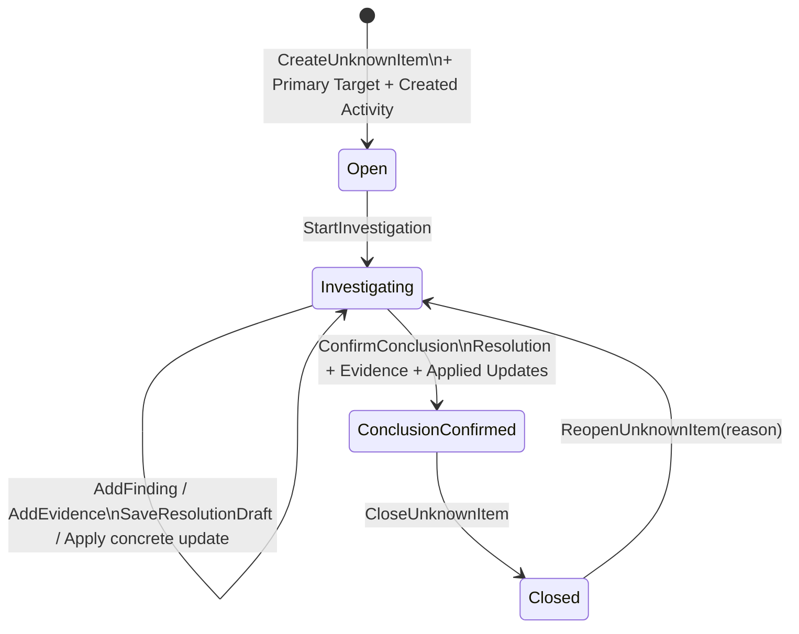
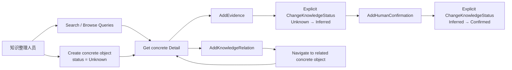
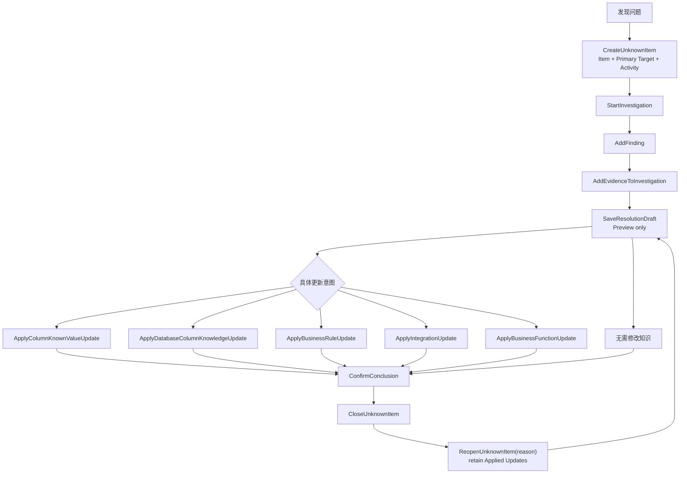
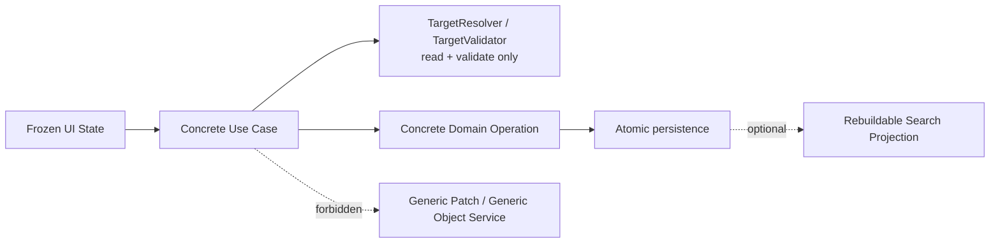

# System Knowledge Hub — MVP Application / Use Case Model

状态：**CONFIRMED / APPLICATION MODEL FROZEN**  
产品：系统知识中心 / System Knowledge Hub  
依据：

- `System_Knowledge_Hub_MVP_Final_UI_Inventory.md`
- `System_Knowledge_Hub_MVP_Design_Baseline.md`
- `System_Knowledge_Hub_MVP_Domain_Model.md`
- `System_Knowledge_Hub_MVP_Database_Model.md`

范围：定义 MVP 中用户可执行的明确业务操作、Application Use Case 边界、事务边界候选、输入输出语义与业务校验。不定义 Controller、API Route、DTO 类、C#、EF Core、Repository 实现、Migration、SQL、MediatR、CQRS Framework、Unit of Work Framework 或 Domain Event Framework。

## 1. Application Design Principles

1. **Use Case First**：先识别用户明确要完成的业务结果，再决定应用操作；不从数据库表反推 CRUD。
2. **具体对象优先**：System、BusinessFunction、DatabaseObject / Column、BusinessRule、Integration、UnknownItem 保持具体业务操作，不建立通用 Knowledge Object Service。
3. **Read First / Edit In Context**：查询返回页面完成判断所需的上下文；写操作对应冻结 UI 中的 Inline Edit、Drawer、Dialog 或明确工作流动作。
4. **Progressive Documentation**：对象以最小信息创建并保持 `Unknown`；Relationship、Evidence、推断与人工确认可后续独立补充。
5. **Evidence 不驱动状态**：保存普通 Evidence 或 Human Confirmation 都不自动改变 KnowledgeStatus；状态必须通过明确状态操作改变。
6. **Relationship 是正式知识**：关系通过 `AddKnowledgeRelation` 显式创建，并校验 RelationType 与端点；不从描述文本自动推断关系。
7. **Unknown Is Data**：UnknownItem 的创建、调查、发现、证据、结论、知识更新与关闭均为明确业务操作。
8. **短事务、原子结果**：一次用户确认动作产生的当前事实与必要 UnknownItemActivity 在同一短事务中提交；失败时整体回滚。
9. **查询与写入分开描述，不引入 CQRS Framework**：Query Contract 可使用专用读投影，但不因此引入 Bus、Handler、Read Database 或框架层级。
10. **受控多态，不做通用框架**：允许轻量 `TargetResolver / TargetValidator` 统一校验 `type + id`，但其允许类型固定且返回具体对象上下文，不提供通用对象 Repository 或动态写入。
11. **不以 CRUD 完整性补功能**：没有冻结 UI 或业务闭环依据的 Delete、Archive、Bulk Edit、Generic Patch 均不进入 MVP。
12. **Application 层协调、Domain 规则约束、Persistence 原子提交**：本阶段只定义职责，不指定 Aggregate Root、Repository 数量或 Unit of Work Framework。

### 1.1 Use Case Contract 通用语义

- 所有写操作接收执行人上下文；普通对象创建仅要求姓名，角色可选。Evidence、Finding、Resolution Confirmation、KnowledgeUpdate Apply 与 UnknownItem Activity 使用完整 PersonSnapshot，姓名、角色 / 身份与发生时间必需。
- 所有 ID 都是已存在对象的稳定标识；技术名称、文件名、数据库名与字段名保持原文。
- “Reads”表示完成校验和生成结果所需读取，不代表 Repository 边界。
- “Transaction: Required”表示该 Use Case 的列出写入必须原子提交，不代表定义 DDD Aggregate。
- 写入成功返回目标 ID、当前状态、`updated_at` 与 UI 下一步导航所需的最小摘要；不定义 HTTP 或 DTO 形式。
- 若启用搜索投影，其更新发生在领域数据成功写入后；搜索投影不是业务事务成功的必要条件，可重建。

## 2. Command / Write Use Case List

| ID | Use Case | 业务结果 | 主要 UI |
| --- | --- | --- | --- |
| C01 | `CreateSystem` | 以最小信息创建未知状态 System | OV-04 / OV-05 |
| C02 | `UpdateSystemOverview` | 原位维护系统概览 | ES-01 / RP-03 |
| C03 | `UpdateSystemTechnology` | 替换 System 技术标签集合 | ES-01 / RP-03 |
| C04 | `UpdateSystemLifecycle` | 明确改变系统生命周期 | ES-01 / RP-03 |
| C05 | `CreateBusinessFunction` | 创建未知状态业务功能 | OV-04 / OV-05 |
| C06 | `UpdateBusinessFunctionOverview` | 维护 Purpose、Caller、Input、Output 等 | ES-02 / RP-05 |
| C07 | `ReplaceBusinessProcessSteps` | 原子替换简洁有序流程步骤 | ES-02 / RP-05 |
| C08 | `CreateDatabaseSource` | 在 System 下登记数据库来源 | OV-04 / OV-05 / RP-06 |
| C09 | `RegisterDatabaseObject` | 手工登记 Table / View | OV-04 / OV-05 / RP-06 |
| C10 | `RegisterDatabaseColumn` | 手工登记对象字段元数据 | RP-07 |
| C11 | `UpdateDatabaseObjectKnowledge` | 更新对象级业务知识 | RP-07 |
| C12 | `UpdateDatabaseColumnKnowledge` | 更新字段级业务知识 | DR-11 / DR-03 |
| C13 | `AddColumnKnownValue` | 为字段添加明确值含义 | DR-11 |
| C14 | `RemoveColumnKnownValue` | 在字段编辑中移除错误值项 | DR-11 |
| C15 | `CreateBusinessRule` | 创建未知状态业务规则 | OV-04 / OV-05 |
| C16 | `UpdateBusinessRule` | 维护规则描述、条件、结果与输入 | DR-12 / RP-10 |
| C17 | `CreateIntegration` | 创建未知状态集成关系对象 | OV-04 / OV-05 |
| C18 | `UpdateIntegration` | 维护参与方、方向、用途与端点 | DR-13 / RP-11 |
| C19 | `ReplaceIntegrationContractFields` | 原子替换消息 / 数据契约字段 | DR-13 / RP-11 |
| C20 | `AddKnowledgeRelation` | 创建受控显式关系，状态为未知 | DR-06 / DR-07 |
| C21 | `UpdateKnowledgeRelationDescription` | 修订关系说明，不改变端点 | DR-02 / DR-07 |
| C22 | `ChangeRelationKnowledgeStatus` | 显式推进或回退关系知识状态 | DR-07 / DR-09 / DR-10 |
| C23 | `AddEvidence` | 为一个明确 Subject 添加证据 | DR-08 |
| C24 | `UpdateEvidence` | 修订一条证据的来源或说明，Subject 绑定保持不变 | DR-09 |
| C25 | `AddHumanConfirmation` | 添加 HumanConfirmation 类型 Evidence | DR-10 |
| C26 | `ChangeKnowledgeStatus` | 显式改变具体知识对象状态 | WF-08 / WF-09 |
| C27 | `CreateUnknownItem` | 创建待处理事项、Primary Target 与 Created Activity | RP-09 / OV-05 |
| C27a | `UpdateUnknownItemRelatedTargets` | 渐进补充或移除非 Primary 相关对象 | RP-09 |
| C28 | `StartInvestigation` | 待处理 → 调查中 | RP-09 / WF-01 |
| C29 | `AddFinding` | 记录调查发现与 Activity | WF-02 |
| C30 | `AddEvidenceToInvestigation` | 添加调查证据与 Activity | DR-08 / WF-03 |
| C31 | `SaveResolutionDraft` | 保存结论草稿与可选知识更新预览 | WF-04 |
| C32a | `ApplyColumnKnownValueUpdate` | 应用“新增字段已知值”知识更新 | WF-04 |
| C32b | `ApplyDatabaseColumnKnowledgeUpdate` | 应用“更新字段知识”知识更新 | WF-04 |
| C32c | `ApplyBusinessRuleUpdate` | 应用“更新业务规则”知识更新 | WF-04 |
| C32d | `ApplyIntegrationUpdate` | 应用“更新集成关系对象”知识更新 | WF-04 |
| C32e | `ApplyBusinessFunctionUpdate` | 应用“更新业务功能”知识更新 | WF-04 |
| C33 | `ConfirmConclusion` | 调查中 → 结论已确认 | WF-05 |
| C34 | `CloseUnknownItem` | 结论已确认 → 已关闭 | WF-06 |
| C35 | `ReopenUnknownItem` | 已关闭 → 调查中 | WF-06 / WF-01 |

`ApplyKnowledgeUpdate` 是 C32a–C32e 的 UI / 工作流族名，不是可直接执行的 Generic Command。第一版只有上表列出的具体 Apply 操作。

## 3. Query Use Case List

| ID | Query | 主要用途 | UI |
| --- | --- | --- | --- |
| Q01 | `GetDashboard` | 知识数量、进展、需要关注、最近整理 | RP-01 |
| Q02 | `SearchKnowledge` | 全局分组搜索与键盘导航 | OV-01 / OV-02 / OV-03 |
| Q03 | `SearchKnowledgeTargets` | Add Relationship / Evidence / Unknown Target 的受控目标选择 | DR-06 / DR-08 / OV-05 |
| Q04 | `GetSystemsList` | 搜索与筛选系统 | RP-02 |
| Q05 | `GetSystemDetail` | 系统主体知识、关系与缺口 | RP-03 |
| Q06 | `GetBusinessFunctionsList` | 搜索与筛选业务功能 | RP-04 |
| Q07 | `GetBusinessFunctionDetail` | 功能主体知识、过程、关系与缺口 | RP-05 |
| Q08 | `GetDatabaseObjectsList` | Database / Schema 浏览及对象搜索 | RP-06 |
| Q09 | `GetDatabaseObjectDetail` | Table / View 概览、字段和 Table-level Context | RP-07 |
| Q10 | `GetColumnDetail` | 字段知识、Evidence、Known Values、关系与缺口 | DR-03 |
| Q11 | `GetUnknownItemsList` | 日常调查工作列表与筛选 | RP-08 |
| Q12 | `GetUnknownItemDetail` | 完整调查闭环与当前可用操作 | RP-09 / WF-00–WF-06 |
| Q13 | `GetBusinessRuleDetail` | 规则、字段、集成、Evidence 与缺口 | RP-10 |
| Q14 | `GetIntegrationDetail` | 参与方、端点、契约、Evidence 与缺口 | RP-11 |
| Q15 | `GetRelationshipDetail` | 显式关系、端点、状态与 Evidence | DR-02 / DR-07 |
| Q16 | `GetEvidenceDetail` | Evidence 来源、支持理由和目标上下文 | DR-09 |

Global Search 的最近搜索 / 最近访问第一版视为客户端会话级辅助状态，不新增 Person、Audit 或 RecentSearch 领域能力。Dashboard 的“最近整理”从各具体对象 `updated_at` 形成查询投影。

## 4. 每个 Use Case 详细定义

### 4.1 System Commands

#### C01 `CreateSystem`

| 项目 | 定义 |
| --- | --- |
| User Intent | 用最小必要信息登记一个系统，后续再渐进补充知识。 |
| Input | Name、DisplayName、SystemType、SystemLifecycle；可选 Purpose；创建人姓名与可选角色。 |
| Preconditions | 无同名 System。 |
| Validation | Name / DisplayName 非空；Lifecycle 属于封闭枚举；Name 按技术标识规则规范化并进行不区分 ASCII 大小写唯一检查。 |
| Writes / Reads | 读取名称唯一性；写入 System，KnowledgeStatus 固定为 `Unknown`。 |
| Transaction Requirement | Required；单个 System 写入原子提交。 |
| Result | SystemId、名称、Lifecycle、KnowledgeStatus=`Unknown`、详情导航信息。 |
| Failure Cases | 重名、枚举非法、必填项缺失。 |
| Related UI Reference | OV-04、OV-05，完成后进入 RP-03。 |

#### C02 `UpdateSystemOverview`

| 项目 | 定义 |
| --- | --- |
| User Intent | 在 System Detail 原位维护用途、主要用户、仓库、部署、项目、入口与备注。 |
| Input | SystemId；DisplayName、SystemType、Purpose、MainUsers、Repository、Deployment、MainProjects、MainEntryPoints、Notes 的明确编辑值。 |
| Preconditions | System 存在。 |
| Validation | 不允许通过此操作改变 Name、Lifecycle 或 KnowledgeStatus；JSON 值满足冻结 Database Model 的结构约束。 |
| Writes / Reads | 读取当前 Overview；更新允许字段与 `updated_at`。 |
| Transaction Requirement | Required；一次 Section Save 原子提交。 |
| Result | 更新后的 Overview 摘要。 |
| Failure Cases | System 不存在、结构非法、修改了不允许字段、并发内容已变化。 |
| Related UI Reference | ES-01、RP-03。 |

#### C03 `UpdateSystemTechnology`

| 项目 | 定义 |
| --- | --- |
| User Intent | 在系统编辑中维护技术标签集合。 |
| Input | SystemId、完整 Technology 字符串集合。 |
| Preconditions | System 存在。 |
| Validation | 去空白、忽略 ASCII 大小写去重、禁止空标签；不创建 Technology 实体。 |
| Writes / Reads | 读取当前标签；在父对象编辑内增删 `system_technology_tags` 并更新 System `updated_at`。 |
| Transaction Requirement | Required；集合替换不可留下半更新状态。 |
| Result | 规范化后的 Technology 集合。 |
| Failure Cases | System 不存在、标签为空或重复、并发修改冲突。 |
| Related UI Reference | ES-01、RP-03。 |

#### C04 `UpdateSystemLifecycle`

| 项目 | 定义 |
| --- | --- |
| User Intent | 明确记录 System 当前生命周期，包括退役。 |
| Input | SystemId、TargetLifecycle。 |
| Preconditions | System 存在。 |
| Validation | Lifecycle 合法；`Retired` 替代物理删除；Lifecycle 与 KnowledgeStatus 完全独立。 |
| Writes / Reads | 读取当前 Lifecycle；更新 Lifecycle 与 `updated_at`。 |
| Transaction Requirement | Required。 |
| Result | 新 Lifecycle；不改变 KnowledgeStatus。 |
| Failure Cases | System 不存在、枚举非法、无实际变化。 |
| Related UI Reference | ES-01、RP-03。 |

### 4.2 Business Function Commands

#### C05 `CreateBusinessFunction`

| 项目 | 定义 |
| --- | --- |
| User Intent | 在明确 System Context 下创建一个业务功能。 |
| Input | SystemId、Name、FunctionType；可选 DisplayName、Purpose；RewriteStatus 默认 `Unknown`；创建人。 |
| Preconditions | System 存在且是当前页面上下文。 |
| Validation | 同一 System 内 Name 唯一；枚举合法；不接受 RuleIds、DataIds 或 IntegrationIds。 |
| Writes / Reads | 读取 System 与唯一性；写入 BusinessFunction，KnowledgeStatus=`Unknown`。 |
| Transaction Requirement | Required。 |
| Result | BusinessFunctionId 与详情导航信息。 |
| Failure Cases | System 不存在、System Context 不一致、重名、必填项缺失。 |
| Related UI Reference | OV-04、OV-05，完成后进入 RP-05。 |

#### C06 `UpdateBusinessFunctionOverview`

| 项目 | 定义 |
| --- | --- |
| User Intent | 维护功能本身的名称、类型、Purpose、Caller、Input、Output 与 RewriteStatus。 |
| Input | BusinessFunctionId；允许编辑的 Overview 字段。 |
| Preconditions | BusinessFunction 存在。 |
| Validation | 不改变 SystemId、KnowledgeStatus、ProcessSteps 或 Relationships；同 System 名称唯一。 |
| Writes / Reads | 读取当前功能和 System Context；更新 Overview 与 `updated_at`。 |
| Transaction Requirement | Required。 |
| Result | 更新后的功能 Overview。 |
| Failure Cases | 对象不存在、重名、枚举非法、跨 System 移动尝试、并发变化。 |
| Related UI Reference | ES-02、RP-05。 |

#### C07 `ReplaceBusinessProcessSteps`

| 项目 | 定义 |
| --- | --- |
| User Intent | 将业务过程保存为一组简单、可扫描的有序步骤。 |
| Input | BusinessFunctionId、完整 Steps 列表，每项含 Order、Name、可选 Description。 |
| Preconditions | BusinessFunction 存在。 |
| Validation | Order 从 1 开始、唯一且连续；Name 非空；不接受 BPMN、脚本或 Relation 绑定。 |
| Writes / Reads | 读取当前步骤；在父级编辑内新增、更新或删除 Step，更新 Function `updated_at`。 |
| Transaction Requirement | Required；完整列表一次提交。 |
| Result | 新的有序 ProcessSteps。 |
| Failure Cases | Function 不存在、顺序重复 / 断裂、空步骤、并发变化。 |
| Related UI Reference | ES-02、RP-05。 |

### 4.3 Database Knowledge Commands

#### C08 `CreateDatabaseSource`

| 项目 | 定义 |
| --- | --- |
| User Intent | 在 System 下登记一个实际数据库来源。 |
| Input | SystemId、Name、Engine；可选 Environment、InstanceName、ServiceName、DatabaseName、Description、IsPrimary；创建人。 |
| Preconditions | System 存在。 |
| Validation | 同 System 名称唯一；最多一个 Primary Source；不得提交连接密码或密钥。 |
| Writes / Reads | 读取 System、名称和 Primary 冲突；写入 DatabaseSource。第一版不写 KnowledgeStatus。 |
| Transaction Requirement | Required。 |
| Result | DatabaseSourceId 与数据库浏览上下文。 |
| Failure Cases | System 不存在、重名、Primary 冲突、必填项缺失、包含敏感凭据。 |
| Related UI Reference | OV-04、OV-05、RP-06。 |

#### C09 `RegisterDatabaseObject`

| 项目 | 定义 |
| --- | --- |
| User Intent | 手工登记一个 Table 或 View；当前不执行自动数据库导入。 |
| Input | DatabaseSourceId、SchemaName、ObjectName、ObjectType；可选 EstimatedRows、AccessMode、PrimaryKeyColumns、BusinessKeyColumns、BusinessDescription；创建人。 |
| Preconditions | DatabaseSource 与其 System 存在。 |
| Validation | 同 Source + Schema 下 ObjectName 唯一；类型、AccessMode 合法；行数非负；Key Column 名称去重。 |
| Writes / Reads | 读取 Source 与唯一性；写入 DatabaseObject，KnowledgeStatus=`Unknown`。 |
| Transaction Requirement | Required。 |
| Result | DatabaseObjectId、完整限定名与详情导航信息。 |
| Failure Cases | Source 不存在、重名、枚举 / 元数据非法。 |
| Related UI Reference | OV-04、OV-05、RP-06，完成后进入 RP-07。 |

#### C10 `RegisterDatabaseColumn`

| 项目 | 定义 |
| --- | --- |
| User Intent | 在已登记 DatabaseObject 下手工登记字段元数据。 |
| Input | DatabaseObjectId、OrdinalPosition、ColumnName、DataType、IsNullable；可选 DefaultValue、DatabaseComment、BusinessDescription。 |
| Preconditions | DatabaseObject 存在。 |
| Validation | 同对象 ColumnName 与 OrdinalPosition 唯一；位置大于 0；技术标识非空；不通过此操作创建 KnownValue、Relation 或 Evidence。 |
| Writes / Reads | 读取父对象与唯一性；写入 DatabaseColumn，KnowledgeStatus=`Unknown`。 |
| Transaction Requirement | Required。 |
| Result | DatabaseColumnId 与 Column Drawer 定位信息。 |
| Failure Cases | 父对象不存在、字段或位置重复、元数据非法。 |
| Related UI Reference | RP-07、DR-03。 |

#### C11 `UpdateDatabaseObjectKnowledge`

| 项目 | 定义 |
| --- | --- |
| User Intent | 维护 Table / View 的业务说明与访问语义。 |
| Input | DatabaseObjectId、BusinessDescription、AccessMode；可选 BusinessKeyColumns。 |
| Preconditions | DatabaseObject 存在。 |
| Validation | 不改变 Source、Schema、ObjectName、ObjectType 或 KnowledgeStatus；BusinessKey 必须引用该对象已登记 Column。 |
| Writes / Reads | 读取对象及 Columns；更新业务知识字段与 `updated_at`。 |
| Transaction Requirement | Required。 |
| Result | 更新后的对象知识摘要。 |
| Failure Cases | 对象不存在、跨对象字段引用、AccessMode 非法、并发变化。 |
| Related UI Reference | RP-07。 |

#### C12 `UpdateDatabaseColumnKnowledge`

| 项目 | 定义 |
| --- | --- |
| User Intent | 在 Column Drawer 中维护字段业务含义，不编辑数据库技术元数据。 |
| Input | DatabaseColumnId、BusinessDescription。 |
| Preconditions | DatabaseColumn 存在。 |
| Validation | 不改变 ColumnName、DataType、Nullable、DefaultValue、OrdinalPosition 或 KnowledgeStatus；KnownValues 与 Evidence 使用独立操作。 |
| Writes / Reads | 读取 Column；更新 BusinessDescription 与 `updated_at`。 |
| Transaction Requirement | Required。 |
| Result | 更新后的字段业务知识。 |
| Failure Cases | Column 不存在、尝试编辑只读元数据、并发变化。 |
| Related UI Reference | DR-11、DR-03。 |

#### C13 `AddColumnKnownValue`

| 项目 | 定义 |
| --- | --- |
| User Intent | 明确记录字段某个值的业务含义。 |
| Input | DatabaseColumnId、ValueText、Meaning、可选 SortOrder。 |
| Preconditions | Column 存在。 |
| Validation | 同 Column 下 ValueText 唯一；ValueText 与 Meaning 非空；不自动改变 Column KnowledgeStatus。 |
| Writes / Reads | 读取 Column 与重复值；写入 ColumnKnownValue，更新 Column `updated_at`。 |
| Transaction Requirement | Required。 |
| Result | 新 KnownValue 与更新后的列表。 |
| Failure Cases | Column 不存在、Value 重复、内容为空。 |
| Related UI Reference | DR-11。 |

#### C14 `RemoveColumnKnownValue`

| 项目 | 定义 |
| --- | --- |
| User Intent | 在字段知识编辑中移除误录或不再成立的具体值项。 |
| Input | DatabaseColumnId、ColumnKnownValueId、明确确认。 |
| Preconditions | KnownValue 属于该 Column。 |
| Validation | 只删除该依赖行；不删除 Column；若该值已被 Evidence 的 SubjectDetailKey 或开放 UnknownItem 明确引用，则拒绝并要求先修正引用。 |
| Writes / Reads | 读取归属及受控引用；删除 KnownValue，更新 Column `updated_at`。 |
| Transaction Requirement | Required。 |
| Result | 更新后的 KnownValues 列表。 |
| Failure Cases | 值不存在 / 不属于 Column、仍被引用、缺少明确确认。 |
| Related UI Reference | DR-11。 |

### 4.4 Business Rule Commands

#### C15 `CreateBusinessRule`

| 项目 | 定义 |
| --- | --- |
| User Intent | 在 System Context 下创建可独立追踪的业务规则。 |
| Input | SystemId、RuleName、Description；可选 Condition、Result、InputData；创建人。 |
| Preconditions | System 存在。 |
| Validation | 同 System 内 RuleName 唯一；Description 非空；不接受 PrimaryBusinessFunctionId。 |
| Writes / Reads | 读取 System 与唯一性；写入 BusinessRule，KnowledgeStatus=`Unknown`。 |
| Transaction Requirement | Required。 |
| Result | BusinessRuleId 与详情导航信息。 |
| Failure Cases | System 不存在、重名、描述为空、提交 Primary Function 绑定。 |
| Related UI Reference | OV-04、OV-05，完成后进入 RP-10。 |

#### C16 `UpdateBusinessRule`

| 项目 | 定义 |
| --- | --- |
| User Intent | 编辑规则自身的名称、描述、Condition、Result 和 InputData。 |
| Input | BusinessRuleId 与允许编辑字段。 |
| Preconditions | BusinessRule 存在。 |
| Validation | 同 System 名称唯一；不改变 SystemId、KnowledgeStatus、相关 Function、Fields、Integrations 或 Evidence。关系由 C20 管理。 |
| Writes / Reads | 读取当前规则与 System；更新规则具体字段与 `updated_at`。 |
| Transaction Requirement | Required。 |
| Result | 更新后的规则详情摘要。 |
| Failure Cases | 规则不存在、重名、输入结构非法、尝试嵌入关系更新。 |
| Related UI Reference | DR-12、RP-10。 |

### 4.5 Integration Commands

#### C17 `CreateIntegration`

| 项目 | 定义 |
| --- | --- |
| User Intent | 登记 HTTP API、RabbitMQ、File Exchange 或 Database Dependency。 |
| Input | Name、IntegrationType、SourceParty、TargetParty、FlowDirection；可选 Purpose 与对应类型 Endpoint；创建人。 |
| Preconditions | 至少一个 Party 的 SystemId 指向已登记 System。 |
| Validation | 类型与 Endpoint 结构匹配；Source / Target 名称非空；至少一端 SystemId 存在；DatabaseDependency 的 Source / Object 归属一致；唯一性成立。 |
| Writes / Reads | 读取参与 System 和 Database Target；写入 Integration，KnowledgeStatus=`Unknown`。 |
| Transaction Requirement | Required。 |
| Result | IntegrationId 与详情导航信息。 |
| Failure Cases | 两端均未登记、System / Database Target 不存在、Endpoint 类型不匹配、重复。 |
| Related UI Reference | OV-04、OV-05，完成后进入 RP-11。 |

#### C18 `UpdateIntegration`

| 项目 | 定义 |
| --- | --- |
| User Intent | 维护集成对象的名称、参与方、方向、用途与 Endpoint。 |
| Input | IntegrationId 与允许编辑字段。 |
| Preconditions | Integration 存在。 |
| Validation | 更新后仍至少一端关联已登记 System；Endpoint 与 Type 一致；DatabaseDependency 归属一致；不改变 KnowledgeStatus、ContractFields、Relationships 或 Evidence。 |
| Writes / Reads | 读取当前 Integration 及引用对象；更新具体字段与 `updated_at`。 |
| Transaction Requirement | Required。 |
| Result | 更新后的 Integration 摘要。 |
| Failure Cases | Integration 不存在、更新后失去已登记 System、端点非法、重复、并发变化。 |
| Related UI Reference | DR-13、RP-11。 |

#### C19 `ReplaceIntegrationContractFields`

| 项目 | 定义 |
| --- | --- |
| User Intent | 维护 Integration 的有序消息 / 数据契约字段。 |
| Input | IntegrationId、完整 ContractFields 列表：Order、FieldName、DataType、Required、Description、SampleValue。 |
| Preconditions | Integration 存在。 |
| Validation | Order 唯一连续；FieldName 在 Integration 内唯一；样例保持简短；不保存完整 Payload。 |
| Writes / Reads | 读取当前契约；在父对象编辑内增删改 ContractField，更新 Integration `updated_at`。 |
| Transaction Requirement | Required；集合替换原子提交。 |
| Result | 新的有序 ContractFields。 |
| Failure Cases | Integration 不存在、字段 / 顺序重复、无效内容、并发变化。 |
| Related UI Reference | DR-13、RP-11。 |

### 4.6 Relationship Commands

#### C20 `AddKnowledgeRelation`

| 项目 | 定义 |
| --- | --- |
| User Intent | 在两个已登记知识对象之间创建一条明确、可追踪的关系。 |
| Input | SourceRef、RelationType、TargetRef、可选 Description；创建人。 |
| Preconditions | Source 与 Target 存在；用户从明确 System Context 发起。 |
| Validation | Type 为 KnowledgeTargetType；两端不相同；端点 System Context 与页面上下文一致或是 RelationType 明确允许的跨系统关系；端点组合符合封闭矩阵；精确关系不重复。`Calls` 只允许同一 System 内的 `BusinessFunction → BusinessFunction`；跨系统 Function 交互必须通过 Integration 关系表达，无法确定 Integration 时创建 UnknownItem，不得用跨系统 `Calls` 绕过。 |
| Writes / Reads | TargetResolver 读取两端与 System Context；写入 KnowledgeRelation，KnowledgeStatus=`Unknown`。 |
| Transaction Requirement | Required。 |
| Result | RelationId、端点 Preview、状态 `Unknown`；可继续添加 Evidence。 |
| Failure Cases | 类型 / ID 非法、上下文不一致、端点组合非法、自关联、重复关系。 |
| Related UI Reference | DR-06、DR-07。 |

#### C21 `UpdateKnowledgeRelationDescription`

| 项目 | 定义 |
| --- | --- |
| User Intent | 修订既有关系的可读说明。 |
| Input | RelationId、Description。 |
| Preconditions | Relation 与两端仍存在。 |
| Validation | 不允许改变 Source、Target、RelationType 或 KnowledgeStatus；端点变更应创建新的正确关系，但 MVP 不提供通用删除旧关系，因此错误端点属于需人工处理的异常。 |
| Writes / Reads | 读取 Relation 与端点；更新 Description、`updated_at`。 |
| Transaction Requirement | Required。 |
| Result | 更新后的 Relationship Detail。 |
| Failure Cases | Relation / 端点不存在、试图修改端点或类型、并发变化。 |
| Related UI Reference | DR-02、DR-07。 |

#### C22 `ChangeRelationKnowledgeStatus`

| 项目 | 定义 |
| --- | --- |
| User Intent | 明确推进或回退一条关系的可信状态。 |
| Input | RelationId、TargetStatus、Reason、ActorName、ActorRole、OccurredAt。 |
| Preconditions | Relation 及两端存在。 |
| Validation | 使用第 7 节状态规则；Evidence 不自动触发；`Unknown → Inferred` 缺少有效相关 Evidence 时拒绝；`Inferred → Confirmed` 缺少完整 HumanConfirmation 时拒绝；回退 Reason 必填。 |
| Writes / Reads | 读取 Relation 当前状态和相关 Evidence；更新 KnowledgeStatus 最近修改列。 |
| Transaction Requirement | Required。 |
| Result | 新状态与状态变化摘要。 |
| Failure Cases | Relation 不存在、非法跃迁、推断操作缺少有效相关 Evidence、回退无原因、确认操作缺少完整 HumanConfirmation。 |
| Related UI Reference | DR-07、DR-09、DR-10、WF-08、WF-09。 |

### 4.7 Evidence Commands

#### C23 `AddEvidence`

| 项目 | 定义 |
| --- | --- |
| User Intent | 为一个明确 Subject 记录“为什么相信这条知识”。 |
| Input | EvidenceType、SubjectType、SubjectId、可选 SubjectDetailKey、SourceTitle、SourceReference 或 SourceLocator、可选 Summary、SupportReason、Confidence、ProviderSnapshot。 |
| Preconditions | Subject 存在且位于当前 System Context；EvidenceType 不是 HumanConfirmation。 |
| Validation | SubjectType 为封闭枚举；一条 Evidence 只绑定一个 Subject；Locator 至少一种存在；SupportReason 非空；SubjectDetailKey 只定位已知区域，不是动态字段。 |
| Writes / Reads | TargetResolver 读取 Subject；写入 Evidence。 |
| Transaction Requirement | Required。 |
| Result | EvidenceId 与 Evidence Detail；Subject KnowledgeStatus 不改变。 |
| Failure Cases | Subject 不存在 / Context 不一致、类型非法、Locator 或支持理由缺失、误用 HumanConfirmation。 |
| Related UI Reference | DR-08、DR-09。 |

#### C24 `UpdateEvidence`

| 项目 | 定义 |
| --- | --- |
| User Intent | 修订误录的 Evidence 来源、摘要、支持理由、可信度或提供人快照。 |
| Input | EvidenceId；允许修改 SourceTitle、SourceReference / SourceLocator、Summary、SupportReason、Confidence 与 ProviderSnapshot 的修正信息。 |
| Preconditions | Evidence 与原 Subject 存在。 |
| Validation | SubjectType、SubjectId、SubjectDetailKey 与 EvidenceType 不可在此改变；Locator 合法；不得借此改变 Subject KnowledgeStatus。误绑 Subject 时不提供重绑定或删除捷径，作为需人工处理的异常。 |
| Writes / Reads | 读取 Evidence 与原 Subject；更新允许字段与 `updated_at`。 |
| Transaction Requirement | Required。 |
| Result | 更新后的 Evidence Detail。 |
| Failure Cases | Evidence / Subject 不存在、Context 不一致、Locator 非法、并发变化。 |
| Related UI Reference | DR-09。 |

#### C25 `AddHumanConfirmation`

| 项目 | 定义 |
| --- | --- |
| User Intent | 将业务专家或责任人的人工确认记录为 Evidence。 |
| Input | SubjectType、SubjectId、可选 SubjectDetailKey、ConfirmationStatement、SupportReason、ConfirmerSnapshot；可选来源备注。 |
| Preconditions | Subject 存在；确认人姓名、角色 / 身份、时间完整。 |
| Validation | EvidenceType 固定为 `HumanConfirmation`；不建立审批人、任务或权限；一条确认只绑定一个 Subject。 |
| Writes / Reads | 读取 Subject；写入 HumanConfirmation Evidence。 |
| Transaction Requirement | Required。 |
| Result | EvidenceId 与确认预览；KnowledgeStatus 仍不自动变化，用户可随后明确执行 C26 / C22。 |
| Failure Cases | Subject 不存在、人员快照不完整、确认内容为空、Context 不一致。 |
| Related UI Reference | DR-10。 |

### 4.8 General Knowledge Status Command

#### C26 `ChangeKnowledgeStatus`

| 项目 | 定义 |
| --- | --- |
| User Intent | 对 System、BusinessFunction、DatabaseObject、DatabaseColumn、BusinessRule 或 Integration 明确推进或回退知识状态。 |
| Input | TargetRef、TargetStatus、Reason、ActorName、ActorRole、OccurredAt。 |
| Preconditions | Target 存在且其类型支持持久化 KnowledgeStatus；DatabaseSource 不允许。 |
| Validation | 第 7 节允许的状态变化；`Unknown → Inferred` 需要明确相关且可访问或具有有效 Source Locator 的 Evidence；`Inferred → Confirmed` 需要相关且确认人快照完整的 HumanConfirmation；回退 Reason 非空；Evidence 本身不触发状态变化。 |
| Writes / Reads | TargetResolver 读取具体对象、当前状态和相关 Evidence；更新该具体表的 KnowledgeStatus 列组与 `updated_at`。 |
| Transaction Requirement | Required；只修改一个明确具体对象。 |
| Result | Target 摘要、新状态与原因。 |
| Failure Cases | Target 不存在、类型不支持、非法跃迁、推断操作缺少有效相关 Evidence、回退无原因、缺少完整 HumanConfirmation、Context 不一致。 |
| Related UI Reference | DR-09、DR-10、WF-08、WF-09。 |

`KnowledgeRelation` 使用 C22，因为它还必须校验两个端点；不通过 C26 绕开关系端点规则。

### 4.9 Unknown Item Commands

#### C27 `CreateUnknownItem`

| 项目 | 定义 |
| --- | --- |
| User Intent | 在发现知识缺口时创建一个可调查的正式事项。 |
| Input | SystemId、Question、Priority、PrimaryTargetRef；可选 Context、RelatedTargetRefs；CreatorSnapshot。 |
| Preconditions | System 与所有 Target 存在。 |
| Validation | Question 非空；Priority 合法；Primary Target 恰好一个；全部 Target 与 System Context 一致；Target 不重复。 |
| Writes / Reads | 读取 System / Targets；写入 UnknownItem(status=`Open`)、Primary / Related Targets、Created Activity。 |
| Transaction Requirement | **Required**；三部分必须同一事务，不能产生无 Target 或无 Created Activity 的事项。 |
| Result | UnknownItemId、ItemCode、状态 `Open` 与详情导航。 |
| Failure Cases | Target 不存在 / Context 不一致、无 Primary Target、重复 Target、Priority 非法、人员快照不完整。 |
| Related UI Reference | OV-04、OV-05、RP-09 / WF-00。 |

#### C27a `UpdateUnknownItemRelatedTargets`

| 项目 | 定义 |
| --- | --- |
| User Intent | 在调查过程中渐进补充相关对象，或移除误选的非 Primary Target。 |
| Input | UnknownItemId、完整 RelatedTargetRefs 集合；PrimaryTarget 不在此变更。 |
| Preconditions | UnknownItem 存在且未 Closed；Primary Target 仍存在。 |
| Validation | 所有 Target 存在并与 Item System Context 一致；不得重复或包含 Primary Target；移除前确认该 Target 没有被本事项 Proposed / Applied KnowledgeUpdate 使用。 |
| Writes / Reads | 读取 Item、Primary Target、现有 Related Targets 与 Updates；增删非 Primary `unknown_item_targets`，更新 Item `updated_at`。 |
| Transaction Requirement | **Required**；集合调整原子提交。当前冻结 ActivityType 没有 TargetChanged，因此不写 Activity。 |
| Result | 更新后的 Related Objects 摘要。 |
| Failure Cases | Item 不存在 / 已关闭、Context 不一致、试图改变 Primary Target、Target 被 Update 引用。 |
| Related UI Reference | RP-09 的 Related Objects / Item-level Context。 |

#### C28 `StartInvestigation`

| 项目 | 定义 |
| --- | --- |
| User Intent | 明确开始调查待处理事项。 |
| Input | UnknownItemId、ActorSnapshot。 |
| Preconditions | 当前状态为 `Open`。 |
| Validation | 不允许从 Investigating / ConclusionConfirmed / Closed 重复开始；ActorSnapshot 完整。 |
| Writes / Reads | 读取事项；更新 status=`Investigating`、首次 `investigation_started_at`；写 StatusChanged Activity。 |
| Transaction Requirement | **Required**；状态、时间与 Activity 同一事务。 |
| Result | 新状态、开始时间与可用调查操作。 |
| Failure Cases | 事项不存在、当前状态非法、人员快照不完整、并发状态变化。 |
| Related UI Reference | RP-09、WF-00 → WF-01。 |

#### C29 `AddFinding`

| 项目 | 定义 |
| --- | --- |
| User Intent | 记录调查中发现的事实或观察，不把它当作最终结论。 |
| Input | UnknownItemId、Content、RecorderSnapshot。 |
| Preconditions | 当前状态为 `Investigating`。 |
| Validation | Content 非空；RecorderSnapshot 完整。 |
| Writes / Reads | 读取事项状态；写 Finding 与 FindingAdded Activity。 |
| Transaction Requirement | **Required**；Finding 与 Activity 同一事务。 |
| Result | FindingId、调查时间线新条目。 |
| Failure Cases | 事项不存在 / 不在调查中、内容为空、人员快照不完整。 |
| Related UI Reference | WF-02、RP-09。 |

#### C30 `AddEvidenceToInvestigation`

| 项目 | 定义 |
| --- | --- |
| User Intent | 将 Evidence 绑定到 UnknownItem、Finding 或 Resolution，并加入调查时间线。 |
| Input | UnknownItemId；Evidence 输入；Subject 必须是该 UnknownItem、本事项 Finding 或本事项 Resolution。 |
| Preconditions | 当前状态为 `Investigating`；Subject 属于该调查。 |
| Validation | 复用 C23 / C25 的 Evidence 校验；Subject 归属同一 UnknownItem；一条 Evidence 一个 Subject。 |
| Writes / Reads | 读取事项、Subject；写 Evidence 与 EvidenceAdded Activity。 |
| Transaction Requirement | **Required**；Evidence 与 Activity 同一事务。 |
| Result | EvidenceId、时间线新条目；事项与知识状态不自动改变。 |
| Failure Cases | 状态非法、Subject 不属于事项、Evidence 内容非法、人员快照不完整。 |
| Related UI Reference | DR-08、WF-03、RP-09。 |

#### C31 `SaveResolutionDraft`

| 项目 | 定义 |
| --- | --- |
| User Intent | 保存最终结论草稿，并预览将对哪些具体知识内容产生影响。 |
| Input | UnknownItemId、Conclusion；零到多个具体 KnowledgeUpdate Draft，每项含 ExistingKnowledgeUpdateId（新建时为空）、TargetRef、SubjectDetailKey、ChangeSummary、BeforeSnapshot、AfterSnapshot、可选 KnowledgeStatusBefore / After。 |
| Preconditions | 当前状态为 `Investigating`。 |
| Validation | Conclusion 非空；每个 Update Target 存在且与事项 System Context 一致；Snapshot 是可读预览而非 Patch；Status 前后成对；Update 必须属于 C32a–C32e 支持的具体目标语义。 |
| Writes / Reads | 读取事项、Targets、当前目标值、当前唯一 Resolution 与历史 Updates；新增或明确修订当前 Resolution；按 ID 新增或更新 `Proposed` KnowledgeUpdates。已 `Applied` Update 作为调查事实永久只读保留，不被覆盖、删除或改回 `Proposed`。若 Reopen 后修改曾确认的 Resolution，清空当前 Resolution 的确认字段以等待再次确认，但不回滚任何历史 Applied Update；ResolutionRecorded Activity 记录可读的“原结论摘要 → 修订结论摘要”及 Proposed Update 变化，使用户无需版本树或 diff framework 也能理解结论变化。 |
| Transaction Requirement | **Required**；Resolution、当前预览和 Activity 一致提交。 |
| Result | ResolutionId、Knowledge Update Preview、仍为 `Investigating`。 |
| Failure Cases | 状态非法、结论为空、Target 不存在 / Context 不一致、不支持的更新语义、Snapshot 与当前事实不一致。 |
| Related UI Reference | WF-04、RP-09。 |

#### C32a `ApplyColumnKnownValueUpdate`

| 项目 | 定义 |
| --- | --- |
| User Intent | 应用 Resolution 中“为字段新增已知值”的建议。 |
| Input | UnknownItemId、KnowledgeUpdateId、ColumnId、ValueText、Meaning、可选目标 KnowledgeStatus；若为回退同时提供非空 Reason；ApplierSnapshot。 |
| Preconditions | 事项为 `Investigating`；Update 为 `Proposed` 且目标是同一 Column；Resolution 已存在。 |
| Validation | 复用 C13；Preview 未过期；可选状态变化符合第 7 节，回退必须有原因。 |
| Writes / Reads | 读取当前 Column / KnownValues；按 C13 相同规则执行具体字段值修改（不是在事务内再调用另一个 Application Service）；记录真实 before / after；标记 Update=`Applied`；可选更新 Column 状态；写 KnowledgeUpdateApplied Activity。 |
| Transaction Requirement | **Required**；具体知识修改、Update 记录、状态与 Activity 同一事务。 |
| Result | Applied Update、更新后的 KnownValues 与 Column 状态。 |
| Failure Cases | Preview 过期、值重复、Target 不匹配、状态非法、并发变化。 |
| Related UI Reference | WF-04。 |

#### C32b `ApplyDatabaseColumnKnowledgeUpdate`

| 项目 | 定义 |
| --- | --- |
| User Intent | 应用 Resolution 中的字段业务含义修订。 |
| Input | UnknownItemId、KnowledgeUpdateId、ColumnId、BusinessDescription、可选目标 KnowledgeStatus；若为回退同时提供非空 Reason；ApplierSnapshot。 |
| Preconditions | 同 C32a；Update 目标为同一 Column。 |
| Validation | 复用 C12；Preview 未过期；状态变化合法。 |
| Writes / Reads | 执行具体字段知识修改；记录真实快照；标记 Applied；可选状态修改；写 Activity。 |
| Transaction Requirement | **Required**。 |
| Result | 更新后的 Column Knowledge 与 Applied 记录。 |
| Failure Cases | 同 C32a，加只读元数据修改尝试。 |
| Related UI Reference | WF-04、DR-11。 |

#### C32c `ApplyBusinessRuleUpdate`

| 项目 | 定义 |
| --- | --- |
| User Intent | 应用 Resolution 中对具体业务规则的修订。 |
| Input | UnknownItemId、KnowledgeUpdateId、BusinessRuleId、允许的规则字段、可选目标 KnowledgeStatus；若为回退同时提供非空 Reason；ApplierSnapshot。 |
| Preconditions | Update Target 为同一 BusinessRule，状态为 Proposed。 |
| Validation | 复用 C16；不更改关系；Preview 未过期；状态合法。 |
| Writes / Reads | 修改具体 BusinessRule；记录快照并标记 Applied；可选状态修改；写 Activity。 |
| Transaction Requirement | **Required**。 |
| Result | 更新后的规则与 Applied 记录。 |
| Failure Cases | Target / Context 不符、Preview 过期、规则校验失败、并发变化。 |
| Related UI Reference | WF-04、DR-12。 |

#### C32d `ApplyIntegrationUpdate`

| 项目 | 定义 |
| --- | --- |
| User Intent | 应用 Resolution 中对具体 Integration 的修订。 |
| Input | UnknownItemId、KnowledgeUpdateId、IntegrationId、允许的 Integration 字段、可选目标 KnowledgeStatus；若为回退同时提供非空 Reason；ApplierSnapshot。 |
| Preconditions | Update Target 为同一 Integration，状态为 Proposed。 |
| Validation | 复用 C18；至少一端仍是登记 System；Preview 未过期；状态合法。 |
| Writes / Reads | 修改具体 Integration；记录快照并标记 Applied；可选状态修改；写 Activity。 |
| Transaction Requirement | **Required**。 |
| Result | 更新后的 Integration 与 Applied 记录。 |
| Failure Cases | Target / Context 不符、参与方 / Endpoint 非法、Preview 过期、并发变化。 |
| Related UI Reference | WF-04、DR-13。 |

#### C32e `ApplyBusinessFunctionUpdate`

| 项目 | 定义 |
| --- | --- |
| User Intent | 应用 Resolution 中对具体 BusinessFunction Overview 的修订。 |
| Input | UnknownItemId、KnowledgeUpdateId、BusinessFunctionId、允许的 Overview 字段、可选目标 KnowledgeStatus；若为回退同时提供非空 Reason；ApplierSnapshot。 |
| Preconditions | Update Target 为同一 BusinessFunction，状态为 Proposed。 |
| Validation | 复用 C06；不修改 ProcessSteps / Relations；Preview 未过期；状态合法。 |
| Writes / Reads | 修改具体 BusinessFunction；记录快照并标记 Applied；可选状态修改；写 Activity。 |
| Transaction Requirement | **Required**。 |
| Result | 更新后的 Function 与 Applied 记录。 |
| Failure Cases | Target / Context 不符、Preview 过期、功能校验失败、并发变化。 |
| Related UI Reference | WF-04、ES-02。 |

#### C33 `ConfirmConclusion`

| 项目 | 定义 |
| --- | --- |
| User Intent | 明确确认调查结论，但暂不关闭事项。 |
| Input | UnknownItemId、ConfirmerSnapshot。 |
| Preconditions | 当前状态为 `Investigating`；Resolution 存在。 |
| Validation | 至少存在一条绑定 UnknownItem / 本事项 Finding / Resolution 的 Supporting Evidence；确认人快照完整；所有 Resolution 声明的 KnowledgeUpdate 均为 Applied。没有 KnowledgeUpdate 的结论允许确认。 |
| Writes / Reads | 读取完整闭环；填充 Resolution Confirmation；更新 status=`ConclusionConfirmed` 与时间；写 StatusChanged Activity。 |
| Transaction Requirement | **Required**；确认人、状态、时间和 Activity 同一事务。 |
| Result | 状态 `ConclusionConfirmed`，可执行 Close。 |
| Failure Cases | 无 Resolution / Evidence、存在未 Applied Update、状态非法、人员快照不完整、并发变化。 |
| Related UI Reference | WF-05、RP-09。 |

#### C34 `CloseUnknownItem`

| 项目 | 定义 |
| --- | --- |
| User Intent | 在结论已经确认后关闭事项。 |
| Input | UnknownItemId、ActorSnapshot、可选 CloseNote。 |
| Preconditions | 当前状态为 `ConclusionConfirmed`。 |
| Validation | Resolution Confirmation 仍完整；所有 Update 仍为 Applied；关闭不再次改变关联对象 KnowledgeStatus。 |
| Writes / Reads | 读取闭环；更新 status=`Closed`、`closed_at`；写 Closed Activity。 |
| Transaction Requirement | **Required**；校验、状态、时间与 Activity 同一事务。 |
| Result | 已关闭只读状态与 Reopen 操作。 |
| Failure Cases | 状态非法、闭环前置条件被破坏、人员快照不完整、并发变化。 |
| Related UI Reference | WF-06、RP-09。 |

#### C35 `ReopenUnknownItem`

| 项目 | 定义 |
| --- | --- |
| User Intent | 当已关闭结论需要继续调查时重新打开事项。 |
| Input | UnknownItemId、非空 Reason、ActorSnapshot。 |
| Preconditions | 当前状态为 `Closed`。 |
| Validation | Reason 非空；不撤销既有 KnowledgeUpdate，不回滚知识对象或 KnowledgeStatus。历史 `Applied` Update 永久保留为调查事实；新的修正通过新 / 修订当前 Resolution Draft 和新的 `Proposed` Update 表达。 |
| Writes / Reads | 读取事项；更新 status=`Investigating`、清空 `closed_at`；保留首次 investigation_started_at；写 Reopened Activity。 |
| Transaction Requirement | **Required**。 |
| Result | 状态 `Investigating`，原 Activity 和 Applied Updates 保留；后续路径为“新 / 修订 Resolution Draft → 新 Proposed KnowledgeUpdate → 具体 C32 Apply → 再次 ConfirmConclusion”。 |
| Failure Cases | 状态非法、Reason 为空、人员快照不完整、并发变化。 |
| Related UI Reference | WF-06 → WF-01、RP-09。 |

### 4.10 Query Use Case Details

查询不改变领域状态，不写 UnknownItemActivity。筛选值必须来自冻结枚举；分页、排序和分组属于 Contract 语义，不指定 API 或 DTO。

#### Q01 `GetDashboard`

- **User Intent**：快速了解当前知识规模、梳理程度、优先缺口与最近整理。
- **Input**：可选 System Context；默认全局。
- **Preconditions**：无。
- **Validation**：不得把 UnknownItemStatus 与 KnowledgeStatus 混算；DatabaseSource 不计 KnowledgeStatus。
- **Reads**：Systems、Functions、Objects、Columns、Rules、Integrations 的数量与状态；开放 UnknownItems；缺少描述 / 关系的查询条件；各对象 `updated_at`。
- **Transaction Requirement**：Read-only consistent view；不要求跨查询强事务快照。
- **Result**：Knowledge Overview、单一进展分段、Needs Attention、Recent Activity / Recently Updated。
- **Failure Cases**：查询不可用；单个统计失败时不得伪造为 0。
- **Related UI**：RP-01。

#### Q02 `SearchKnowledge`

- **User Intent**：用名称、技术标识或描述跨对象找到目标并继续导航。
- **Input**：QueryText、可选 Type Filter、Limit、当前键盘选中位置。
- **Preconditions**：QueryText 去空白后非空；空输入返回最近搜索 / 访问的会话状态。
- **Validation**：仅搜索冻结类型；结果必须带 System Context、ObjectType、ShortDescription 与正确的 Knowledge / UnknownItem Status。
- **Reads**：优先可选 FTS 投影；未启用时读取具体表进行受限 LIKE / Prefix Search。
- **Transaction Requirement**：Read-only；FTS 不可用不得阻塞基本搜索。
- **Result**：按类型分组结果；Column 结果携带所属 DatabaseObject 和自动打开 Drawer 的导航意图。
- **Failure Cases**：搜索投影不可用时降级；无结果返回恢复建议而非错误。
- **Related UI**：OV-01、OV-02、OV-03。

#### Q03 `SearchKnowledgeTargets`

- **User Intent**：在 Add Relationship、Evidence 或 UnknownItem 创建时查找允许的目标。
- **Input**：Purpose（RelationSource / RelationTarget / EvidenceSubject / UnknownTarget）、QueryText、当前 System Context、可选 SourceRef / RelationType。
- **Preconditions**：当前上下文存在。
- **Validation**：按用途限制 TargetType；若已选 RelationType，只返回合法端点候选；不返回通用对象类型。
- **Reads**：具体知识对象的搜索摘要与 System Context。
- **Transaction Requirement**：Read-only。
- **Result**：可预览的候选 TargetRef；保存时仍必须重新校验。
- **Failure Cases**：Context 不存在、Purpose 非法；无候选是正常结果。
- **Related UI**：DR-06、DR-08、OV-05。

#### Q04 `GetSystemsList`

- **User Intent**：搜索、筛选并进入 System。
- **Input**：Search、Lifecycle / Status Filter、Technology Filter、KnowledgeStatus Filter、Sort、Page。
- **Preconditions**：无。
- **Validation**：筛选枚举合法。
- **Reads**：System、Technology、Function / Database Object / Open Unknown 数量。
- **Transaction Requirement**：Read-only。
- **Result**：冻结列表列与导航到 RP-03 的 SystemId。
- **Failure Cases**：筛选非法、查询失败；空列表不是错误。
- **Related UI**：RP-02。

#### Q05 `GetSystemDetail`

- **User Intent**：理解系统自身并探索下级知识对象。
- **Input**：SystemId。
- **Preconditions**：System 存在。
- **Validation**：System Context 必须贯穿返回结果。
- **Reads**：Overview、Knowledge Summary、Functions、Database Objects、Integrations、Repository、系统级 UnknownItems；Context Rail 只读系统级摘要。
- **Transaction Requirement**：Read-only。
- **Result**：RP-03 Main Content + System-level Rail；对象点击信息支持 DR-01 / DR-04。
- **Failure Cases**：System 不存在、关联摘要部分失败。
- **Related UI**：RP-03、DR-01、DR-04。

#### Q06 `GetBusinessFunctionsList`

- **User Intent**：按系统、类型、改写状态、知识状态与 Unknown 情况查找功能。
- **Input**：Search、System、FunctionType、RewriteStatus、KnowledgeStatus、HasUnknownItems、Sort、Page。
- **Preconditions**：无。
- **Validation**：筛选值合法。
- **Reads**：Function 及 RelatedData / Rule / Unknown Count。
- **Transaction Requirement**：Read-only。
- **Result**：冻结列表列与 RP-05 导航。
- **Failure Cases**：筛选非法、查询失败。
- **Related UI**：RP-04。

#### Q07 `GetBusinessFunctionDetail`

- **User Intent**：理解功能、流程、数据、规则、集成、证据和缺口。
- **Input**：BusinessFunctionId。
- **Preconditions**：Function 存在。
- **Validation**：Main Content 与 Function-level Rail 不重复完整详情。
- **Reads**：Overview、ProcessSteps、Relations / Related Objects、Evidence、UnknownItems。
- **Transaction Requirement**：Read-only。
- **Result**：RP-05 与 Drawer 导航所需摘要。
- **Failure Cases**：Function 不存在、关联引用已损坏。
- **Related UI**：RP-05、DR-02 / DR-03 / DR-04 / DR-05。

#### Q08 `GetDatabaseObjectsList`

- **User Intent**：按 DatabaseSource / Schema 浏览并搜索 Table、View、Column 和业务说明。
- **Input**：System / DatabaseSource / Schema、Search、ObjectType、KnowledgeStatus、Sort、Page。
- **Preconditions**：若指定 Source，它必须存在并属于 System Context。
- **Validation**：筛选合法；Column 命中归并到所属 DatabaseObject。
- **Reads**：DatabaseSource、Objects、关联 Function / Unknown Count；可选搜索投影。
- **Transaction Requirement**：Read-only。
- **Result**：冻结对象列表与 RP-07 导航；Column 命中携带 Drawer 自动打开信息。
- **Failure Cases**：Context 不一致、筛选非法、搜索投影降级。
- **Related UI**：RP-06。

#### Q09 `GetDatabaseObjectDetail`

- **User Intent**：查看 Table / View 本身及紧凑 Column Table。
- **Input**：DatabaseObjectId、可选 SelectedColumnId。
- **Preconditions**：Object 存在；SelectedColumn 属于 Object。
- **Validation**：Table-level Context Rail 不混入 Column-level 完整关系与缺口。
- **Reads**：Object Overview / Metadata、Columns、Table-level Relations / Gaps；可选选中 Column 摘要。
- **Transaction Requirement**：Read-only。
- **Result**：RP-07；若有 ColumnId 同时打开 DR-03。
- **Failure Cases**：Object / Column 不存在、Column 归属错误。
- **Related UI**：RP-07、DR-03。

#### Q10 `GetColumnDetail`

- **User Intent**：查看字段的数据库元数据、业务知识、状态、已知值、证据、关系与待确认事项。
- **Input**：DatabaseColumnId。
- **Preconditions**：Column 及父 Object 存在。
- **Validation**：只返回 Column-level 关系与缺口；数据库元数据标记只读。
- **Reads**：Column、KnownValues、Evidence、Relations、UnknownItems、父对象上下文。
- **Transaction Requirement**：Read-only。
- **Result**：DR-03 内容与可用编辑 / 导航操作。
- **Failure Cases**：Column 不存在、受控引用损坏。
- **Related UI**：DR-03、DR-11。

#### Q11 `GetUnknownItemsList`

- **User Intent**：筛选日常调查事项并进入处理。
- **Input**：System、RelatedObjectType、Priority、UnknownItemStatus、UpdatedRange、Sort、Page。
- **Preconditions**：无。
- **Validation**：UnknownItemStatus 使用 Open / Investigating / ConclusionConfirmed / Closed，不与 KnowledgeStatus 混用。
- **Reads**：UnknownItem、Primary Target、Finding / Evidence Count。
- **Transaction Requirement**：Read-only。
- **Result**：冻结列表列与 RP-09 导航。
- **Failure Cases**：筛选非法、查询失败。
- **Related UI**：RP-08。

#### Q12 `GetUnknownItemDetail`

- **User Intent**：查看问题上下文、调查事实、证据、结论、知识影响和时间线，并知道当前允许的下一步。
- **Input**：UnknownItemId。
- **Preconditions**：UnknownItem 存在。
- **Validation**：KnowledgeStatus 与 UnknownItemStatus 分开返回；Activity 仅限本事项闭环。
- **Reads**：Item、Targets、Findings、Evidence、Resolution、KnowledgeUpdates、Activity；目标对象摘要。
- **Transaction Requirement**：Read-only consistent view；关键按钮执行时写 Use Case 重新校验。
- **Result**：同一 RP-09 的当前状态、可用操作和所有闭环数据。
- **Failure Cases**：事项不存在、逻辑引用损坏。
- **Related UI**：RP-09、WF-00–WF-06。

#### Q13 `GetBusinessRuleDetail`

- **User Intent**：查看规则及其功能、字段、集成、证据与缺口。
- **Input**：BusinessRuleId。
- **Preconditions**：Rule 存在。
- **Validation**：相关 Function 必须来自 `AppliesRule` Relation，不读取 PrimaryFunction 字段。
- **Reads**：Rule、Relations、Evidence、UnknownItems、System Context。
- **Transaction Requirement**：Read-only。
- **Result**：RP-10 与 DR-05 Preview 所需内容。
- **Failure Cases**：Rule 不存在、关系端点损坏。
- **Related UI**：RP-10、DR-05。

#### Q14 `GetIntegrationDetail`

- **User Intent**：查看 Integration 的参与方、方向、端点、契约、功能、数据、证据和缺口。
- **Input**：IntegrationId。
- **Preconditions**：Integration 存在。
- **Validation**：至少一个参与 System 仍存在；DatabaseDependency 归属一致。
- **Reads**：Integration、ContractFields、Relations、Evidence、UnknownItems。
- **Transaction Requirement**：Read-only。
- **Result**：RP-11 与 DR-04 Preview 所需内容。
- **Failure Cases**：Integration 不存在、参与方 / 端点引用损坏。
- **Related UI**：RP-11、DR-04。

#### Q15 `GetRelationshipDetail`

- **User Intent**：理解两个对象如何关联以及为何相信这条关系。
- **Input**：RelationId。
- **Preconditions**：Relation 及两端存在。
- **Validation**：端点组合仍符合 RelationType 矩阵。
- **Reads**：Relation、Source / Target Preview、Evidence、相关 UnknownItems。
- **Transaction Requirement**：Read-only。
- **Result**：Relationship Detail / Saved Drawer。
- **Failure Cases**：Relation / 端点不存在、端点组合损坏。
- **Related UI**：DR-02、DR-07。

#### Q16 `GetEvidenceDetail`

- **User Intent**：查看来源、定位、摘要、支持理由、提供人及 Subject Context。
- **Input**：EvidenceId。
- **Preconditions**：Evidence 与 Subject 存在。
- **Validation**：SubjectDetailKey 仅作为显示定位；不得转成动态字段访问。
- **Reads**：Evidence、Subject Preview、当前 Subject KnowledgeStatus（若有）。
- **Transaction Requirement**：Read-only。
- **Result**：Evidence Detail 与可显式改变状态的下一步提示。
- **Failure Cases**：Evidence / Subject 不存在、Locator 无法解析时仍返回保存的原始信息并标记不可访问。
- **Related UI**：DR-09。

## 5. Transaction Boundary Candidates

下表是基于真实 Use Case 的原子提交候选，不定义 Aggregate Root、Repository、Unit of Work Framework 或 Domain Event。

| Use Case / Group | 必须同一事务完成 | 原因 |
| --- | --- | --- |
| 单对象 Create / Update | 目标对象及其本次明确编辑的直接值集合 | 避免保存半个 Section；搜索投影不属于成功前置条件 |
| `UpdateSystemTechnology` | Technology 集合差异 + System `updated_at` | 集合替换必须整体可见 |
| `ReplaceBusinessProcessSteps` | Step 增删改 + Function `updated_at` | 保证顺序连续且无部分版本 |
| `ReplaceIntegrationContractFields` | ContractField 增删改 + Integration `updated_at` | 保证契约是一致版本 |
| `CreateUnknownItem` | UnknownItem + Primary / Related Targets + Created Activity | Domain 要求创建即有明确 Target 与至少一条 Activity |
| `StartInvestigation` | Status + investigation_started_at + StatusChanged Activity | 状态和时间线不可分离 |
| `AddFinding` | Finding + FindingAdded Activity | 页面事实与时间线一致 |
| `AddEvidenceToInvestigation` | Evidence + EvidenceAdded Activity | 证据与调查记录一致 |
| `UpdateUnknownItemRelatedTargets` | 非 Primary Target 集合差异 + Item `updated_at` | 支持 Progressive Documentation 且不改变 Primary Target |
| `SaveResolutionDraft` | 当前唯一 Resolution + Proposed Update Drafts + ResolutionRecorded Activity | 页面 Preview 必须对应同一当前结论草稿；历史 Applied Update 不可被草稿覆盖 |
| 具体 `Apply*KnowledgeUpdate` | 具体知识对象修改 + Before / After + Update Applied + 可选 KnowledgeStatus + KnowledgeUpdateApplied Activity | 不能出现“知识已改但记录未 Applied”或相反情况 |
| `ConfirmConclusion` | Resolution Confirmation + Status + conclusion_confirmed_at + StatusChanged Activity | 结论确认与事项状态一致 |
| `CloseUnknownItem` | 前置校验 + Status + closed_at + Closed Activity | 不产生已关闭但无关闭事实的状态 |
| `ReopenUnknownItem` | Status + closed_at 清理 + Reopened Activity | 重开动作与时间线一致 |

### 5.1 `ConfirmConclusion` 与 Apply 的关系

- Apply 与 Confirm 是两个明确操作，互不隐式触发。
- 每个 KnowledgeUpdate 由具体 C32a–C32e 单独应用；一次事务只处理一个明确 Update 与一个具体知识目标，控制 SQLite 写事务长度。
- 若 Resolution 没有声明任何 KnowledgeUpdate，可以在有 Resolution、Supporting Evidence 与 ConfirmerSnapshot 时确认。
- 若声明了 KnowledgeUpdate，`ConfirmConclusion` 要求全部为 `Applied`；它不负责补应用，也不再次改变目标 KnowledgeStatus。
- Apply 可以按明确选择同步修改目标 KnowledgeStatus，但仍受第 7 节 Evidence / HumanConfirmation 规则约束。
- Confirm 后若需修正，先 `ReopenUnknownItem`，不得偷偷改已确认 / 已关闭事项。

### 5.2 一致性与并发候选

- 所有写操作在事务开始后重新读取当前状态、归属和引用，不依赖打开 Drawer 时的旧数据。
- Application Model 只要求所有编辑与 Apply 操作能够发现并发修改；发现当前事实已不同于用户开始编辑时所见内容时，返回“内容已变化，请刷新后重试”，不静默覆盖，也不做字段级自动合并。
- 本阶段不决定使用 RowVersion、Integer Version、ETag 或 `updated_at` compare。输入如何携带并发标记、持久化层如何比较，留到 Implementation / Persistence Design 确定，不因此修改冻结 Domain Model 或 Database Model。
- SQLite 写事务只包含数据库读取 / 校验 / 写入；文件访问、代码定位、外部 API 或人工交互均在事务外完成。
- 本节也不选定 Isolation API 或 Unit of Work 实现。

## 6. Cross-object Target Validation

### 6.1 轻量职责边界

允许定义两个轻量 Application 辅助职责：

- **TargetResolver**：根据封闭 Type 和 ID 读取一个具体对象的存在性、显示名和 System Context；返回的是受控摘要，不是通用可变 KnowledgeObject。
- **TargetValidator**：按当前 Use Case 校验 Context、RelationType 端点、Subject 类型和物理删除引用。

二者不得提供通用 Save、Patch、Delete、动态属性访问或“任意对象 Repository”。具体对象仍由 C01–C35 的明确 Use Case 读写。

### 6.2 Target → System Context 解析

| TargetType | System Context 来源 |
| --- | --- |
| System | 自身 ID |
| DatabaseSource | `database_sources.system_id` |
| BusinessFunction | `business_functions.system_id` |
| DatabaseObject | DatabaseSource → System |
| DatabaseColumn | DatabaseObject → DatabaseSource → System |
| BusinessRule | `business_rules.system_id` |
| Integration | 已登记的 SourceSystemId / TargetSystemId 集合，至少一个 |
| KnowledgeRelation Subject | Source / Target 解析后的 Context 集合 |
| UnknownItem | `unknown_items.system_id` |
| Finding / Resolution / KnowledgeUpdate | 所属 UnknownItem 的 System Context |

### 6.3 统一校验责任

每次保存多态引用时，Application / Persistence Boundary 必须统一完成：

1. Type 属于对应用途的封闭枚举。
2. ID 在 Type 对应的具体表中存在。
3. Target 的解析 System Context 与当前页面 / Command 的 System Context 一致。
4. RelationType 与 Source / Target 类型组合符合冻结矩阵，两端不能相同，精确关系不能重复。
5. Integration 的 Source / Target 至少一端关联已登记 System；更新后仍需满足。
6. 物理删除不是核心对象的常规 Use Case；对于允许删除的依赖行，删除前检查所有受控多态引用。

“System Context 一致”不等于所有关系只能同系统：

- 当前上下文必须至少命中 Source 或 Target 的解析 Context。
- `PublishesVia / ConsumesVia / UsesIntegration / DependsOn` 可以通过已登记 Integration / System 明确跨系统。
- MVP 中 `Calls` 只连接同一 System 的 BusinessFunction；跨系统调用通过 Integration 表达，避免隐藏跨系统边界。
- 跨系统 Function 交互应使用 `UsesIntegration / PublishesVia / ConsumesVia → Integration → Other System` 的显式路径；当前无法确定所用 Integration 时创建 UnknownItem，不能用跨系统 `Calls` 作为临时替代。
- UnknownItem 的所有 Target 必须包含该 Item 的 System Context；Integration Target 只要该 System 是其已登记参与方即可。

### 6.4 物理删除前引用检查

虽然 MVP 不提供核心对象 Delete，用于依赖行编辑和未来受控清理的边界仍统一反查：

- KnowledgeRelation Source 与 Target 两侧。
- Evidence Subject。
- UnknownItem Primary / Related Target。
- KnowledgeUpdate Target。
- UnknownItemActivity RelatedRef（仅调查对象）。

有引用即拒绝物理删除。此职责只用于完整性保护，不发展成 Knowledge Graph Service。

## 7. KnowledgeStatus Rules

### 7.1 支持状态的对象

- System
- BusinessFunction
- DatabaseObject
- DatabaseColumn
- BusinessRule
- Integration
- KnowledgeRelation（使用专用 C22）

DatabaseSource 第一版不持久化 KnowledgeStatus，因此 C26 不接受 DatabaseSource。

### 7.2 状态变化矩阵

| Current | Target | 是否允许 | 额外条件 |
| --- | --- | --- | --- |
| Unknown | Inferred | Yes | 至少一条与当前知识对象 / Relation / SubjectDetailKey 明确相关的 Evidence；来源可访问，或至少保存有有效 Source Locator；由用户显式操作 |
| Inferred | Confirmed | Yes | 至少一条与当前知识区域明确相关的 `HumanConfirmation` Evidence，且包含完整确认人快照；由用户显式操作 |
| Unknown | Confirmed | No | MVP UI 使用渐进路径，必须先进入 Inferred |
| Confirmed | Inferred | Yes | 非空回退原因 |
| Confirmed | Unknown | Yes | 非空回退原因 |
| Inferred | Unknown | Yes | 非空回退原因 |
| 任意 | 相同状态 | No-op / 拒绝 | 不写状态或伪造变化 |

### 7.3 Evidence 相关性

- 普通显式状态操作：Evidence 应绑定目标对象 / Relation，且 SubjectDetailKey 与本次知识区域兼容。
- UnknownItem Apply 路径：Evidence 可以绑定同一 UnknownItem、Finding、Resolution 或 KnowledgeUpdate，但必须能沿该事项的明确 Target / Update 追踪到当前目标；Application 返回可审阅的 Evidence 链，不做文本相似度推断。
- `Unknown → Inferred` 使用的 Evidence 来源必须当前可访问，或至少已经持久化有效 SourceReference / SourceLocator。来源暂时不可访问但 Locator 有效时仍满足门槛；只有标题、Locator 空白或 Locator 结构无效且没有可访问来源的记录不满足门槛。
- `Inferred → Confirmed` 必须有 `HumanConfirmation`，其确认人快照至少包含姓名、角色 / 身份与确认时间。
- 保存普通 Evidence 或 HumanConfirmation 本身仍不改变状态；用户必须在保存后另行执行 C22 / C26 或具体 C32 中的显式状态操作。
- KnowledgeStatus 与 UnknownItemStatus 始终独立；`ConclusionConfirmed` 不等于目标知识 `Confirmed`。

### 7.4 持久化语义

- 更新当前 `knowledge_status`、Reason、ChangedAt、ChangedByName、ChangedByRole 和目标对象 `updated_at`。
- 前进时 Reason 可选；回退时 Reason 必填。
- 不建立 KnowledgeStatus History / Transition 表，不写通用 Audit / Event。

## 8. UnknownItem Workflow Mapping

| UI / Domain State | 进入操作 | 允许的主要操作 | 退出条件 |
| --- | --- | --- | --- |
| Open / 待处理 | C27 `CreateUnknownItem` | 查看上下文、C28 开始调查 | C28 原子写入调查中与 Activity |
| Investigating / 调查中 | C28 或 C35 | C29 Finding、C30 Evidence、C31 Resolution Draft、C32a–e Apply | C33 前需 Resolution、Supporting Evidence、完整确认人；声明的 Update 全部 Applied |
| ConclusionConfirmed / 结论已确认 | C33 | 只读复核、C34 Close | C34 明确关闭 |
| Closed / 已关闭 | C34 | 只读查看、C35 Reopen | C35 需非空原因，回到 Investigating |

活动映射：

| Use Case | UnknownItemActivityType |
| --- | --- |
| CreateUnknownItem | Created |
| StartInvestigation / ConfirmConclusion | StatusChanged |
| AddFinding | FindingAdded |
| AddEvidenceToInvestigation | EvidenceAdded |
| SaveResolutionDraft（内容实际变化） | ResolutionRecorded |
| 具体 Apply KnowledgeUpdate | KnowledgeUpdateApplied |
| CloseUnknownItem | Closed |
| ReopenUnknownItem | Reopened |

UnknownItemActivity 只服务该时间线，不被其它对象复用。

### 8.1 Resolution 修订与 Reopen 规则

- 每个 UnknownItem 只有一个当前 Resolution；MVP 不增加 Resolution Version 表、版本树或通用 diff framework。
- `Investigating` 状态允许通过 C31 修改当前 Resolution Draft。若该事项是 Reopen 后重新调查，当前 Resolution 可以被明确修订。
- C31 只能新增或修改 `Proposed` KnowledgeUpdate；任何 `Applied` KnowledgeUpdate 都不可被草稿覆盖、删除或恢复为 `Proposed`。
- Reopen 不自动回滚任何已应用知识、KnowledgeStatus 或 KnowledgeUpdate。历史 Applied Update 永久保留为调查事实。
- Reopen 后若发现原结论错误，正式路径为：Reopen → 新 / 修订 Resolution Draft → 新 Proposed KnowledgeUpdate → 具体 C32 Apply Use Case → 再次 ConfirmConclusion。
- Resolution 实际变化时，ResolutionRecorded Activity 必须保存足够的原结论与新结论可读摘要；这用于理解结论变化，不形成完整版本模型。
- 明确禁止 Automatic Knowledge Rollback、Generic Undo Engine、KnowledgeUpdate Reverse Patch。

## 9. KnowledgeUpdate Apply Strategy

### 9.1 原则

- `before_json / after_json` 是 Preview 与闭环快照，不是命令载荷执行器。
- `subject_detail_key` 是受控显示定位，不是反射属性路径。
- 用户保存 Resolution Draft 时必须选择一个具体可支持的业务修改语义；查询投影返回明确 `allowed_apply_action`，例如 `AddColumnKnownValue`，而不是运行时扫描 JSON 推断动作。
- Apply Command 再次读取目标当前值，验证 Preview 未过期，然后调用对应具体 Domain Operation / Application Use Case 语义。
- 具体修改成功后才写真实 Before / After、ApplierSnapshot、AppliedAt、Status=`Applied` 与 Activity。

### 9.2 明确分派

| Knowledge Update 意图 | 具体 Apply Use Case | 复用的业务规则 |
| --- | --- | --- |
| 为 Column 添加 Known Value | C32a `ApplyColumnKnownValueUpdate` | C13 |
| 修改 Column 业务含义 | C32b `ApplyDatabaseColumnKnowledgeUpdate` | C12 |
| 修改 BusinessRule | C32c `ApplyBusinessRuleUpdate` | C16 |
| 修改 Integration | C32d `ApplyIntegrationUpdate` | C18 |
| 修改 BusinessFunction Overview | C32e `ApplyBusinessFunctionUpdate` | C06 |

第一版不支持通过 KnowledgeUpdate 修改 System、DatabaseObject、ProcessSteps、ContractFields、Relationship 端点或任意未知字段；这些需要未来有真实闭环与 UI 后再增加具体 Use Case。

### 9.3 禁止实现

- `GenericKnowledgeUpdateApplier`
- `DynamicEntityUpdater`
- Reflection Mapper
- Generic Patch Service / JSON Patch Framework
- Generic Knowledge Mutation Service

不存在“按 TargetType 找 Repository，再按 JSON 字段名写属性”的运行路径。

## 10. Failure / Validation Matrix

| Code family | 条件 | 适用 Use Case | 结果语义 |
| --- | --- | --- | --- |
| `NotFound` | 具体对象、Subject、Target 或父上下文不存在 | 全部具体读写 | 不写入；返回缺失对象类型与 ID |
| `SystemContextMismatch` | Target 不属于当前 System，或 Integration 不包含当前 System | Relation、Evidence、UnknownItem、KnowledgeUpdate | 不写入；要求重新选择 Target |
| `InvalidEnumValue` | Type、Status、Priority、Lifecycle 等不在封闭枚举 | 相应 Command / Query | 不写入；指出非法字段 |
| `DuplicateIdentity` | System / Function / Rule / Object / Column 等违反业务唯一性 | Create / Rename | 不写入；返回现有对象摘要供导航 |
| `DuplicateRelation` | 精确 Source + Type + Target 已存在 | C20 | 不创建；返回现有 RelationId |
| `InvalidRelationEndpoints` | RelationType 与端点类型或方向不符 | C20 / Q15 | 不写入；返回允许的组合 |
| `InvalidEvidenceSubject` | SubjectType 不允许、ID 不存在、一条 Evidence 多 Subject | C23–C25 / C30 | 不写入 |
| `EvidenceLocatorMissing` | SourceReference 与 Locator 均无 | C23–C25 / C30 | 不写入 |
| `EvidenceDoesNotAdvanceStatus` | 用户仅保存 Evidence 但期望状态自动变化 | C23 / C25 / C30 | Evidence 保存成功，状态保持不变并提示显式下一步 |
| `InferenceEvidenceRequired` | 尝试 `Unknown → Inferred` 但没有明确相关且可访问或具有有效 Source Locator 的 Evidence | C22 / C26 / C32 | 不改变状态；返回当前 Subject / Detail 所需的 Evidence 条件 |
| `HumanConfirmationRequired` | 尝试进入 Confirmed 但无相关 HumanConfirmation | C22 / C26 / C32 | 不改变状态 |
| `RollbackReasonRequired` | Confirmed / Inferred 回退无非空原因 | C22 / C26 / C32 | 不改变状态 |
| `InvalidKnowledgeStatusTransition` | Unknown 直接 Confirmed 或其它不支持跃迁 | C22 / C26 / C32 | 不改变状态 |
| `InvalidUnknownItemState` | 当前事项状态不允许该动作 | C28–C35 | 不写入；返回当前状态与允许操作 |
| `PrimaryTargetRequired` | UnknownItem 无恰好一个 Primary Target | C27 | 整体创建失败 |
| `ResolutionRequired` | ConfirmConclusion 时无 Resolution | C33 | 保持 Investigating |
| `SupportingEvidenceRequired` | ConfirmConclusion 时无调查支持证据 | C33 | 保持 Investigating |
| `KnowledgeUpdatesNotApplied` | Resolution 声明的 Update 仍 Proposed | C33 | 保持 Investigating，返回未应用列表 |
| `StaleKnowledgeUpdatePreview` | 目标事实与 Before Snapshot 不再一致 | C32a–e | 不应用；刷新 Preview 后重试 |
| `UnsupportedKnowledgeUpdateIntent` | Draft 目标不在五个具体 Apply 语义中 | C31 / C32 | 不创建 / 不应用 Generic Update |
| `IntegrationRegisteredSystemRequired` | Integration 更新后两端均未登记 | C17 / C18 | 不写入 |
| `ReadOnlyMetadataChange` | Column Knowledge 编辑试图改 DB Metadata | C12 / C32b | 不写入该修改 |
| `ReferencedDependentCannotDelete` | KnownValue / Target 等仍有受控引用 | C14 或依赖集合编辑 | 不删除；先修正引用 |
| `ConcurrentModification` | 实现阶段选定的并发检测机制发现内容已变化 | 所有 Edit / Apply | 不覆盖；要求刷新后重试；本模型不指定 RowVersion / Version / ETag / `updated_at` compare |
| `SearchAccelerationUnavailable` | FTS5 / trigram 不可用 | Q02 / Q08 | 降级到受限 LIKE / Prefix，不视为业务失败 |

失败不写通用 Audit 或 Domain Event。UnknownItem 的失败操作也不写 Activity；Activity 只记录成功发生的闭环事实。

## 11. UI → Use Case Mapping

### 11.1 Route / Overlay

| UI ID | 页面 / 状态 | Query | Commands |
| --- | --- | --- | --- |
| RP-01 | 总览 | Q01 | — |
| RP-02 | 系统列表 | Q04 | C01 由全局 `+ 新增`进入 |
| RP-03 | 系统详情 | Q05 | C02、C03、C04；可发起 C05、C08、C20、C23、C27 |
| RP-04 | 业务功能列表 | Q06 | C05 由全局 `+ 新增`进入 |
| RP-05 | 业务功能详情 | Q07 | C06、C07、C20、C23、C26、C27 |
| RP-06 | 数据库对象列表 | Q08 | C08、C09 |
| RP-07 | 数据库对象详情 | Q09 | C10、C11、C20、C23、C26、C27 |
| RP-08 | 待确认事项列表 | Q11 | C27 |
| RP-09 | 待确认事项详情 | Q12 | C27a、C28–C35 |
| RP-10 | 业务规则详情 | Q13 | C16、C20、C23、C26、C27 |
| RP-11 | 集成关系详情 | Q14 | C18、C19、C20、C23、C26、C27 |
| OV-01–03 | 全局搜索 | Q02 | — |
| OV-04–05 | 新增知识对象 | Q03（需要目标选择时） | C01、C05、C08、C09、C15、C17、C27、C23 |

OV-05 的“数据库知识”按用户选择的具体结果分派到 C08（DatabaseSource）或 C09（DatabaseObject）；Column 的手工登记在 RP-07 上下文执行 C10，避免创建向导承担数据库结构编辑器职责。

### 11.2 Drawer / Edit / Workflow

| UI ID | 交互 | Query | Command |
| --- | --- | --- | --- |
| DR-01 | Function Preview | Q07 的摘要形态 | 进入 RP-05 |
| DR-02 / DR-07 | Relationship Detail | Q15 | C21、C22、C23 |
| DR-03 | Column Detail | Q10 | C12–C14、C20、C23、C26、C27 |
| DR-04 | Integration Preview | Q14 摘要 | 进入 RP-11 |
| DR-05 | Rule Preview | Q13 摘要 | 进入 RP-10 |
| DR-06 | Add Relationship | Q03 | C20 |
| DR-08 | Add Evidence | Q03 | C23、调查中为 C30 |
| DR-09 | Evidence Detail | Q16 | C24；显式 C22 / C26 标记推断 |
| DR-10 | Human Confirmation | Q03 / Q16 | C25；随后显式 C22 / C26 标记确认 |
| DR-11 | Edit Database Knowledge | Q10 | C12、C13、C14 |
| DR-12 | Edit Business Rule | Q13 | C16 |
| DR-13 | Edit Integration | Q14 | C18、C19 |
| ES-01 | Edit System | Q05 | C02、C03、C04 |
| ES-02 | Edit Business Function | Q07 | C06、C07 |
| WF-00 | 待处理 | Q12 | C28 |
| WF-01 | 调查中 | Q12 | C29–C33 |
| WF-02 | Add Finding | Q12 | C29 |
| WF-03 | Add Evidence | Q12 / Q03 | C30 |
| WF-04 | Resolution / Update Preview | Q12 | C31、C32a–e |
| WF-05 | 结论已确认 | Q12 | C34 |
| WF-06 | 已关闭 | Q12 | C35 |
| WF-07 | 新对象 / 关系未知 | 对象详情 / Q15 | Create Command / C20 |
| WF-08 | 未知 → 推断 | Q16 | C22 / C26 |
| WF-09 | 推断 → 已确认 | Q16 | C25 后 C22 / C26 |

## 12. Mermaid Use Case / Flow Diagram

### 12.1 Authoring 与探索

Relationship、Evidence、Infer 与 Human Confirmation 都是可后续独立执行的操作；图中顺序是标准完善路径，不是强制创建事务。

### 12.2 Unknown Item 与具体 Apply

### 12.3 Application 边界

## 13. MVP Out of Scope

- `DeleteSystem`、`DeleteBusinessFunction`、`DeleteDatabaseObject`、`DeleteDatabaseColumn`、`DeleteBusinessRule`、`DeleteIntegration`、`DeleteUnknownItem`。
- 通用 Delete Relation / Evidence Use Case；只有未来明确纠错需求后再设计。
- `GenericDeleteKnowledgeObject`、Bulk Generic CRUD、Generic Patch、Dynamic Entity Update。
- BusinessProcessStep、ColumnKnownValue、IntegrationContractField、System Technology Tag 的独立 CRUD Service；只在父对象明确编辑 Use Case 内调整。
- Person、User、Role、Permission、ACL、组织架构、人员中心与审批工作流。
- Import Engine、数据库连接采集、代码扫描、SQL 解析、自动关系生成、Automatic Knowledge Inference / Confirmation。
- Controller、HTTP Route / Status、DTO 类、C#、EF Core Entity / Mapping、Migration、SQL、Repository 实现。
- MediatR、CQRS Framework、Command Bus、Query Bus、Unit of Work Framework、Generic Repository。
- Aggregate Root 决策、Domain Event Framework、Event Sourcing、通用 Audit Log。
- Generic Knowledge Framework、KnowledgeObject Repository / Service、Knowledge Graph Service / Engine、Claim Framework。
- 外部搜索引擎、复杂搜索同步基础设施；FTS5 仍是可选加速。
- 自动回滚已 Applied KnowledgeUpdate；修正通过 Reopen + 新的具体 Update 表达。

## 14. Final Decisions

以下 6 项均已 Resolved，并作为冻结 Application Model 的正式决策：

1. **FD-01 — KnowledgeStatus 前进门槛（Resolved）**：`Unknown → Inferred` 必须至少存在一条与当前知识对象、KnowledgeRelation 或 SubjectDetailKey 明确相关的 Evidence，且来源可访问或至少保存有有效 Source Locator；`Inferred → Confirmed` 必须至少存在一条相关 `HumanConfirmation` Evidence，并包含姓名、角色 / 身份、确认时间完整的确认人快照。两次前进均必须由用户显式执行；保存 Evidence 不自动改变状态。MVP 禁止 `Unknown → Confirmed`。显式回退 `Confirmed → Inferred / Unknown` 与 `Inferred → Unknown` 继续允许，但 Reason 必须非空。
2. **FD-02 — 跨系统 Function Calls（Resolved）**：`RelationType.Calls` 第一版只允许同一 System 内的 `BusinessFunction → BusinessFunction`。跨系统 Function 交互必须通过 `UsesIntegration / PublishesVia / ConsumesVia → Integration → Other System` 表达；无法确定 Integration 时创建 UnknownItem，不通过跨系统 `Calls` 绕过 Integration 模型。
3. **FD-03 — Resolution Draft 修订语义（Resolved）**：每个 UnknownItem 只保留一个当前 Resolution，不增加 Resolution Version 表。`Investigating` 状态允许修改当前 Draft；Reopen 后允许明确修订曾确认的当前 Resolution。Applied KnowledgeUpdate 不得被草稿覆盖、删除或恢复为 Proposed。ResolutionRecorded Activity 保存足够可读的前后结论摘要，但不建立版本树或 diff framework。
4. **FD-04 — Reopen 后 Applied Update（Resolved）**：Reopen 不自动回滚任何 Applied KnowledgeUpdate、具体知识内容或 KnowledgeStatus。历史 Applied Update 永久保留为调查事实。若原结论错误，使用“Reopen → 新 / 修订 Resolution Draft → 新 Proposed KnowledgeUpdate → 具体 C32 Apply → 再次 ConfirmConclusion”。不设计 Automatic Knowledge Rollback、Generic Undo Engine 或 KnowledgeUpdate Reverse Patch。
5. **FD-05 — UpdateEvidence（Resolved）**：第一版保留 C24，用于纠正误录。只允许修改 SourceTitle、SourceReference / SourceLocator、Summary、SupportReason、Confidence 与 ProviderSnapshot 修正信息；EvidenceType、SubjectType、SubjectId、SubjectDetailKey 及 Subject KnowledgeStatus 不可通过 C24 修改。误绑 Subject 属于异常纠错场景，MVP 不提供 Rebind 或 Generic Delete 快捷能力。
6. **FD-06 — 并发控制（Resolved for Application Model）**：Application 语义只要求发现并发修改并拒绝静默覆盖，不决定 RowVersion、Integer Version、ETag 或 `updated_at` compare。具体并发标记与比较方案推迟到 Implementation / Persistence Design；不修改冻结 Domain Model 或 Database Model。

## 15. Application_Design_Conflict_Report

### 15.1 非阻塞性语义差异

| ID | 文档差异 | Application 处理 | 是否修改冻结文档 |
| --- | --- | --- | --- |
| CR-01 | Final UI Inventory 的 DR-08 说明仍出现“Claim”，但冻结 Domain Model 已明确删除 Claim / ClaimRef / Claim Framework。 | `AddEvidence` 只接受 SubjectType + SubjectId + optional SubjectDetailKey；“Claim”仅视为 Golden 中的历史文案，不形成 Use Case 或模型。 | No |
| CR-02 | Design Baseline 的 Unknown Item Detail 段落写“添加证据采用 Main Content 内联编辑”，Final UI Inventory 的 WF-03 明确旧内联 Evidence 已由统一 DR-08 Drawer 替代。 | 业务操作统一为 C30；UI Reference 按资产优先级采用 DR-08 / WF-03，不创建第二个 Evidence Use Case。 | No |
| CR-03 | Domain Model 保留 DatabaseSource.KnowledgeStatus 概念但把是否持久化交给 Database Design；冻结 Database Model 明确第一版不持久化。 | C26 不接受 DatabaseSource；查询也不展示来源级 KnowledgeStatus。 | No |

### 15.2 结论

本轮最终决策复核未发现新的阻塞性冲突。上述既有差异均可由已经冻结的资产优先级或阶段决策确定；本轮收紧的 KnowledgeStatus 门槛、同系统 `Calls`、Resolution / Reopen 语义、C24 编辑边界与并发语义也都能由现有 UI、Domain 与 Database Model 承载，不需要回写任何冻结文档。

## 16. Final Application Freeze Summary

### 16.1 本轮正式确认的业务规则

- KnowledgeStatus 前进采用有 Evidence 门槛的显式渐进路径：`Unknown → Inferred → Confirmed`；普通 Evidence 与 HumanConfirmation 均不会自动推进状态，MVP 不允许 `Unknown → Confirmed`。
- KnowledgeStatus 显式回退继续允许，且必须填写非空 Reason。
- `Calls` 仅表达同一 System 内的 Function 调用；跨系统 Function 交互正式收口到 Integration，未知的 Integration 以 UnknownItem 记录。
- UnknownItem 保持一个当前 Resolution；Reopen 后可以明确修订当前结论，但历史 Applied KnowledgeUpdate 永久保留且绝不自动回滚。
- 重新调查的修正路径使用新的 Proposed KnowledgeUpdate 与具体 C32a–C32e Apply 操作，不引入 Undo、Reverse Patch 或 Generic Mutation。
- C24 `UpdateEvidence` 正式保留，只纠正 Evidence 内容与提供人快照，不允许改变类型、Subject 绑定或 Subject KnowledgeStatus。

### 16.2 明确推迟到实现阶段的问题

- 并发修改检测必须实现，但具体采用 RowVersion、Integer Version、ETag 或 `updated_at` compare，由 Implementation / Persistence Design 决定。
- SQLite Runtime 的 FTS5 / trigram 能力继续在正式实现前验证；不可用时使用冻结 Database Model 已允许的受限 LIKE / Prefix Search。
- Controller、API、DTO、C#、Repository、EF Core、具体事务 / Isolation API 与 Solution Structure 均未在本阶段决定。

### 16.3 冻结模型影响

- 本轮只修订 `System_Knowledge_Hub_MVP_Application_Use_Case_Model.md`。
- 未修改 Final UI Inventory、Design Baseline、Domain Model 或 Database Model，也未新增 Use Case、实体、枚举、表、Route 或 UI 状态。
- `Application_Design_Conflict_Report` 未发现阻塞性冲突；Application / Use Case Model 状态正式确认为 **CONFIRMED / APPLICATION MODEL FROZEN**。
