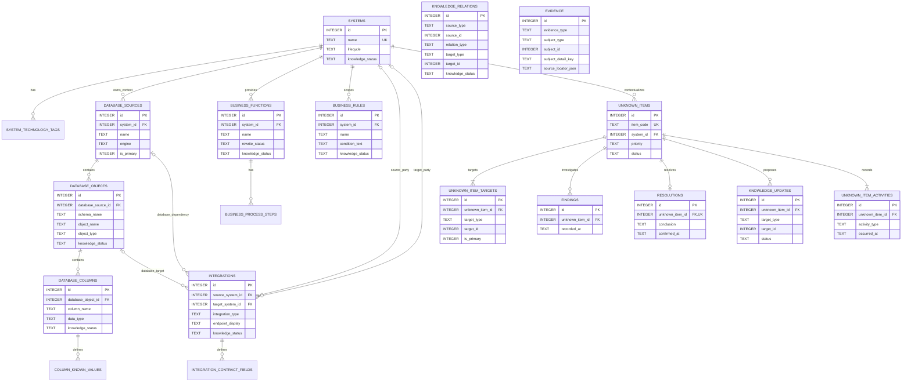

# System Knowledge Hub — MVP Database Model

状态：**CONFIRMED / DATABASE MODEL FROZEN**  
目标数据库：SQLite  
依据：

- `System_Knowledge_Hub_MVP_Final_UI_Inventory.md`
- `System_Knowledge_Hub_MVP_Design_Baseline.md`
- `System_Knowledge_Hub_MVP_Domain_Model.md`

范围：只定义第一版持久化模型。不生成 C# Entity、EF Core Mapping、Migration、Repository、API 或可执行 SQL。

## 1. 设计结论

### 1.1 总体策略

- 使用具体业务表，不建立通用 Knowledge Object Registry、EAV、任意属性表或通用知识数据库框架。
- 使用 SQLite `INTEGER PRIMARY KEY` 作为内部标识；对外显示编号另设业务字段，例如 `unknown_items.item_code`。
- 枚举保存为稳定英文 `TEXT` 值，并用 `CHECK` 限制。
- 普通知识实体只保存最小创建信息；完整 PersonSnapshot 仅在人员身份本身具有证据或调查意义的业务事实中展平，不建立 Person 表。
- `KnowledgeRelation`、`Evidence`、`UnknownItemTarget` 和 `KnowledgeUpdate` 的跨类型 Subject / Target 使用受控的 `type + id`；不增加通用对象注册表。
- Value Object 优先展平。只有真实一对多集合才拆表。
- UnknownItemActivity 只记录 Unknown Item 调查闭环，不复用为系统级 Audit / Event 表。
- 不使用 Event Sourcing，不建立通用 Audit 表。

### 1.2 DatabaseSource.KnowledgeStatus 决策

**第一版不持久化 `DatabaseSource.KnowledgeStatus`。**

理由：

1. 当前冻结 UI 没有 DatabaseSource Detail、Knowledge Status 展示或筛选。
2. Database Objects List 的状态属于 DatabaseObject；Column Drawer 的状态属于 DatabaseColumn。
3. System Detail 的知识概况可以由实际知识对象汇总，不需要来源级状态。
4. 持久化后需要定义来源级状态如何由对象汇总、如何手工修改以及如何计入 Dashboard，当前没有真实需求。

`database_sources` 因此不包含 `knowledge_status`。如果后续冻结 UI 或查询明确要求来源级状态，再通过正常 Schema 变更加入；不从子对象自动推导后回写。

## 2. MVP Table List

### 2.1 领域数据表

| Table | 对应 Domain Entity / 属性 | 说明 |
| --- | --- | --- |
| `systems` | System | 系统主数据与当前 KnowledgeStatus |
| `system_technology_tags` | System.Technology | 支持 Systems List 的多技术过滤 |
| `database_sources` | DatabaseSource | System 下的实际数据库来源；不持久化 KnowledgeStatus |
| `business_functions` | BusinessFunction | 业务功能主数据 |
| `business_process_steps` | BusinessProcessStep | 功能下有序流程步骤 |
| `database_objects` | DatabaseObject | DatabaseSource 中的 Table / View |
| `database_columns` | DatabaseColumn | DatabaseObject 下字段 |
| `column_known_values` | ColumnKnownValue | 字段已知值 |
| `business_rules` | BusinessRule | 业务规则；不保存 PrimaryBusinessFunction |
| `integrations` | Integration | HTTP API、RabbitMQ、文件交换、数据库依赖 |
| `integration_contract_fields` | IntegrationContractField | 消息 / 数据契约字段 |
| `knowledge_relations` | KnowledgeRelation | 受控的显式对象关系 |
| `evidence` | Evidence | 单 Subject Evidence |
| `unknown_items` | UnknownItem | 待确认事项当前状态与问题信息 |
| `unknown_item_targets` | UnknownItem.Primary / Related Targets | 一个 Primary Target 与可选 Related Targets |
| `findings` | Finding | 调查发现 |
| `resolutions` | Resolution | 每个 Unknown Item 最多一个当前结论 |
| `knowledge_updates` | KnowledgeUpdate | 结论产生的知识更新预览与应用结果 |
| `unknown_item_activities` | UnknownItemActivity | 仅 Unknown Item 调查闭环活动 |

### 2.2 派生搜索索引

| Virtual Table | 对应能力 | 说明 |
| --- | --- | --- |
| `search_documents_fts` | Global Search | 推荐但可选的 SQLite FTS5 派生索引；不是领域事实，可重建 |

第一版领域 Schema 共 19 张领域数据表。运行时能力验证通过后可增加 1 张 `search_documents_fts` 虚拟表；FTS5 不是领域 Schema 的硬依赖。不建立独立 Person、Attachment、Audit、Event、KnowledgeObject 或 Claim 表。

## 3. 通用列组

以下是实际展平到对应表的列，不代表共享基表或继承结构。

### 3.1 `creation_metadata` 列组

用于 `systems`、`database_sources`、`business_functions`、`database_objects`、`business_rules`、`integrations`、`knowledge_relations`、`unknown_items` 等可独立创建的记录。它是普通实体的最小创建归因信息，不是完整 PersonSnapshot。

| Column | SQLite Type | Nullable | 说明 |
| --- | --- | --- | --- |
| `created_at` | TEXT | No | UTC ISO-8601 |
| `created_by_name` | TEXT | No | 创建时显示姓名 |
| `created_by_role` | TEXT | Yes | 创建时角色 / 身份；普通实体允许为空 |
| `updated_at` | TEXT | No | UTC ISO-8601；不是 Audit History |

不保存 `created_by_team / external_key / source / note`。冻结 UI 不展示或查询这些普通实体创建属性；如机械展开会把可选 PersonSnapshot 误当成所有实体的固定审计结构。

### 3.2 `knowledge_status` 列组

用于 `systems`、`business_functions`、`database_objects`、`database_columns`、`business_rules`、`integrations` 和 `knowledge_relations`。

| Column | SQLite Type | Nullable | 说明 |
| --- | --- | --- | --- |
| `knowledge_status` | TEXT | No | `Unknown / Inferred / Confirmed`；默认 `Unknown` |
| `knowledge_status_reason` | TEXT | Yes | 当前状态修改说明；显式回退时由业务操作要求非空 |
| `knowledge_status_changed_at` | TEXT | No | 最近一次明确修改时间 |
| `knowledge_status_changed_by_name` | TEXT | No | 最近修改人的快照姓名 |
| `knowledge_status_changed_by_role` | TEXT | No | 最近修改人的角色 / 身份 |

不保存 `knowledge_status_changed_by_team / external_key`，因为当前 UI、查询和领域规则均不使用。也不建立 KnowledgeStatusTransition 历史表。SQLite 单行无法判断一次 `UPDATE` 是前进还是回退，因此“回退必须有原因”由显式状态修改用例校验；表只保存当前值和最近一次修改上下文。

## 4. Tables — Columns / Keys / Constraints

下列“包含列组”表示该表实际包含第 3 节列出的全部列。

### 4.1 `systems`

对应：System。

| Column | Type | Nullable | 约束 / 说明 |
| --- | --- | --- | --- |
| `id` | INTEGER | No | PK |
| `name` | TEXT | No | 稳定技术名称，例如 `MES` |
| `display_name` | TEXT | No | 中文显示名称 |
| `system_type` | TEXT | No | 当前为受控输入文本，不新增枚举 |
| `lifecycle` | TEXT | No | SystemLifecycle CHECK |
| `purpose` | TEXT | Yes | 系统用途 |
| `main_users_json` | TEXT | Yes | JSON 字符串数组 |
| `repository_name` | TEXT | Yes | 主仓库名称 |
| `repository_url` | TEXT | Yes | 仓库地址 |
| `deployment_json` | TEXT | Yes | 部署节点 / 环境数组 |
| `main_projects_json` | TEXT | Yes | 主要项目数组 |
| `main_entry_points_json` | TEXT | Yes | 主要入口数组 |
| `notes` | TEXT | Yes | 备注 |
| `creation_metadata` | — | — | 展开第 3.1 节 |
| `knowledge_status` | — | — | 展开第 3.2 节 |

PK：`id`。  
Unique：`name COLLATE NOCASE`。  
Indexes：`(lifecycle, knowledge_status, updated_at DESC)`、`(knowledge_status)`。  
Delete：MVP 不提供 System 物理删除操作；退役使用 `lifecycle = Retired`。所有物理 FK 与受控多态引用均阻止被引用 System 删除。

### 4.2 `system_technology_tags`

对应：System.Technology 多值属性。

| Column | Type | Nullable | 约束 / 说明 |
| --- | --- | --- | --- |
| `system_id` | INTEGER | No | FK → `systems.id` |
| `technology` | TEXT | No | 例如 `.NET Framework 4.8`、`Oracle`、`RabbitMQ` |

PK：`(system_id, technology COLLATE NOCASE)`；适合 `WITHOUT ROWID`。  
Indexes：`(technology COLLATE NOCASE, system_id)`，服务 Technology Filter。  
Delete：编辑 System 的 Technology 集合时可直接删除单条 Tag；System 本身不物理删除，FK 使用 `RESTRICT`，不把 CASCADE 当作删除入口。

### 4.3 `database_sources`

对应：DatabaseSource。**不包含 KnowledgeStatus 列组。**

| Column | Type | Nullable | 约束 / 说明 |
| --- | --- | --- | --- |
| `id` | INTEGER | No | PK |
| `system_id` | INTEGER | No | FK → `systems.id` |
| `name` | TEXT | No | 知识中心内来源名称，例如“MES 生产库” |
| `engine` | TEXT | No | 例如 `Oracle`、`SQL Server`、`PostgreSQL`、`SQLite` |
| `environment` | TEXT | Yes | Production / Test 等受控输入文本 |
| `instance_name` | TEXT | Yes | 实例标识 |
| `service_name` | TEXT | Yes | 服务名 |
| `database_name` | TEXT | Yes | 实际数据库名 |
| `description` | TEXT | Yes | 用途说明 |
| `is_primary` | INTEGER | No | Boolean CHECK `0/1`，默认 `0` |
| `creation_metadata` | — | — | 展开第 3.1 节 |

PK：`id`。  
FK：`system_id → systems.id ON DELETE RESTRICT`。  
Unique：`(system_id, name COLLATE NOCASE)`；部分唯一索引 `(system_id) WHERE is_primary = 1`。  
Indexes：`(system_id, is_primary DESC, name)`、`(engine)`。  
Delete：MVP 不提供 DatabaseSource 物理删除操作；存在 DatabaseObject 或受控多态引用时必须 `RESTRICT`。

### 4.4 `business_functions`

对应：BusinessFunction。

| Column | Type | Nullable | 约束 / 说明 |
| --- | --- | --- | --- |
| `id` | INTEGER | No | PK |
| `system_id` | INTEGER | No | FK → `systems.id` |
| `name` | TEXT | No | 原始功能名称 |
| `display_name` | TEXT | Yes | 可选中文显示名 |
| `function_type` | TEXT | No | 当前受控输入文本 |
| `purpose` | TEXT | Yes | 最小创建后可渐进补充 |
| `caller_summary` | TEXT | Yes | 用户 / 调用方摘要 |
| `input_description` | TEXT | Yes | 输入摘要 |
| `output_description` | TEXT | Yes | 输出摘要 |
| `rewrite_status` | TEXT | No | RewriteStatus CHECK；默认 `Unknown` |
| `creation_metadata` | — | — | 展开第 3.1 节 |
| `knowledge_status` | — | — | 展开第 3.2 节 |

PK：`id`。  
FK：`system_id → systems.id ON DELETE RESTRICT`。  
Unique：`(system_id, name COLLATE NOCASE)`。  
Indexes：`(system_id, function_type, rewrite_status, knowledge_status, updated_at DESC)`、`(knowledge_status)`。  
Delete：MVP 不提供 BusinessFunction 物理删除操作。流程编辑可直接增删 BusinessProcessStep；Function 的 FK 与受控多态引用均按 `RESTRICT` 处理。

### 4.5 `business_process_steps`

对应：BusinessProcessStep。

| Column | Type | Nullable | 约束 / 说明 |
| --- | --- | --- | --- |
| `id` | INTEGER | No | PK |
| `business_function_id` | INTEGER | No | FK → `business_functions.id` |
| `step_order` | INTEGER | No | 大于 0 |
| `name` | TEXT | No | 步骤名称 |
| `description` | TEXT | Yes | 补充说明 |

PK：`id`。  
Unique：`(business_function_id, step_order)`。  
Indexes：`(business_function_id, step_order)`。  
Delete：编辑 Business Process 时允许直接删除单条 Step；父 Function 不物理删除，FK 使用 `RESTRICT`。

流程步骤保持简单文本序列，不直接绑定 KnowledgeRelation。用户从同页“关联数据 / 业务规则 / 集成关系”进入显式关系，避免为流程步骤新增一套关系语义。

### 4.6 `database_objects`

对应：DatabaseObject。

| Column | Type | Nullable | 约束 / 说明 |
| --- | --- | --- | --- |
| `id` | INTEGER | No | PK |
| `database_source_id` | INTEGER | No | FK → `database_sources.id` |
| `schema_name` | TEXT | No | Schema 技术标识 |
| `object_name` | TEXT | No | Table / View 名称 |
| `object_type` | TEXT | No | `Table / View` CHECK |
| `business_description` | TEXT | Yes | 业务说明 |
| `estimated_rows` | INTEGER | Yes | 非负估算行数 |
| `access_mode` | TEXT | No | DatabaseAccessMode CHECK；默认 `Unknown` |
| `primary_key_columns_json` | TEXT | Yes | JSON 字符串数组 |
| `business_key_columns_json` | TEXT | Yes | JSON 字符串数组 |
| `creation_metadata` | — | — | 展开第 3.1 节 |
| `knowledge_status` | — | — | 展开第 3.2 节 |

PK：`id`。  
FK：`database_source_id → database_sources.id ON DELETE RESTRICT`。  
Unique：`(database_source_id, schema_name COLLATE NOCASE, object_name COLLATE NOCASE)`。  
Indexes：`(database_source_id, schema_name, object_type, knowledge_status)`、`(object_name COLLATE NOCASE)`、`(knowledge_status)`。  
Delete：MVP 不提供 DatabaseObject 物理删除操作；Column、Integration Database Dependency 与受控多态引用均按 `RESTRICT` 处理。

### 4.7 `database_columns`

对应：DatabaseColumn。

| Column | Type | Nullable | 约束 / 说明 |
| --- | --- | --- | --- |
| `id` | INTEGER | No | PK |
| `database_object_id` | INTEGER | No | FK → `database_objects.id` |
| `ordinal_position` | INTEGER | No | 大于 0 |
| `column_name` | TEXT | No | 字段技术标识 |
| `data_type` | TEXT | No | 例如 `VARCHAR2(20)`，保持原文 |
| `is_nullable` | INTEGER | No | Boolean CHECK `0/1` |
| `default_value` | TEXT | Yes | 原始数据库默认值文本 |
| `business_description` | TEXT | Yes | 字段业务含义 |
| `database_comment` | TEXT | Yes | 数据库注释的当前文本；证据仍单独记录 |
| `created_at` | TEXT | No | UTC ISO-8601 |
| `updated_at` | TEXT | No | UTC ISO-8601 |
| `knowledge_status` | — | — | 展开第 3.2 节 |

PK：`id`。  
FK：`database_object_id → database_objects.id ON DELETE RESTRICT`。  
Unique：`(database_object_id, column_name COLLATE NOCASE)`、`(database_object_id, ordinal_position)`。  
Indexes：`(database_object_id, ordinal_position)`、`(column_name COLLATE NOCASE)`、`(knowledge_status)`。  
Delete：MVP 不提供 DatabaseColumn 物理删除操作；父对象删除被 FK 阻止，字段自身若存在 Relation、Evidence 或 UnknownItem Target 也必须通过受控引用检查阻止删除。

### 4.8 `column_known_values`

对应：ColumnKnownValue。

| Column | Type | Nullable | 约束 / 说明 |
| --- | --- | --- | --- |
| `id` | INTEGER | No | PK |
| `database_column_id` | INTEGER | No | FK → `database_columns.id` |
| `value_text` | TEXT | No | 原始值，例如 `30` |
| `meaning` | TEXT | No | 业务含义 |
| `sort_order` | INTEGER | No | 默认 0 |
| `created_at` | TEXT | No | UTC ISO-8601 |
| `updated_at` | TEXT | No | UTC ISO-8601 |

PK：`id`。  
Unique：`(database_column_id, value_text)`。  
Indexes：`(database_column_id, sort_order, value_text)`。  
Delete：编辑字段业务知识时允许直接删除错误的 KnownValue；父 Column 不物理删除，FK 使用 `RESTRICT`。

### 4.9 `business_rules`

对应：BusinessRule。

| Column | Type | Nullable | 约束 / 说明 |
| --- | --- | --- | --- |
| `id` | INTEGER | No | PK |
| `system_id` | INTEGER | No | FK → `systems.id` |
| `name` | TEXT | No | 规则名称 |
| `description` | TEXT | No | 最小创建必需信息 |
| `condition_text` | TEXT | Yes | Condition，保留技术文本 |
| `result_text` | TEXT | Yes | Result |
| `input_data_json` | TEXT | Yes | 无独立生命周期的输入数据行数组 |
| `creation_metadata` | — | — | 展开第 3.1 节 |
| `knowledge_status` | — | — | 展开第 3.2 节 |

PK：`id`。  
FK：`system_id → systems.id ON DELETE RESTRICT`。  
Unique：`(system_id, name COLLATE NOCASE)`。  
Indexes：`(system_id, knowledge_status, updated_at DESC)`、`(knowledge_status)`。  
Delete：MVP 不提供 BusinessRule 物理删除操作；System FK 与所有受控多态引用均按 `RESTRICT` 处理。  
特别约束：没有 `primary_business_function_id`；Function ↔ Rule 只存在于 `knowledge_relations`。

### 4.10 `integrations`

对应：Integration。

| Column | Type | Nullable | 约束 / 说明 |
| --- | --- | --- | --- |
| `id` | INTEGER | No | PK |
| `name` | TEXT | No | 例如 `equipment.status.changed` |
| `integration_type` | TEXT | No | IntegrationType CHECK |
| `source_system_id` | INTEGER | Yes | FK → `systems.id` |
| `source_party_name` | TEXT | No | 参与方名称快照 |
| `target_system_id` | INTEGER | Yes | FK → `systems.id` |
| `target_party_name` | TEXT | No | 参与方名称快照 |
| `flow_direction` | TEXT | No | IntegrationFlowDirection CHECK |
| `purpose` | TEXT | Yes | 用途 |
| `topic_or_queue` | TEXT | Yes | RabbitMQ 主要 Topic / Queue；供详情展示与列表搜索 |
| `endpoint_display` | TEXT | Yes | 可搜索的主要 Endpoint / Topic / Queue / File 标识 |
| `endpoint_json` | TEXT | Yes | 各 IntegrationType 的结构化 Endpoint 明细 |
| `database_source_id` | INTEGER | Yes | DatabaseDependency 时可指向 DatabaseSource |
| `database_object_id` | INTEGER | Yes | DatabaseDependency 时可指向具体 DatabaseObject |
| `creation_metadata` | — | — | 展开第 3.1 节 |
| `knowledge_status` | — | — | 展开第 3.2 节 |

PK：`id`。  
FK：两个 System FK 均 `ON DELETE RESTRICT`；Database FK 均 `ON DELETE RESTRICT`。  
CHECK：`source_system_id IS NOT NULL OR target_system_id IS NOT NULL`。  
Unique：`(integration_type, name COLLATE NOCASE, source_party_name COLLATE NOCASE, target_party_name COLLATE NOCASE)`。  
Indexes：`(source_system_id, integration_type)`、`(target_system_id, integration_type)`、`(database_source_id)`、`(database_object_id)`、`(integration_type, knowledge_status)`、`(endpoint_display COLLATE NOCASE)`。  
Delete：MVP 不提供 Integration 物理删除操作；参与 System、Database Dependency 与所有受控多态引用均按 `RESTRICT` 处理。

类型一致性规则：`topic_or_queue` 只用于 `RabbitMq`；只有 `DatabaseDependency` 可以填写 `database_source_id / database_object_id`；若填写 `database_object_id`，该对象必须属于填写的 `database_source_id`，未填写 Source 时则由该对象反查确定。其它 IntegrationType 的这两个字段必须为空。这类跨表规则由显式写入操作校验，不增加触发器或 Endpoint 子类型表。

### 4.11 `integration_contract_fields`

对应：IntegrationContractField。

| Column | Type | Nullable | 约束 / 说明 |
| --- | --- | --- | --- |
| `id` | INTEGER | No | PK |
| `integration_id` | INTEGER | No | FK → `integrations.id` |
| `ordinal_position` | INTEGER | No | 大于 0 |
| `field_name` | TEXT | No | 技术字段名 |
| `data_type` | TEXT | Yes | 技术类型 |
| `is_required` | INTEGER | No | Boolean CHECK `0/1` |
| `description` | TEXT | Yes | 字段说明 |
| `sample_value` | TEXT | Yes | 简短样例，不保存大消息正文 |

PK：`id`。  
Unique：`(integration_id, field_name COLLATE NOCASE)`、`(integration_id, ordinal_position)`。  
Indexes：`(integration_id, ordinal_position)`。  
Delete：编辑 Message / Data Contract 时允许直接删除单条 ContractField；父 Integration 不物理删除，FK 使用 `RESTRICT`。

### 4.12 `knowledge_relations`

对应：KnowledgeRelation。

| Column | Type | Nullable | 约束 / 说明 |
| --- | --- | --- | --- |
| `id` | INTEGER | No | PK |
| `source_type` | TEXT | No | KnowledgeTargetType CHECK |
| `source_id` | INTEGER | No | 对应具体表 ID |
| `target_type` | TEXT | No | KnowledgeTargetType CHECK |
| `target_id` | INTEGER | No | 对应具体表 ID |
| `relation_type` | TEXT | No | RelationType CHECK |
| `description` | TEXT | Yes | 关系说明 |
| `creation_metadata` | — | — | 展开第 3.1 节 |
| `knowledge_status` | — | — | 展开第 3.2 节 |

PK：`id`。  
Unique：`(source_type, source_id, target_type, target_id, relation_type)`。  
CHECK：Source 与 Target 不能是相同的 `type + id`；类型与 RelationType 必须属于冻结枚举。  
Indexes：`(source_type, source_id, relation_type)`、`(target_type, target_id, relation_type)`、`(relation_type, knowledge_status)`。  
FK：SQLite 无法让一列根据 type 指向不同表，因此 `source_id / target_id` 不声明物理 FK。  
Delete：MVP 不提供 KnowledgeRelation 通用物理删除操作。若后续出现明确的纠错用例，必须先检查自身 Evidence 与其它引用，再由具体用例决定；本冻结模型不预设该操作。

### 4.13 `evidence`

对应：Evidence。

| Column | Type | Nullable | 约束 / 说明 |
| --- | --- | --- | --- |
| `id` | INTEGER | No | PK |
| `evidence_type` | TEXT | No | EvidenceType CHECK |
| `subject_type` | TEXT | No | EvidenceSubjectType CHECK |
| `subject_id` | INTEGER | No | 对应具体 Subject 表 ID |
| `subject_detail_key` | TEXT | Yes | 例如 `Purpose`、`Condition`、`KnownValues:30` |
| `source_title` | TEXT | No | 可读来源标题 |
| `source_reference` | TEXT | Yes | 可读文件名、SQL 名、文档名或 Endpoint |
| `source_locator_json` | TEXT | Yes | 类型特定 Locator 结构 |
| `summary` | TEXT | Yes | 来源摘要 |
| `support_reason` | TEXT | No | 为什么该证据支持 Subject |
| `confidence` | TEXT | Yes | EvidenceConfidence CHECK |
| `provider_name` | TEXT | No | PersonSnapshot.DisplayName |
| `provider_role` | TEXT | No | RoleOrIdentity |
| `provider_team` | TEXT | Yes | Team / Organization |
| `provider_external_key` | TEXT | Yes | 外部人员标识 |
| `provider_source` | TEXT | Yes | 快照来源 |
| `provider_note` | TEXT | Yes | 快照备注 |
| `provided_at` | TEXT | No | PersonSnapshot.OccurredAt |
| `created_at` | TEXT | No | 数据写入时间 |
| `updated_at` | TEXT | No | 最近修订时间 |

PK：`id`。  
Indexes：`(subject_type, subject_id, subject_detail_key)`、`(evidence_type, provided_at DESC)`、`(source_reference COLLATE NOCASE)`。  
FK：`subject_id` 不声明多态 FK。  
Delete：MVP 不提供 Evidence 通用物理删除操作；删除 Subject 前必须检查 Evidence 并 `RESTRICT`。  
约束：一条 Evidence 只能有一个 Subject；支持多个 Subject 时创建多条 Evidence；`source_reference` 与 `source_locator_json` 至少一个非空，确保领域模型要求的 Source Locator 实际落盘。

### 4.14 `unknown_items`

对应：UnknownItem 当前状态。

| Column | Type | Nullable | 约束 / 说明 |
| --- | --- | --- | --- |
| `id` | INTEGER | No | PK |
| `item_code` | TEXT | No | 可读编号，例如 `UNK-023` |
| `system_id` | INTEGER | No | FK → `systems.id`，服务列表过滤与 System Context |
| `question` | TEXT | No | 问题标题 |
| `context` | TEXT | Yes | 问题上下文 |
| `priority` | TEXT | No | High / Medium / Low CHECK |
| `status` | TEXT | No | UnknownItemStatus CHECK；默认 `Open` |
| `investigation_started_at` | TEXT | Yes | 首次进入 Investigating |
| `conclusion_confirmed_at` | TEXT | Yes | 进入 ConclusionConfirmed |
| `closed_at` | TEXT | Yes | 关闭时间 |
| `creation_metadata` | — | — | 展开第 3.1 节 |

PK：`id`。  
FK：`system_id → systems.id ON DELETE RESTRICT`。  
Unique：`item_code COLLATE NOCASE`。  
Indexes：`(system_id, status, priority, updated_at DESC)`、`(status, updated_at DESC)`、`(priority, status)`。  
Delete：MVP 不提供 UnknownItem 物理删除操作；正常结束使用 `Closed`。其调查事实、Evidence 与 Target 引用均保留。

### 4.15 `unknown_item_targets`

对应：UnknownItem Primary / Related Targets。

| Column | Type | Nullable | 约束 / 说明 |
| --- | --- | --- | --- |
| `id` | INTEGER | No | PK |
| `unknown_item_id` | INTEGER | No | FK → `unknown_items.id` |
| `target_type` | TEXT | No | KnowledgeTargetType CHECK |
| `target_id` | INTEGER | No | 对应具体对象 ID |
| `is_primary` | INTEGER | No | Boolean CHECK `0/1` |
| `display_snapshot` | TEXT | No | 例如 `MES.TABLE_EQP.STATE_FLAG` |

PK：`id`。  
FK：`unknown_item_id → unknown_items.id ON DELETE RESTRICT`。  
Unique：`(unknown_item_id, target_type, target_id)`；部分唯一索引 `(unknown_item_id) WHERE is_primary = 1`。  
Indexes：`(target_type, target_id, unknown_item_id)`、`(unknown_item_id, is_primary DESC)`。  
约束：每个 UnknownItem 必须恰有一个 Primary Target；“至少一个”由创建事务校验，部分索引保证“至多一个”。  
Delete：Target 是多态逻辑引用，存在 UnknownItem Target 时目标对象物理删除 `RESTRICT`。

### 4.16 `findings`

对应：Finding。

| Column | Type | Nullable | 约束 / 说明 |
| --- | --- | --- | --- |
| `id` | INTEGER | No | PK |
| `unknown_item_id` | INTEGER | No | FK → `unknown_items.id` |
| `content` | TEXT | No | 调查发现 |
| `recorded_by_name` | TEXT | No | PersonSnapshot |
| `recorded_by_role` | TEXT | No | PersonSnapshot |
| `recorded_by_team` | TEXT | Yes | 可选团队 |
| `recorded_by_external_key` | TEXT | Yes | 可选外部标识 |
| `recorded_by_source` | TEXT | Yes | 可选来源 |
| `recorded_by_note` | TEXT | Yes | 可选备注 |
| `recorded_at` | TEXT | No | PersonSnapshot.OccurredAt |
| `created_at` | TEXT | No | 数据写入时间 |
| `updated_at` | TEXT | No | 最近修订时间 |

PK：`id`。  
FK：`unknown_item_id → unknown_items.id ON DELETE RESTRICT`。  
Indexes：`(unknown_item_id, recorded_at)`。  
Delete：Finding 是调查事实，MVP 不提供物理删除；Evidence 引用也必须阻止删除。

### 4.17 `resolutions`

对应：Resolution。

| Column | Type | Nullable | 约束 / 说明 |
| --- | --- | --- | --- |
| `id` | INTEGER | No | PK |
| `unknown_item_id` | INTEGER | No | FK → `unknown_items.id` |
| `conclusion` | TEXT | No | 最终结论或草稿 |
| `confirmed_by_name` | TEXT | Yes | 确认前可空 |
| `confirmed_by_role` | TEXT | Yes | 确认前可空 |
| `confirmed_by_team` | TEXT | Yes | 可选团队 |
| `confirmed_by_external_key` | TEXT | Yes | 可选外部标识 |
| `confirmed_by_source` | TEXT | Yes | 可选来源 |
| `confirmed_by_note` | TEXT | Yes | 可选备注 |
| `confirmed_at` | TEXT | Yes | 结论确认时间 |
| `created_at` | TEXT | No | UTC ISO-8601 |
| `updated_at` | TEXT | No | UTC ISO-8601 |

PK：`id`。  
FK：`unknown_item_id → unknown_items.id ON DELETE RESTRICT`。  
Unique：`unknown_item_id`，保证最多一个当前 Resolution。  
Indexes：唯一索引已覆盖按 UnknownItem 查询。  
约束：当 UnknownItem 状态为 `ConclusionConfirmed / Closed` 时，确认人姓名、角色和时间必须存在；跨表规则由显式状态修改事务校验。  
Delete：Resolution 草稿允许编辑，但 MVP 不提供物理删除；Evidence 引用也必须阻止删除。

### 4.18 `knowledge_updates`

对应：KnowledgeUpdate。

| Column | Type | Nullable | 约束 / 说明 |
| --- | --- | --- | --- |
| `id` | INTEGER | No | PK |
| `unknown_item_id` | INTEGER | No | FK → `unknown_items.id` |
| `target_type` | TEXT | No | KnowledgeTargetType CHECK |
| `target_id` | INTEGER | No | 对应具体对象 ID |
| `subject_detail_key` | TEXT | Yes | 例如 `KnownValues:30` |
| `change_summary` | TEXT | No | 可读更新说明 |
| `before_json` | TEXT | No | 更新前快照；没有旧值时保存 JSON `null`，不以 SQL NULL 表达 |
| `after_json` | TEXT | No | 更新后快照 |
| `status` | TEXT | No | Proposed / Applied CHECK |
| `knowledge_status_before` | TEXT | Yes | 如本次同时改变状态 |
| `knowledge_status_after` | TEXT | Yes | 与 before 成对出现 |
| `applied_by_name` | TEXT | Yes | Applied 前可空 |
| `applied_by_role` | TEXT | Yes | Applied 前可空 |
| `applied_by_team` | TEXT | Yes | 可选团队 |
| `applied_by_external_key` | TEXT | Yes | 可选外部标识 |
| `applied_by_source` | TEXT | Yes | 可选来源 |
| `applied_by_note` | TEXT | Yes | 可选备注 |
| `applied_at` | TEXT | Yes | Applied 前可空 |
| `created_at` | TEXT | No | UTC ISO-8601 |
| `updated_at` | TEXT | No | UTC ISO-8601 |

PK：`id`。  
FK：`unknown_item_id → unknown_items.id ON DELETE RESTRICT`。  
Indexes：`(unknown_item_id, status)`、`(target_type, target_id)`、`(status, applied_at)`。  
CHECK：KnowledgeStatus before / after 要么同时为空，要么同时非空；Applied 时应用人和时间必需。  
Delete：KnowledgeUpdate 属于调查闭环记录，MVP 不提供物理删除；目标对象存在 Proposed / Applied Update 时必须 `RESTRICT` 删除。

### 4.19 `unknown_item_activities`

对应：UnknownItemActivity。它不是通用 Audit 表。

| Column | Type | Nullable | 约束 / 说明 |
| --- | --- | --- | --- |
| `id` | INTEGER | No | PK |
| `unknown_item_id` | INTEGER | No | FK → `unknown_items.id` |
| `activity_type` | TEXT | No | UnknownItemActivityType CHECK |
| `actor_name` | TEXT | No | PersonSnapshot |
| `actor_role` | TEXT | No | PersonSnapshot |
| `actor_team` | TEXT | Yes | 可选团队 |
| `actor_external_key` | TEXT | Yes | 可选外部标识 |
| `actor_source` | TEXT | Yes | 可选来源 |
| `actor_note` | TEXT | Yes | 可选备注 |
| `occurred_at` | TEXT | No | PersonSnapshot.OccurredAt |
| `note` | TEXT | Yes | 活动说明 |
| `related_type` | TEXT | Yes | 仅 Finding / Evidence / Resolution / KnowledgeUpdate |
| `related_id` | INTEGER | Yes | 与 related_type 成对出现 |

PK：`id`。  
FK：`unknown_item_id → unknown_items.id ON DELETE RESTRICT`。  
Indexes：`(unknown_item_id, occurred_at, id)`、`(related_type, related_id)`。  
CHECK：`related_type / related_id` 同时为空或同时非空；related_type 只允许调查闭环对象。  
Delete：Activity 是不可变调查事实，MVP 不提供物理删除；它不驱动其它表删除，也不用于其它实体的审计。

## 5. Foreign Keys 与 Delete Behavior 总结

### 5.1 物理 Foreign Keys

- `database_sources.system_id → systems.id RESTRICT`
- `system_technology_tags.system_id → systems.id RESTRICT`
- `business_functions.system_id → systems.id RESTRICT`
- `business_process_steps.business_function_id → business_functions.id RESTRICT`
- `database_objects.database_source_id → database_sources.id RESTRICT`
- `database_columns.database_object_id → database_objects.id RESTRICT`
- `column_known_values.database_column_id → database_columns.id RESTRICT`
- `business_rules.system_id → systems.id RESTRICT`
- `integrations.source_system_id / target_system_id → systems.id RESTRICT`
- `integrations.database_source_id → database_sources.id RESTRICT`
- `integrations.database_object_id → database_objects.id RESTRICT`
- `integration_contract_fields.integration_id → integrations.id RESTRICT`
- `unknown_items.system_id → systems.id RESTRICT`
- `unknown_item_targets / findings / resolutions / knowledge_updates / unknown_item_activities → unknown_items.id RESTRICT`

### 5.2 受控多态引用

以下列不建立物理 FK：

- `knowledge_relations.source_type + source_id`
- `knowledge_relations.target_type + target_id`
- `evidence.subject_type + subject_id`
- `unknown_item_targets.target_type + target_id`
- `knowledge_updates.target_type + target_id`
- `unknown_item_activities.related_type + related_id`

原因是 SQLite 不能让同一 FK 根据 type 指向不同表。第一版不增加通用 `knowledge_objects` 注册表，因为它会引入双写、生命周期同步与通用知识框架。

Application / Persistence Boundary 必须统一执行三项校验：

1. type 必须属于封闭枚举。
2. 对应具体表中的 ID 必须存在，并满足 RelationType 的端点规则。
3. 物理删除对象前必须反查所有多态引用；有引用则 `RESTRICT`。

这些是受控跨对象引用的共同基础操作，不构成通用 Knowledge Framework。各具体对象仍由明确的 Application Use Case 创建和修改，不提供通用对象读写器。

### 5.3 MVP 物理删除边界

Final UI Inventory 没有 System、BusinessFunction、DatabaseObject、DatabaseColumn、BusinessRule、Integration、KnowledgeRelation、Evidence 或 UnknownItem 的删除入口。因此第一版不为这些核心知识和调查事实提供物理删除 Use Case，也不为 CRUD 完整性补齐删除能力。

- System 结束生命周期使用 `Retired`；UnknownItem 正常结束使用 `Closed`。
- 不增加 `is_deleted / deleted_at / deleted_by`，也不建立通用 Archive / Soft Delete Framework。
- BusinessProcessStep、ColumnKnownValue、IntegrationContractField、System Technology Tag 与非 Primary UnknownItem Target 是父对象内容集合；只有在对应编辑用例中，才允许直接删除被移除的单条子记录。
- Finding、Resolution、KnowledgeUpdate 与 UnknownItemActivity 是调查闭环事实，不属于可随意重排或清空的编辑集合。
- 所有父级 FK 使用 `RESTRICT`，避免未来误调用父对象删除时静默级联丢失知识。允许编辑的依赖行由明确用例直接删除，不依靠删除父对象触发 CASCADE。
- 若未来出现“错误导入清理”等明确需求，应单独设计权限、引用检查和恢复策略；不属于本冻结 MVP。

## 6. Enum Persistence Strategy

所有枚举使用稳定英文名称保存为 `TEXT`，不用整数序号：

- 可直接诊断数据库内容。
- 枚举代码顺序变化不会破坏已有数据。
- SQLite 可用 `CHECK` 约束合法值。
- UI 中文文案由应用映射，不写入枚举列。

主要枚举：

| Column family | Stored values |
| --- | --- |
| KnowledgeStatus | `Unknown / Inferred / Confirmed` |
| SystemLifecycle | `Planned / InDevelopment / Running / Maintaining / Legacy / Retired` |
| UnknownItemStatus | `Open / Investigating / ConclusionConfirmed / Closed` |
| EvidenceType | `CodeReference / Sql / DatabaseSample / DatabaseComment / Api / MqMessage / ExistingDocument / HumanConfirmation` |
| RelationType | `Calls / Reads / Writes / UsesField / AppliesRule / PublishesVia / ConsumesVia / UsesIntegration / DependsOn` |
| RewriteStatus | `Keep / Change / Remove / Unknown` |
| IntegrationType | `HttpApi / RabbitMq / FileExchange / DatabaseDependency` |
| IntegrationFlowDirection | `OneWay / Bidirectional` |
| DatabaseObjectType | `Table / View` |
| DatabaseAccessMode | `Read / Write / ReadWrite / Unknown` |
| UnknownItemPriority | `High / Medium / Low` |
| KnowledgeUpdateStatus | `Proposed / Applied` |
| KnowledgeTargetType | `System / DatabaseSource / BusinessFunction / DatabaseObject / DatabaseColumn / BusinessRule / Integration` |
| EvidenceSubjectType | KnowledgeTargetType 的全部值，加 `KnowledgeRelation / UnknownItem / Finding / Resolution / KnowledgeUpdate` |
| EvidenceConfidence | `High / Medium / Low` |
| UnknownItemActivityType | `Created / StatusChanged / FindingAdded / EvidenceAdded / ResolutionRecorded / KnowledgeUpdateApplied / Closed / Reopened` |

新增枚举值需要 Schema 变更以更新 CHECK。这是有意约束，避免“任意字符串即新类型”。

## 7. PersonSnapshot Persistence

第一版不建立 `people` 表。持久化分为两档：

普通实体创建只使用第 3.1 节最小 `creation_metadata`：`created_at / created_by_name / optional created_by_role / updated_at`。这不是完整 PersonSnapshot，不包含 Team、External Key、Source 或 Note。

完整 PersonSnapshot 只在人员身份本身具有业务证据或调查意义的事实中展平：

- Evidence：`provider_* + provided_at`
- Finding：`recorded_by_* + recorded_at`
- Resolution：`confirmed_by_* + confirmed_at`
- KnowledgeUpdate：`applied_by_* + applied_at`
- UnknownItemActivity：`actor_* + occurred_at`

这些完整快照保留姓名、角色 / 身份、时间，以及可选 Team、External Key、Source、Note；它们用于解释证据来源、人工确认和调查责任。即使未来接入人员中心，历史快照也不被覆盖。

KnowledgeStatus 最近修改使用专门的最小列组：`knowledge_status_changed_at / by_name / by_role`，不保存 Team 或 External Key。它表达最近一次显式状态操作，不是完整人员档案或状态历史。

只为 UI 与闭环明确要求的业务事实持久化快照。BusinessProcessStep、DatabaseColumn、KnownValue、ContractField 等依赖行不重复保存创建人；其编辑归因由父对象的创建上下文、KnowledgeUpdate 或 UnknownItemActivity 承载。进入“调查中”的人员通过对应 StatusChanged Activity 的 ActorSnapshot 表达，不建立 Assignee / Person 表。

## 8. Evidence Subject Persistence

Evidence 使用：

`subject_type + subject_id + optional subject_detail_key`

规则：

- 一条 Evidence 只支持一个 Subject。
- `subject_type` 使用 EvidenceSubjectType CHECK。
- `subject_id` 指向 type 对应的具体表，由写入边界验证存在性。
- `subject_detail_key` 只定位 Subject 内的已知区域，例如 `Purpose`、`Condition`、`KnownValues:30`，不定义动态字段。
- 同一来源支持多个 Subject 时，创建多条 Evidence；允许复用相同 `source_reference / source_locator_json`。
- 不建立 EvidenceBinding、Claim、Attachment 或 KnowledgeObject Registry 表。

## 9. KnowledgeRelation Persistence

KnowledgeRelation 直接保存 Source 与 Target：

`source_type + source_id + relation_type + target_type + target_id`

数据库约束负责：合法枚举、非自关联、精确重复关系唯一。写入边界负责：

- Source / Target 存在性。
- RelationType 允许的端点组合。
- BusinessFunction ↔ BusinessRule 只能用 `AppliesRule`。
- 不允许万能 `RelatedTo`。
- 删除任一端点前检查关系引用。

状态和 Evidence 属于关系自身：KnowledgeStatus 保存在 `knowledge_relations`，Evidence 通过 `subject_type = KnowledgeRelation` 指向其 ID。

## 10. UnknownItem 调查闭环 Persistence

最小闭环映射：

1. `unknown_items`：保存问题、System Context、Priority 和当前状态。
2. `unknown_item_targets`：保存恰好一个 Primary Target 与可选 Related Targets。
3. `findings`：保存调查发现与记录人快照。
4. `evidence`：以 UnknownItem、Finding 或 Resolution 为 Subject 保存证据。
5. `resolutions`：保存一个当前结论；确认前允许确认人字段为空。
6. `knowledge_updates`：保存变更前后快照、目标、状态变化与应用结果。
7. `unknown_item_activities`：保存该事项闭环的时间线。

### 10.1 KnowledgeUpdate 不是 Generic Patch Engine

`knowledge_updates.before_json / after_json` 只承担三项职责：

- 在用户应用结论前展示 Knowledge Update Preview。
- 保存 UnknownItem 调查闭环中建议修改的可读内容。
- 具体业务修改成功后，记录 Applied 时的变更前后快照。

它们不是可执行 Patch，不是动态属性映射，也不能作为任意对象的写入指令。`subject_detail_key` 只帮助 UI 说明“将影响哪里”，不能被解释成反射属性路径。

真正 Apply 时必须调用目标对象的具体 Application Use Case，例如 `UpdateDatabaseColumnMeaning`、`AddColumnKnownValue`、`UpdateBusinessRule`、`UpdateIntegration` 或 `UpdateBusinessFunction`。具体业务修改成功后，才在同一业务操作中记录 `before_json / after_json`、可选 KnowledgeStatus 前后值、ApplierSnapshot 与 `Applied` 状态。

明确禁止后续实现：

- `GenericKnowledgeUpdateApplier`
- Reflection-based Entity Updater
- Dynamic Property Mapper
- JSON Patch Framework
- Generic Knowledge Mutation Engine

允许的 Update 类型与每种 Snapshot 结构由具体 Application Use Case 明确定义。本 Database Model 不引入 UpdateType 枚举、动态 Schema 或通用 Patch 表。

### 10.2 状态闭环规则

关键状态规则需要在同一显式业务操作中校验：

- 进入 `Investigating` 时记录 StatusChanged Activity。
- 添加 Finding / Evidence / Resolution 时分别记录 Activity。
- 进入 `ConclusionConfirmed` 前必须存在 Resolution、支持 Evidence 与确认人快照；若有 KnowledgeUpdate，必须已 Applied。
- 进入 `Closed` 只能从 `ConclusionConfirmed`，并记录 Closed Activity。
- Reopen 记录 Reopened Activity，但 UnknownItemActivity 不扩展为其它实体的审计。

这不是 Event Sourcing：`unknown_items.status`、`resolutions` 和 `knowledge_updates` 是当前事实；Activity 只是调查页面需要显示的闭环时间线。

## 11. JSON 字段

仅对“结构可变、无独立身份、不需要独立关系、主要整体读写”的值使用 JSON。

| Column | JSON 内容 | 为什么适合 JSON |
| --- | --- | --- |
| `systems.main_users_json` | 简短用户 / 角色字符串数组 | 只展示，不作为人员实体或权限依据 |
| `systems.deployment_json` | 环境、节点与说明数组 | 部署形态可变，当前不筛选单个节点 |
| `systems.main_projects_json` | 项目名称数组 | 只在 System Detail 展示 |
| `systems.main_entry_points_json` | 文件 / 入口名称数组 | 只作索引摘要；完整 Code Reference 在 Evidence |
| `database_objects.primary_key_columns_json` | PK 字段名数组 | 数据库元数据快照，无独立生命周期 |
| `database_objects.business_key_columns_json` | 业务唯一键字段名数组 | 同上 |
| `business_rules.input_data_json` | 输入项对象数组 | 当前只在 Rule Detail 整体展示，不被其它实体引用 |
| `integrations.endpoint_json` | 类型特定 Endpoint 明细 | HTTP、RabbitMQ、File、Database 四种形态互斥；公共可搜索值另存 `endpoint_display` |
| `evidence.source_locator_json` | EvidenceType 特定 Locator | Code、SQL、DB Sample、API、MQ、Document 的定位字段不同 |
| `knowledge_updates.before_json` | 更新前结构快照 | 只用于 Preview、调查闭环记录与 Applied 后快照；不是 Patch 指令 |
| `knowledge_updates.after_json` | 更新后结构快照 | 同上；不得据此反射修改领域对象 |

不使用 JSON 保存：Relation、Evidence Subject、UnknownItem Targets、Columns、Known Values、Process Steps、Contract Fields 或 PersonSnapshot，因为这些内容需要关系、过滤、排序或明确约束。

所有 JSON TEXT 列在非空时使用 `json_valid(...)` CHECK；数组型字段还应检查顶层是 array。第一版不为 JSON 内部属性建立索引。

## 12. Indexes 与 Global Search

### 12.1 事务表索引

除 PK / Unique 自动索引外，重点保留：

- 系统列表：`systems(lifecycle, knowledge_status, updated_at DESC)`、`system_technology_tags(technology, system_id)`。
- 功能列表：`business_functions(system_id, function_type, rewrite_status, knowledge_status, updated_at DESC)`。
- 数据库浏览：`database_objects(database_source_id, schema_name, object_type, knowledge_status)`。
- 字段查找：`database_columns(column_name COLLATE NOCASE)`。
- 待确认事项：`unknown_items(system_id, status, priority, updated_at DESC)` 与 `unknown_item_targets(target_type, target_id, unknown_item_id)`。
- Context Rail：Relation Source / Target 双向索引、Evidence Subject 索引。
- Dashboard：各知识实体的 `knowledge_status` 索引、UnknownItem `status / priority` 索引。

不为低选择性 Boolean 单独建索引。

### 12.2 `search_documents_fts`

Global Search 是 MVP 核心导航能力；`search_documents_fts` 是推荐但非阻塞的实现策略，不是领域 Schema 的硬依赖。正式编码前必须先验证目标 SQLite Runtime 是否包含 FTS5 与 `trigram` tokenizer。验证通过且数据规模需要时，可使用以下可重建虚拟表投影：

| Column | FTS role |
| --- | --- |
| `object_type` | UNINDEXED；System、BusinessFunction、DatabaseObject、DatabaseColumn、BusinessRule、Integration、UnknownItem |
| `object_id` | UNINDEXED |
| `system_context` | UNINDEXED；普通对象为 System Name，Integration 为 Source → Target |
| `knowledge_status` | UNINDEXED；UnknownItem 为空 |
| `unknown_item_status` | UNINDEXED；仅 UnknownItem 有值，避免与 KnowledgeStatus 混淆 |
| `title` | Indexed |
| `subtitle` | Indexed |
| `description` | Indexed |
| `technical_text` | Indexed；Schema、Object、Column、Endpoint、Condition 等技术标识 |
| `updated_at` | UNINDEXED |

搜索文档来源：

- System：Name、DisplayName、Purpose、Technology。
- BusinessFunction：Name、DisplayName、Purpose、Input / Output。
- DatabaseObject：DatabaseSource、Schema、ObjectName、BusinessDescription。
- DatabaseColumn：完整限定名、ColumnName、BusinessDescription、Known Values。
- BusinessRule：Name、Description、Condition、Result。
- Integration：Name、Party、EndpointDisplay、Purpose。
- UnknownItem：Question、Context、Primary Target Display Snapshot。

若启用 FTS5，建议优先使用 `trigram` tokenizer，以兼顾中文片段和 `STATE_FLAG` 等技术标识的 substring 查找。trigram 对少于 3 个 Unicode 字符的全文查询无法命中，因此 1–2 字符查询仍回退到受限 `LIKE` / 精确前缀查询。

如果运行环境不支持 FTS5 / trigram，或 MVP 初期数据量较小，Global Search 可以先使用各具体领域表上的受限 `LIKE`、精确匹配与 Prefix Search，并复用第 12.1 节索引。后续启用 FTS 只新增或重建派生搜索投影，不修改任何领域数据表，也不引入外部搜索服务、复杂同步管线或通用搜索基础设施。

Integration 同时关联两个已登记 System 时只产生一条搜索结果，`system_context` 展示 Source → Target，不虚构单一 Owning System。Database Objects List 对 Table / View / Column Name / Business Description 的组合搜索复用这张 FTS 投影，并将 Column 命中归并到所属 DatabaseObject；精确与前缀过滤仍使用领域表 B-tree 索引。

FTS 表是派生索引，不是事实来源。启用后，在具体对象写入成功时更新投影；发生不一致时允许整表重建。无需建立通用 SearchDocument Domain Entity。

## 13. SQLite-specific Considerations

- 每个连接启用 `PRAGMA foreign_keys = ON`；SQLite 默认可能关闭 FK。
- 建议启用 WAL 模式与合理 `busy_timeout`，适合桌面优先的多读少写场景。
- 采用 `INTEGER PRIMARY KEY` 以利用 rowid 和较小索引；业务编号单独唯一。
- 时间统一保存 UTC ISO-8601 `TEXT`，应用显示时转换时区；禁止混用本地时间与 Unix 秒。
- Boolean 保存 `INTEGER 0/1` 并加 CHECK。
- Enum 保存 `TEXT` 并加 CHECK，不依赖 SQLite 原生 Enum。
- JSON 保存 `TEXT`；非空时使用 JSON1 的 `json_valid` 检查。
- 若目标 SQLite ≥ 3.37，领域表建议使用 `STRICT`；否则用 NOT NULL、CHECK 和写入校验达到同样目标。
- 技术标识唯一索引使用 `COLLATE NOCASE`；SQLite 内置 NOCASE 主要覆盖 ASCII，适合表名、字段名、文件名，不用于中文语言排序。
- `LIKE '%term%'` 无法有效利用普通 B-tree；MVP 小数据量阶段允许接受受限扫描，列表前缀 / 精确过滤继续使用普通索引。FTS5 验证可用后再作为搜索加速，不是启动前置条件。
- SQLite 不支持跨多张目标表的多态 FK；不通过触发器模拟通用知识注册表。写入与删除用例必须显式验证受控引用。
- SQLite 同一时刻只有一个写事务；写操作保持短事务，不在事务中执行代码扫描、文件读取或人工交互，也不将数据库文件放在网络共享目录上。
- 大文本与样本只保存摘要和 Locator；不把代码文件、完整 SQL 文档、大型 DB Sample 或 MQ Payload 直接塞入 SQLite。
- Schema 变更通过正常版本化 Migration 完成，但本阶段不设计 Migration 内容。

SQLite 能力依据官方文档：[Foreign Keys](https://www.sqlite.org/foreignkeys.html)、[STRICT Tables](https://www.sqlite.org/stricttables.html)、[JSON Functions](https://www.sqlite.org/json1.html) 与 [FTS5](https://www.sqlite.org/fts5.html)。

## 14. Mermaid ER Diagram

实线关系是 SQLite 物理 FK。多态 `type + id` 逻辑引用显示在实体字段中，不伪装为物理 FK。

逻辑多态引用：

- `KNOWLEDGE_RELATIONS` Source / Target → System、DatabaseSource、BusinessFunction、DatabaseObject、DatabaseColumn、BusinessRule 或 Integration。
- `EVIDENCE` Subject → 上述知识对象、KnowledgeRelation、UnknownItem、Finding、Resolution 或 KnowledgeUpdate。
- `UNKNOWN_ITEM_TARGETS` 和 `KNOWLEDGE_UPDATES` Target → KnowledgeTargetType 允许的具体对象。

### 14.1 关键多态端点规则矩阵

| RelationType | Allowed Source | Allowed Target |
| --- | --- | --- |
| `Calls` | BusinessFunction | BusinessFunction |
| `Reads` | BusinessFunction | DatabaseObject / DatabaseColumn |
| `Writes` | BusinessFunction | DatabaseObject / DatabaseColumn |
| `UsesField` | BusinessFunction / BusinessRule | DatabaseColumn |
| `AppliesRule` | BusinessFunction | BusinessRule |
| `PublishesVia` | System / BusinessFunction | Integration |
| `ConsumesVia` | System / BusinessFunction | Integration |
| `UsesIntegration` | BusinessFunction / BusinessRule | Integration |
| `DependsOn` | System / BusinessFunction / Integration | System / DatabaseSource / DatabaseObject |

`EvidenceSubjectType`、UnknownItem Target 与 KnowledgeUpdate Target 的允许集合见第 6 节。所有多态端点均验证具体 ID 存在；不允许通过新增字符串类型绕过矩阵。

## 15. MVP Out of Scope

- C# Entity、EF Core Mapping、Migration、Repository、Unit of Work 与 API。
- Aggregate / Transaction Boundary 的最终设计。
- PostgreSQL、SQL Server、Oracle 等其它目标数据库适配。
- 通用 Knowledge Object Registry、EAV、任意属性表、Claim Framework 或 Knowledge Graph Schema。
- Event Sourcing、系统级 Audit Log、通用 Event Store；UnknownItemActivity 只服务调查闭环。
- Person / User / Role / Permission 表和人员中心。
- 通用附件、文档库、Blob 存储或代码仓库镜像。
- KnowledgeStatus 的完整历史表与版本树。
- 数据采集、自动代码扫描、SQL 解析、自动推断或自动确认。
- FTS 同义词、拼音、模糊排序、外部搜索引擎和高级相关度训练。
- 数据保留、归档、备份、加密与多租户策略。
- 可执行 DDL、Seed Data 与性能压测脚本。

## 16. Final Freeze Summary

本轮 MVP Simplification Review 已完成，未发现与冻结 Domain Model、Design Baseline 或 Final UI Inventory 的阻塞性冲突。

### 16.1 已删除 / 简化的持久化字段

- 普通实体创建列组由完整 `created_snapshot` 简化为 `created_at / created_by_name / optional created_by_role / updated_at`。
- 从普通实体删除 `created_by_team / created_by_external_key / created_by_source / created_by_note`。
- 从 KnowledgeStatus 最近修改列组删除 `knowledge_status_changed_by_team / knowledge_status_changed_by_external_key`。
- 完整 PersonSnapshot 仅保留在 Evidence Provider、Finding Recorder、Resolution Confirmation、KnowledgeUpdate Applier 与 UnknownItem Activity Actor 等身份具有业务证据意义的场景。
- 未增加 KnowledgeStatus History / Transition 表、人员表、软删除字段或 Archive 表。

### 16.2 保持不变的核心设计

- SQLite、`INTEGER PRIMARY KEY`、稳定英文 TEXT Enum 与受控 CHECK。
- DatabaseSource 第一版不持久化 KnowledgeStatus。
- BusinessRule 不保存 PrimaryBusinessFunctionId；Function ↔ Rule 通过 KnowledgeRelation。
- KnowledgeRelation、Evidence、UnknownItem Target 与 KnowledgeUpdate Target 继续使用受控 `type + id`，不增加 KnowledgeObject Registry、EAV 或 Claim Framework。
- Evidence 一条记录一个 Subject；RelationType 保持封闭枚举且没有 `RelatedTo`。
- UnknownItem / Finding / Resolution / KnowledgeUpdate / Activity 调查闭环保持不变。
- 核心知识对象不提供通用物理删除；System 使用 `Retired`，UnknownItem 使用 `Closed`，不建立 Soft Delete Framework。
- `search_documents_fts` 保留为可选、可重建的搜索加速投影，不是领域 Schema 硬依赖。
- 不建立 Event Sourcing、通用 Audit Log、Knowledge Graph Engine 或通用 Knowledge Framework。

### 16.3 留到 Application Design 的问题

- 由具体 Application Use Case 定义各类 KnowledgeUpdate 的允许修改内容与 Snapshot 结构；`before_json / after_json` 绝不作为 Generic Patch 或动态对象修改指令。
- Application / Persistence Boundary 统一实现多态 Target 存在性校验、RelationType 端点校验，以及物理删除前的跨表引用检查，但不得演变为通用 Knowledge Framework。
- 正式编码前验证目标 SQLite Runtime 的 FTS5 / trigram 支持；不可用或数据量较小时先使用受限 LIKE / Prefix Search。
- Aggregate、Repository、Transaction Boundary、并发控制和具体 Migration 仍按冻结 Domain Model 留到后续阶段决定。

冻结结论：当前持久化模型已满足 MVP 页面、知识维护和调查闭环需求，不需要新增表、通用抽象或基础设施。状态正式确认为 **CONFIRMED / DATABASE MODEL FROZEN**。
