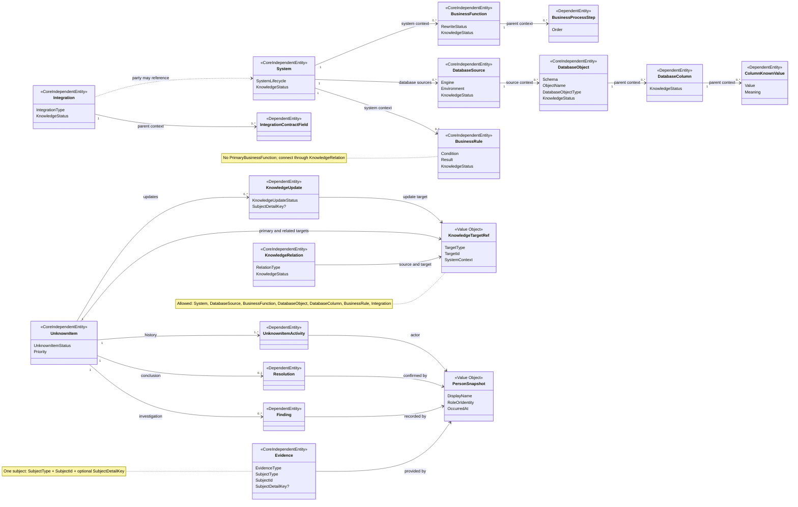

# System Knowledge Hub — MVP Domain Model

状态：**CONFIRMED / DOMAIN MODEL FROZEN**  
依据：`System_Knowledge_Hub_MVP_Final_UI_Inventory.md`、`System_Knowledge_Hub_MVP_Design_Baseline.md`  
范围：仅定义核心实体、依赖实体、值对象、枚举、关系与领域规则；不决定 Aggregate、Repository、Transaction、数据库表、API 或 C# 实现。

## 1. 简化后的建模原则

1. 核心业务对象保持具体：System、DatabaseSource、BusinessFunction、DatabaseObject / Column、BusinessRule、Integration、UnknownItem。
2. 当前只定义 **Core Independent Entity** 与必要的依赖实体，不提前指定 Aggregate Root、Repository 或事务一致性边界。
3. 只统一 MVP 明确需要统一的能力：KnowledgeStatus、Evidence、受控 KnowledgeRelation、跨对象引用与 PersonSnapshot。
4. 不建立通用 `KnowledgeObject`、Claim Framework、任意属性字典、通用 Workflow 或 Knowledge Graph Engine。
5. Progressive Documentation 保持不变：对象可先以最小信息和“未知”状态保存，再逐步补充 Relationship、Evidence 与确认。
6. Dashboard、List、Global Search、Context Rail 与 Drawer 是查询 / 展示形态，不是领域实体。

## 2. Core Entity List

### 2.1 Core Independent Entities

“Independent”表示对象有稳定身份并可以被单独引用、查询和修改；它不代表 Aggregate Root，也不暗示独立 Repository 或事务。

| Entity | 职责 | 核心内容 | Knowledge Status |
| --- | --- | --- | --- |
| **System** | 表达一个被知识中心管理的软件系统，不限定为旧系统 | Name、Display Name、Purpose、System Type、SystemLifecycle、Technology、Repository、Deployment、Notes | 有 |
| **DatabaseSource** | 表达 System 下一个实际数据库来源 | System、Name、Engine、Environment、Instance / Service / Database Name、Description | 有 |
| **BusinessFunction** | 表达 System 提供的一个具体业务能力 | Name、Purpose、Caller、Input、Output、Function Type、Rewrite Status、Business Process Steps | 有 |
| **DatabaseObject** | 表达 DatabaseSource 中的 Table 或 View 及其业务知识 | DatabaseSource、Schema、Object Name、Object Type、Metadata、Business Description、Access Mode、Columns | 有 |
| **BusinessRule** | 表达一个可独立追踪、解释并提供证据的业务判断 | System、Rule Name、Description、Condition、Result、Input Data | 有 |
| **Integration** | 表达 HTTP API、RabbitMQ、文件交换或数据库依赖 | Name、Type、Source Party、Target Party、Direction、Purpose、Endpoint、Contract | 有 |
| **KnowledgeRelation** | 表达两个具体知识对象之间的一条显式、受控关系 | Source、Target、Relation Type、Description、Knowledge Status | 有 |
| **Evidence** | 表达“为什么相信某条知识”的可追溯依据 | Evidence Type、Subject Type、Subject ID、Subject Detail Key、Source Locator、Summary、Provider Snapshot | 无独立 Knowledge Status |
| **UnknownItem** | 管理尚未确认的问题及其调查、结论和知识更新闭环 | Question、Context、Priority、Status、Primary Target、Findings、Resolution、Knowledge Updates、Activity | 使用独立 UnknownItemStatus |

### 2.2 Dependent Entities

这些实体必须存在于明确的父级上下文中，但其 Aggregate、加载与事务边界留到后续设计决定。

| Entity | 必需父级上下文 | 职责 |
| --- | --- | --- |
| **BusinessProcessStep** | BusinessFunction | 表达可排序的简单业务过程步骤；不是 BPMN 节点 |
| **DatabaseColumn** | DatabaseObject | 表达字段技术元数据、业务知识、KnowledgeStatus 与 Known Values |
| **ColumnKnownValue** | DatabaseColumn | 表达具体值及其业务含义，例如 `30 → Unknown / Offline` |
| **IntegrationContractField** | Integration | 表达消息或数据契约字段、类型、必填性和说明 |
| **Finding** | UnknownItem | 记录调查中发现的事实或观察；不等于最终结论 |
| **Resolution** | UnknownItem | 记录最终结论、确认人、确认时间与支持证据 |
| **KnowledgeUpdate** | UnknownItem | 记录 Resolution 将更新的目标、前后内容、KnowledgeStatus 变化和应用结果 |
| **UnknownItemActivity** | UnknownItem | 记录创建、状态改变、Finding、Evidence、Resolution、KnowledgeUpdate、Close / Reopen 等事实事件 |

## 3. 每个 Core Entity 的职责

### System

- 是所有系统级知识的上下文来源，可表示规划中、开发中、运行中、维护中、遗留或已退役系统。
- 不再使用“System 只表示旧系统”的限制。
- Technology、Repository、Deployment 等保持为 System 自身信息。
- System 不重复保存实际 Database 字段；实际数据库来源由 DatabaseSource 表达。

### DatabaseSource

- 表达一个 System 实际连接或依赖的数据库来源，例如 MES 生产 Oracle、MES 报表库或历史归档库。
- 保存数据库来源级别的技术身份与用途，不保存密码、连接密钥或运行监控信息。
- 一个 System 可以有零到多个 DatabaseSource。
- DatabaseObject 必须属于一个 DatabaseSource，从而避免每个对象重复保存 Database 名称与数据库环境信息。
- 暂时保留 `DatabaseSource.KnowledgeStatus`，以表达数据库来源本身的梳理程度；该字段是否实际持久化，由 Database Model 阶段根据最终 UI 展示、筛选和查询需求确认。本 Domain Freeze 不提前决定其存储形式。

### BusinessFunction

- 保存功能自身的 Purpose、Caller、Input、Output 与简洁 Business Process。
- 与 BusinessRule、DatabaseObject / Column、Integration 或相邻 Function 的关系统一通过 KnowledgeRelation 表达。
- Code Reference 继续作为 EvidenceType，不建立平行的代码知识实体体系。

### DatabaseObject / DatabaseColumn

- DatabaseObject 保存 Schema、Object Name 与对象级知识；Database / Engine / Environment 从 DatabaseSource 获得。
- DatabaseColumn 必须处于 DatabaseObject 上下文，但仍有稳定 ID，可被 Relation、Evidence 和 UnknownItem 精确引用。
- ColumnKnownValue 不能脱离 DatabaseColumn 独立存在。

### BusinessRule

- 保存具体 Condition、Result 与 Input Data，不抽象为规则引擎表达式树。
- 必须关联一个 System。
- 不保存 `PrimaryBusinessFunction` 或 BusinessFunction ID 字段。
- BusinessFunction 与 BusinessRule 的所有关联统一使用 KnowledgeRelation，关系类型为 `AppliesRule`。

### Integration

- Source Party 与 Target Party 描述参与方；已纳入知识中心的参与方可引用 System，未建档参与方保留名称快照。
- Source Party 与 Target Party 中至少一端必须通过 SystemId 关联当前系统知识中心中已登记的 System；不允许两端都只保存未登记的名称快照。
- Endpoint 按 IntegrationType 保存 HTTP Endpoint、RabbitMQ Topic / Queue / Exchange、File Location 或 Database Dependency Target。
- 不建立通用消息总线、运行监控或集成编排模型。

### KnowledgeRelation

- 是正式知识，不是 UI 临时连线。
- Source、Target、RelationType 与 KnowledgeStatus 必需；Source 和 Target 不得相同。
- RelationType 必须符合受控的端点组合，不提供任意 `RelatedTo`。
- 新关系默认为“未知”；状态变化只能由显式行为完成。

### Evidence

- MVP 中一条 Evidence 只指向一个明确 Subject，不再建立多层 EvidenceBinding。
- 必需字段为 `SubjectType + SubjectId`；`SubjectDetailKey` 可选，用于定位具体属性或局部内容，例如 `Purpose`、`Condition`、`KnownValues:30`。
- SubjectDetailKey 只是受 SubjectType 约束的定位键，不是 Claim Entity、动态字段定义或通用 Schema。
- 同一来源若需要支持多个 Subject，MVP 允许创建多条 Evidence 记录并复用相同 Source Locator；不为此引入 Binding 聚合。
- Evidence 不是附件系统。必须同时记录来源、摘要和“为什么支持该 Subject”。

### UnknownItem

- 保留完整闭环：Question → Finding → Evidence → Resolution → KnowledgeUpdate → Close。
- Primary Target 必需；其它 Related Targets 可渐进补充。
- `结论已确认`要求存在 Resolution、Supporting Evidence 与确认人快照；如果 Resolution 声明需要更新知识，对应 KnowledgeUpdate 必须已经应用。
- `已关闭`只能从`结论已确认`显式进入；关闭不再次改变关联知识对象的 KnowledgeStatus。

### UnknownItemActivity

- 仅记录单个 UnknownItem 调查闭环中的事实事件，包括创建、状态变化、Finding、Evidence、Resolution、KnowledgeUpdate、关闭与重新打开。
- 不扩展为 System、BusinessFunction 或其他知识对象的通用 Audit Log、Domain Event Store 或系统级 Event Framework。
- 其它对象是否需要审计历史，由后续真实需求单独决定，不复用 UnknownItemActivity 作为通用机制。

## 4. Value Objects

| Value Object | 内容与约束 |
| --- | --- |
| **PersonSnapshot** | DisplayName、RoleOrIdentity、OccurredAt 必需；Team / Organization、ExternalUserKey、Source、Note 可选；不可变 |
| **KnowledgeTargetRef** | TargetType、TargetId、SystemContext、DisplaySnapshot；只允许引用已列出的具体核心知识实体或 DatabaseColumn |
| **QualifiedDatabaseObjectName** | Schema、ObjectName；数据库来源由 DatabaseSource 表达，不重复包含 Database |
| **QualifiedColumnName** | DatabaseObjectRef、ColumnName；保持技术标识原文 |
| **CodeLocation** | Repository、File、Class、Method、StartLine、可选 EndLine |
| **EvidenceSourceLocator** | 根据 EvidenceType 保存代码位置、SQL 名称、Database Sample 描述、Document、API / MQ Reference 或人工确认说明 |
| **IntegrationParty** | DisplayName 必需；SystemId 可选；可表达尚未纳入 System Catalog 的外部参与方 |
| **IntegrationEndpoint** | 内容受 IntegrationType 约束，只保存该类型需要的 Endpoint / Topic / Queue / File / Database Target |
| **KnowledgeChange** | TargetRef、可选 SubjectDetailKey、BeforeSnapshot、AfterSnapshot；用于 KnowledgeUpdate Preview 与应用结果 |

本版明确不建立 `ClaimRef`、`EvidenceBinding` 和 `KnowledgeStatusTransition` Value Object。

## 5. Entity Relationships

### 5.1 结构与必需上下文

- System `1 → 0..*` DatabaseSource。
- System `1 → 0..*` BusinessFunction。
- System `1 → 0..*` BusinessRule。
- DatabaseSource `1 → 0..*` DatabaseObject。
- DatabaseObject `1 → 0..*` DatabaseColumn。
- DatabaseColumn `1 → 0..*` ColumnKnownValue。
- BusinessFunction `1 → 0..*` BusinessProcessStep。
- Integration `1 → 0..*` IntegrationContractField。
- UnknownItem `1 → 0..*` Finding。
- UnknownItem `1 → 0..1` Resolution。
- UnknownItem `1 → 0..*` KnowledgeUpdate。
- UnknownItem `1 → 1..*` UnknownItemActivity；创建时至少产生 Created Activity。

上述关系表达必需上下文与生命周期依赖，不决定 Aggregate、Repository、级联保存或事务边界。

### 5.2 跨对象关系

- BusinessFunction ↔ BusinessRule 只通过 KnowledgeRelation 表达；BusinessRule 不保存 PrimaryBusinessFunction。
- KnowledgeRelation 使用两个 KnowledgeTargetRef 连接具体知识实体。
- Evidence 使用 SubjectType + SubjectId 指向一个对象、Relation、UnknownItem、Finding、Resolution 或 KnowledgeUpdate；SubjectDetailKey 可选。
- UnknownItem 使用一个 PrimaryTarget 与零到多个 RelatedTarget 指向待澄清上下文。
- KnowledgeUpdate 使用 KnowledgeTargetRef + 可选 SubjectDetailKey 描述更新对象及其具体内容。
- Global Search 与 Dashboard 从实体产生查询投影，不反向拥有实体。

## 6. Required / Optional Association

| Entity / Association | Required | Optional | MVP 约束 |
| --- | --- | --- | --- |
| System | Name、DisplayName、SystemLifecycle、KnowledgeStatus | Purpose、Technology、Repository、Deployment、Notes | 不限定为旧系统 |
| DatabaseSource → System | System、Name、Engine | Environment、Instance / Service / DatabaseName、Description | DatabaseSource 不能脱离 System Context |
| BusinessFunction → System | System | ProcessSteps、Relations | 不直接保存 Rule IDs |
| DatabaseObject → DatabaseSource | DatabaseSource、Schema、ObjectName、ObjectType | Description、Columns、Metadata | 不重复保存 Database / Engine / Environment |
| DatabaseColumn → DatabaseObject | DatabaseObject、ColumnName、DataType | BusinessDescription、KnownValues | 不能脱离 DatabaseObject Context |
| BusinessRule → System | System、RuleName、Description | Condition、Result、InputData、Relations | 无 PrimaryBusinessFunction 字段 |
| Integration → Parties | SourceParty、TargetParty、Type，且至少一个 Party 的 SystemId | 另一端 Party 的 SystemId、ContractFields | 至少一端必须关联当前系统知识中心中已登记的 System；另一端可仅保留名称快照 |
| KnowledgeRelation → Endpoints | Source、Target、RelationType、KnowledgeStatus | Description、Supporting Evidence | 两端必需且不同 |
| Evidence → Subject | EvidenceType、SubjectType、SubjectId、SourceLocator、ProviderSnapshot、CapturedAt | SubjectDetailKey、Confidence、Summary | 一条 Evidence 一个 Subject |
| UnknownItem → Target | Question、Priority、Status、PrimaryTarget | RelatedTargets | 至少一个明确问题上下文 |
| Finding → UnknownItem | UnknownItem、Content、RecordedBy、RecordedAt | Supporting Evidence | 不可独立存在 |
| Resolution → UnknownItem | UnknownItem、Conclusion | ConfirmedBy / At 在确认前可空 | `ConclusionConfirmed`后确认快照必需 |
| KnowledgeUpdate → UnknownItem | UnknownItem、TargetRef、KnowledgeChange、Status | SubjectDetailKey、KnowledgeStatusBefore / After | 只有需要修改知识时创建 |
| UnknownItemActivity → UnknownItem | UnknownItem、Type、ActorSnapshot、OccurredAt | Note、RelatedId | 不可变的调查闭环事实记录；不得作为系统级 Audit / Event Framework |

## 7. Enums

### SystemLifecycle

- `Planned` — 规划中
- `InDevelopment` — 开发中
- `Running` — 运行中
- `Maintaining` — 维护中
- `Legacy` — 遗留
- `Retired` — 已退役

SystemLifecycle 描述系统生命周期，与 KnowledgeStatus 无关。

### KnowledgeStatus

- `Unknown` — 未知
- `Inferred` — 推断
- `Confirmed` — 已确认

正常完善路径为：`Unknown → Inferred → Confirmed`。

Domain Model 不禁止显式回退：`Confirmed → Inferred / Unknown`、`Inferred → Unknown`均允许。回退必须通过明确状态修改行为执行，并提供非空原因。当前版本不建立 KnowledgeStatusTransition 或通用历史模型；回退原因如何持久化和展示，由后续 Application / Database Design 根据真实需求决定。

Evidence 不自动推进或回退 KnowledgeStatus。

### UnknownItemStatus

- `Open` — 待处理
- `Investigating` — 调查中
- `ConclusionConfirmed` — 结论已确认
- `Closed` — 已关闭

UnknownItemStatus 与 KnowledgeStatus 完全独立。

### EvidenceType

- `CodeReference` — 代码引用
- `Sql` — SQL
- `DatabaseSample` — 数据库样本
- `DatabaseComment` — 数据库注释
- `Api` — API
- `MqMessage` — MQ 消息
- `ExistingDocument` — 现有文档
- `HumanConfirmation` — 人工确认

### EvidenceSubjectType

- `System`
- `DatabaseSource`
- `BusinessFunction`
- `DatabaseObject`
- `DatabaseColumn`
- `BusinessRule`
- `Integration`
- `KnowledgeRelation`
- `UnknownItem`
- `Finding`
- `Resolution`
- `KnowledgeUpdate`

### RelationType

| Value | 允许的主要方向 | 含义 |
| --- | --- | --- |
| `Calls` | BusinessFunction → BusinessFunction | 一个功能调用另一个功能 |
| `Reads` | BusinessFunction → DatabaseObject / DatabaseColumn | 读取数据 |
| `Writes` | BusinessFunction → DatabaseObject / DatabaseColumn | 写入或更新数据 |
| `UsesField` | BusinessFunction / BusinessRule → DatabaseColumn | 字段作为输入、条件或计算依据 |
| `AppliesRule` | BusinessFunction → BusinessRule | 功能应用某条业务规则 |
| `PublishesVia` | System / BusinessFunction → Integration | 通过集成发布消息或数据 |
| `ConsumesVia` | System / BusinessFunction → Integration | 通过集成消费消息或数据 |
| `UsesIntegration` | BusinessRule / BusinessFunction → Integration | 规则或功能依赖某个集成 |
| `DependsOn` | System / BusinessFunction / Integration → System / DatabaseSource / DatabaseObject | 明确的运行或数据依赖 |

MVP 不提供万能 `RelatedTo`。无法选择准确 RelationType 时，应保持未建立关系并创建 UnknownItem，而不是写入模糊边。

### Supporting Enums

| Enum | Values |
| --- | --- |
| **KnowledgeTargetType** | System、DatabaseSource、BusinessFunction、DatabaseObject、DatabaseColumn、BusinessRule、Integration |
| **UnknownItemPriority** | High、Medium、Low |
| **RewriteStatus** | Keep、Change、Remove、Unknown |
| **IntegrationType** | HttpApi、RabbitMq、FileExchange、DatabaseDependency |
| **IntegrationFlowDirection** | OneWay、Bidirectional |
| **DatabaseObjectType** | Table、View |
| **DatabaseAccessMode** | Read、Write、ReadWrite、Unknown |
| **EvidenceConfidence** | High、Medium、Low |
| **KnowledgeUpdateStatus** | Proposed、Applied |
| **UnknownItemActivityType** | Created、StatusChanged、FindingAdded、EvidenceAdded、ResolutionRecorded、KnowledgeUpdateApplied、Closed、Reopened |

## 8. PersonSnapshot 设计

### 必需字段

- **DisplayName**：当时显示的人员姓名。
- **RoleOrIdentity**：当时承担的身份，例如“创建人”“调查人”“MES 业务专家”。
- **OccurredAt**：该人员执行动作或提供信息的时间。

### 可选字段

- Team / Organization
- ExternalUserKey：未来与身份系统关联的非权威标识
- Source：手工录入、导入或其他来源
- Note

### 使用位置

- Entity Created By
- Finding Recorded By
- Evidence Provided By
- Human Confirmation Confirmed By
- Resolution Confirmed By
- KnowledgeUpdate Applied By
- KnowledgeStatus Changed By
- UnknownItemActivity Actor

### 约束

- PersonSnapshot 是不可变值，不是 Person Entity。
- 人员改名、调岗或离开后，历史快照不随外部系统变化。
- ExternalUserKey 不能替代 DisplayName、RoleOrIdentity 与 OccurredAt。
- PersonSnapshot 不承载账号、登录、权限、角色授权或组织关系。

## 9. 哪些能力应该统一

### 统一

- KnowledgeStatus 与显式状态修改行为，包括需要原因的显式回退。
- 简化后的 Evidence：EvidenceType、SubjectType、SubjectId、Optional SubjectDetailKey 与 Source Locator。
- KnowledgeRelation、受控 RelationType 与端点约束。
- KnowledgeTargetRef，用于 Relation、UnknownItem 与 KnowledgeUpdate 的跨对象引用。
- PersonSnapshot，用于知识来源与调查活动。
- System Context 与 DatabaseSource Context。
- Created / Updated 时间和 UnknownItem 的最小 Activity 记录。

### 保持具体对象

- System 的 SystemLifecycle、Technology、Repository 与 Deployment。
- DatabaseSource 的 Engine、Environment、Instance / Service / DatabaseName。
- BusinessFunction 的 Caller、Input、Output 与 BusinessProcessStep。
- DatabaseObject / Column 的技术元数据、KnownValues 与 Read / Write 信息。
- BusinessRule 的 Condition、Result 与 InputData。
- Integration 的 Parties、Endpoint 与 Message / Data Contract。
- UnknownItem 的 Finding、Resolution、KnowledgeUpdate 与 Activity 闭环。

### 明确不统一

- 不建立通用 `KnowledgeObject` Entity。
- 不建立 Claim Entity、ClaimRef、ClaimKind 或 Claim Framework。
- 不建立复杂 EvidenceBinding、多 Subject Binding Aggregate 或通用 Resource。
- 不建立 KnowledgeStatusTransition Value Object 或预设通用历史模型。
- 不把 Finding、Resolution、BusinessRule、KnownValue 合并成通用 Claim。
- 不把 UnknownItemStatus 与 KnowledgeStatus 合并。
- 不把 KnowledgeRelation 变成无约束 Knowledge Graph Edge。

## 10. 暂不决定的 Application / Persistence Boundaries

本 Domain Model 不指定：

- 哪些 Core Independent Entity 最终成为 Aggregate Root。
- 哪些依赖实体与父级必须在同一事务中修改。
- Repository 数量、Repository 边界或查询接口。
- Unit of Work、事务一致性、并发控制和级联删除策略。
- Evidence 在多个 Subject 之间的复用优化。
- KnowledgeStatus 变更与回退的历史存储方式。
- Dashboard、Global Search、Context Rail 与 List Page 的读模型存储方式。

这些决定必须基于后续 Application Flow、写入频率、并发风险、数据库选择和真实查询需求完成，不能从当前 UI 页面结构直接推导。

## 11. 相较上一版删除的抽象

| 删除 / 降级内容 | 修订方式 | 删除原因 |
| --- | --- | --- |
| Aggregate Root 标记 | 全部降级为 Core Independent Entity 或 Dependent Entity | UI 与领域概念不足以决定事务一致性和 Repository 边界 |
| Owned Entity / 强 Aggregate Ownership 推断 | 改为“必需父级上下文 / 生命周期依赖” | 防止过早决定加载、保存与级联策略 |
| `ClaimRef` | 删除，改用 Optional SubjectDetailKey | MVP 只需要定位具体属性，不需要 Claim 身份和框架 |
| `ClaimKind` | 删除 | 避免为每种对象属性维护第二套抽象分类 |
| 复杂 `EvidenceBinding` | 删除；Evidence 直接保存 SubjectType + SubjectId + Optional SubjectDetailKey | 当前 UI 只需要把一条证据绑定到一个明确 Subject |
| 多 Subject Evidence 设计 | MVP 改为一条 Evidence 一个 Subject | 避免 Binding 聚合与多对多生命周期复杂度 |
| `KnowledgeStatusTransition` Value Object | 删除 | 当前只需状态值与显式修改行为；历史结构尚无足够真实需求 |
| `PrimaryBusinessFunction` | 从 BusinessRule 删除 | Function ↔ Rule 已由受控 KnowledgeRelation 完整表达 |
| Database 在 System / DatabaseObject 中的重复表达 | 引入 DatabaseSource；DatabaseObject 只保存 DatabaseSource + Schema + ObjectName | 支持同一 System 多数据库来源并避免重复字段 |
| “System 只表示旧系统”假设 | 删除并增加 SystemLifecycle | 知识中心需要覆盖规划、开发、运行、维护、遗留和退役全过程 |

保留 `KnowledgeTargetRef`，因为 Relation、UnknownItem 与 KnowledgeUpdate 都需要受控的跨对象引用；其 TargetType 仍是封闭枚举，不是通用 Knowledge Framework。

## 12. Mermaid ER / Domain Diagram

## 13. MVP Out of Scope

- 通用 KnowledgeObject、Claim Framework、Ontology、Knowledge Graph Engine 或任意 Node / Edge Schema。
- Aggregate Root、Repository、Unit of Work 与 Transaction Boundary 设计。
- KnowledgeStatus 的通用 Transition / Audit History 模型。
- 系统级 Audit Log、Domain Event Store 或通用 Event Framework；UnknownItemActivity 仅服务 UnknownItem 调查闭环。
- 人员中心、组织架构、角色管理、权限管理、ACL 与审批权限模型。
- 数据库表结构、ORM、迁移策略、搜索索引结构和缓存设计。
- REST / GraphQL API、DTO、事件消息契约和 C# 实现。
- BPMN、业务流程设计器、规则执行引擎或集成编排引擎。
- 自动代码扫描、自动 SQL 解析、自动知识推断或自动状态确认引擎。
- RabbitMQ / API 运行监控、消息重放、数据库 IDE 或数据编辑能力。
- 通用文档管理、附件版本管理或企业内容管理系统。
- 复杂审批流、可配置 Workflow Engine、SLA 和任务分派系统。
- 完整知识版本树、分支 / 合并、多人实时协作与冲突解决。
- 多租户、跨组织数据隔离和企业级权限边界。
- Dashboard KPI / BI 分析体系。
