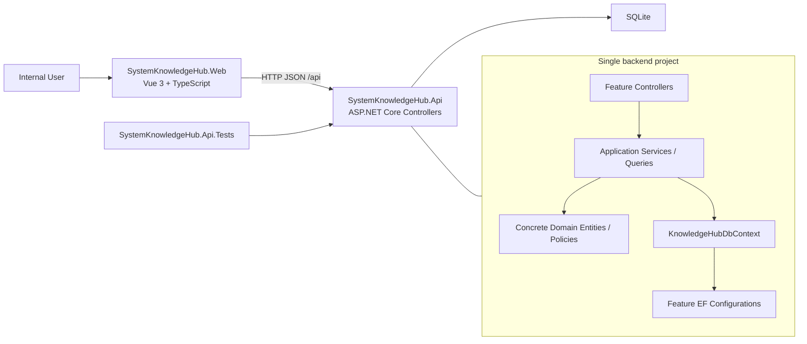
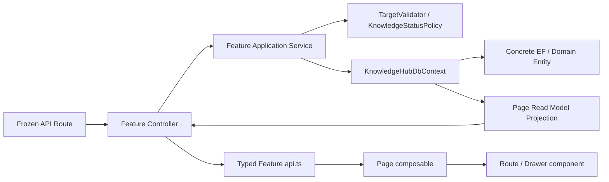
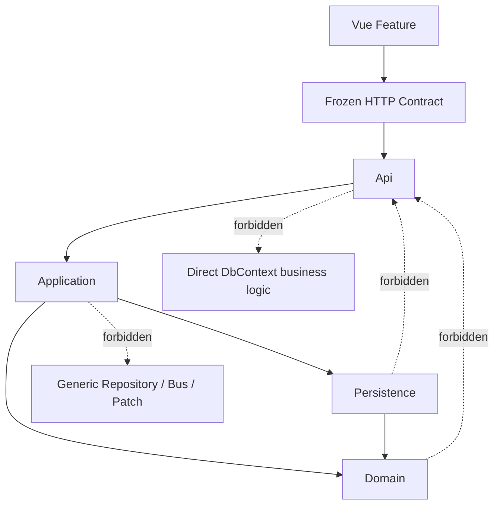

# System Knowledge Hub — MVP Solution Structure

状态：**CONFIRMED / MVP SOLUTION STRUCTURE FROZEN**  
产品：系统知识中心 / System Knowledge Hub  
技术基础：.NET 8 + ASP.NET Core Controllers + EF Core SQLite + Vue 3 TypeScript  

依据：

- `System_Knowledge_Hub_MVP_Final_UI_Inventory.md`
- `System_Knowledge_Hub_MVP_Design_Baseline.md`
- `System_Knowledge_Hub_MVP_Domain_Model.md`
- `System_Knowledge_Hub_MVP_Database_Model.md`
- `System_Knowledge_Hub_MVP_Application_Use_Case_Model.md`
- `System_Knowledge_Hub_MVP_API_Contract.md`

范围：只决定 Solution / Project 结构、代码模块边界、Application Service、Persistence、Controller、Vue 目录、依赖和测试组织。不创建 `.sln`、`.csproj`、C#、Vue 项目、`package.json`、Migration、SQLite 文件或任何正式业务实现。

## 1. Architecture Goals

1. **两项目优先**：MVP 只保留一个 .NET 后端和一个 Vue 前端，不为逻辑层级机械创建程序集。
2. **Feature-first navigation**：从 Route、UI 或 Use Case 名称都能快速定位对应 Feature。
3. **清楚边界，少量抽象**：Domain、Application、Persistence、API 在后端内部有明确目录与命名空间，但不强制通过项目引用和大量接口隔离。
4. **Use Case First**：服务方法映射冻结 Use Case，不从表生成 CRUD Service。
5. **组合查询直接服务页面**：Detail Query 允许 EF Projection 和少量参数化 SQL，不创建通用 Query Framework。
6. **直接使用 DbContext**：不增加 Generic Repository、Repository per Entity、UnitOfWork Framework 或 Specification Pattern。
7. **单一实现选择**：Controllers、EF Core、app-managed integer concurrency、native fetch、Pinia、Element Plus 各只选一套。
8. **Codex 可持续开发**：文件命名包含 Feature 与业务动作，相关代码相邻，禁止“为了整洁”扩展空层。
9. **测试真实边界**：核心规则测试与 SQLite / HTTP 集成测试优先，不使用 EF Core InMemory 伪装生产数据库。
10. **冻结模型优先**：Solution Structure 只能实现冻结 UI、Domain、Database、Application 与 API，不反向修改其语义。

## 2. Candidate Structures

### 2.1 Option A — 极简结构

```text
SystemKnowledgeHub.Api
SystemKnowledgeHub.Web
```

后端单项目内以 Feature 和子目录区分 Domain、Application、Persistence、Api。

**优点**

- 项目引用最少；业务开发、调试、重构和启动路径最短。
- Application Service 可以直接使用 `KnowledgeHubDbContext`，无需为了跨项目隔离创建 DbContext Interface 或 Repository。
- 一个 Feature 的 Controller、Contract、Service、Query、Entity Mapping 可以靠近放置，Codex 搜索成本最低。
- 测试可以引用一个后端项目，API 集成测试可直接启动完整应用。
- SQLite、单进程 ASP.NET Core、内部工具的真实复杂度与结构一致。

**缺点**

- 编译器不能阻止 Domain 误引用 ASP.NET Core 或 EF Core；需要明确目录 / namespace 规则和 Review 检查。
- 单项目增长后可能出现引用随意，需要坚持 Feature Boundary。
- 将来若确有多个 Host 或 Persistence Provider，拆项目需要一次有意识重构。

**Codex 开发复杂度**：低。  
**测试复杂度**：低。  
**维护成本**：当前最低；依赖纪律主要靠文档与测试。

### 2.2 Option B — 适度分层

```text
SystemKnowledgeHub.Api
SystemKnowledgeHub.Core
SystemKnowledgeHub.Infrastructure
SystemKnowledgeHub.Web
```

**优点**

- Core 可在编译期隔离 ASP.NET Core 与 SQLite Provider。
- Infrastructure 集中 EF Mapping、迁移和 SQL。
- 对未来增加另一个 Host 或更换 Persistence 有更明显的接缝。

**缺点**

- Core 中的 Application Service 若不能直接引用 DbContext，就需要 DbContext abstraction、多个 data gateway 或 Repository interface。
- API Contract、Application Result 与 EF Projection 容易产生额外 DTO / Mapper。
- Feature 修改常跨 3 个后端项目，Codex 定位和变更面更大。
- 当前只有一个 Host、一个 Database Provider、一个客户端，程序集隔离带来的收益有限。

**Codex 开发复杂度**：中。  
**测试复杂度**：中；需要选择 mock abstraction 或跨项目集成。  
**维护成本**：中；边界清晰但样板更多。

### 2.3 Option C — 完整分层

```text
SystemKnowledgeHub.Domain
SystemKnowledgeHub.Application
SystemKnowledgeHub.Infrastructure
SystemKnowledgeHub.Api
SystemKnowledgeHub.Web
```

**优点**

- 编译期依赖方向最强。
- 适合多个 Host、多个 Infrastructure 实现、大团队独立发布。
- 领域层可完全不引用外部框架。

**缺点**

- 当前项目会被迫引入 Repository / Gateway abstraction、Request / Command / Result 多模型、Mapper 和 composition ceremony。
- 35 个 Use Case 很容易被机械拆成 35 个 Command、Handler、Validator 与测试夹具。
- 页面组合查询跨 Application / Infrastructure Projection 时样板显著增加。
- 当前 MVP 没有多 Host、多数据库、外部集成发布或独立团队边界来回收这些成本。

**Codex 开发复杂度**：高。  
**测试复杂度**：高；单元测试数量上升但大量测试只验证 plumbing。  
**维护成本**：当前最高。

### 2.4 Decision

**推荐 Option A。**

当前系统是单体内部工具，只有一个 ASP.NET Core Host、SQLite 和一个 Vue 客户端。Option A 能最直接地实现冻结 Use Case 与页面组合查询。边界通过 Feature folder、namespace、依赖规则和测试保护；只有出现第二个 Host、第二种持久化实现或多人团队独立发布边界时，才重新评估 Option B。

不推荐 Option C；其成本无法由当前冻结需求证明。

## 3. Recommended Solution

```text
SystemKnowledgeHub.sln
├─ SystemKnowledgeHub.Api      # 单一 .NET 8 ASP.NET Core 后端
├─ SystemKnowledgeHub.Web      # 单一 Vue 3 + TypeScript SPA
└─ SystemKnowledgeHub.Api.Tests # 单一后端测试项目
```

说明：上面是设计目标，不在本阶段实际生成文件。

### 3.1 Backend organization style

- 单项目内使用 `Features/<Feature>/<Boundary>`。
- Feature 是首要导航维度；Boundary 是 Feature 内第二维度。
- 通用项只允许进入 `Shared`，并且必须被至少两个 Feature 真实使用。
- 不建立 `BuildingBlocks`、`Kernel`、`Framework`、`Abstractions` 大杂烩目录。

### 3.2 Canonical backend features

- `Dashboard`
- `Systems`
- `BusinessFunctions`
- `DatabaseKnowledge`
- `BusinessRules`
- `Integrations`
- `Relationships`
- `Evidence`
- `KnowledgeStatus`
- `UnknownItems`
- `Search`

这些名称与冻结 UI、Application 和 API 一致。不要创建 `GenericKnowledge`、`KnowledgeObjects` 或按数据库表产生的 Feature。

## 4. Backend Project Structure

```text
SystemKnowledgeHub.Api/
├─ Program.cs
├─ appsettings.json
├─ appsettings.Development.json
├─ Features/
│  ├─ Dashboard/
│  ├─ Systems/
│  ├─ BusinessFunctions/
│  ├─ DatabaseKnowledge/
│  ├─ BusinessRules/
│  ├─ Integrations/
│  ├─ Relationships/
│  ├─ Evidence/
│  ├─ KnowledgeStatus/
│  ├─ UnknownItems/
│  └─ Search/
├─ Persistence/
│  ├─ KnowledgeHubDbContext.cs
│  ├─ DbContextConfiguration.cs
│  ├─ Concurrency/
│  ├─ Search/
│  └─ Migrations/
├─ Shared/
│  ├─ Domain/
│  ├─ Application/
│  └─ Api/
└─ Properties/
   └─ launchSettings.json
```

`Persistence/Migrations` 是未来 EF Migration 的唯一位置；当前不生成内容。Feature-specific EF configuration 放在 Feature 自身，DbContext 只负责集合与统一注册。

## 5. Backend Feature Structure

Feature 使用同一模板，但只创建实际需要的文件：

```text
Features/Systems/
├─ Domain/
│  ├─ System.cs
│  └─ SystemLifecycle.cs
├─ Application/
│  ├─ SystemService.cs
│  ├─ SystemQueries.cs
│  └─ Models/
├─ Api/
│  ├─ SystemsController.cs
│  └─ Contracts/
│     ├─ SystemRequests.cs
│     └─ SystemResponses.cs
└─ Persistence/
   └─ SystemConfiguration.cs
```

规则：

- `Domain`：具体实体、依赖实体、值对象、枚举和局部业务规则；不引用 Controller 或 JSON Contract。
- `Application`：冻结 Use Case 的编排、事务、业务校验和页面查询 Projection。
- `Api`：HTTP Request / Response Contract、Controller、HTTP Status 映射；不包含业务判断。
- `Persistence`：EF Core Fluent Mapping 和 Feature-specific query helpers；不包含 HTTP。
- 小 Feature 不机械补齐四个空目录。例如 Dashboard 只有 Application Query + Controller Contract；KnowledgeStatus 没有独立 Entity Mapping。

### 5.1 Concrete feature contents

| Feature | Domain / Persistence | Application | API Controller |
| --- | --- | --- | --- |
| Dashboard | 无独立实体 | `DashboardQueries`（Q01） | `DashboardController` |
| Systems | System、Technology tags、mapping | C01–C04、Q04–Q05 | `SystemsController` |
| BusinessFunctions | Function、ProcessStep、mapping | C05–C07、Q06–Q07 | `BusinessFunctionsController` |
| DatabaseKnowledge | DatabaseSource/Object/Column/KnownValue | C08–C14、Q08–Q10 | `DatabaseSourcesController`、`DatabaseObjectsController`、`DatabaseColumnsController` |
| BusinessRules | BusinessRule、mapping | C15–C16、Q13 | `BusinessRulesController` |
| Integrations | Integration、ContractField、mapping | C17–C19、Q14 | `IntegrationsController` |
| Relationships | KnowledgeRelation、mapping | C20–C22、Q15 | `RelationshipsController` |
| Evidence | Evidence、mapping | C23–C25、Q16 | `EvidenceController` |
| KnowledgeStatus | 共享状态规则；无独立表 | C26 | `KnowledgeStatusController` |
| UnknownItems | Item、Target、Finding、Resolution、Update、Activity | C27–C35、Q11–Q12 | `UnknownItemsController`、`UnknownItemWorkflowController` |
| Search | 可选 FTS projection | Q02–Q03 | `SearchController`、`KnowledgeTargetsController` |

Controller 数量由 Route 可读性决定，不等于 Entity 或 Use Case 数量。UnknownItem 查询 / 创建与 Workflow 可以分成两个 Controller，但共享 `/api/unknown-items` route prefix；不得重复实现逻辑。

## 6. Application Service Organization

### 6.1 Recommended services

推荐少量、按业务对象组织的服务，而不是 35 个 Handler：

| Service | 负责 Use Cases |
| --- | --- |
| `SystemService` | C01–C04 |
| `SystemQueries` | Q04–Q05 |
| `BusinessFunctionService` | C05–C07 |
| `BusinessFunctionQueries` | Q06–Q07 |
| `DatabaseKnowledgeService` | C08–C14 |
| `DatabaseKnowledgeQueries` | Q08–Q10 |
| `BusinessRuleService` / `BusinessRuleQueries` | C15–C16 / Q13 |
| `IntegrationService` / `IntegrationQueries` | C17–C19 / Q14 |
| `RelationshipService` / `RelationshipQueries` | C20–C22 / Q15 |
| `EvidenceService` / `EvidenceQueries` | C23–C25 / Q16 |
| `KnowledgeStatusService` | C26 与共享状态门槛 |
| `UnknownItemService` | C27、C27a、C28–C31、C33–C35 |
| `KnowledgeUpdateService` | C32a–C32e 具体 Apply |
| `UnknownItemQueries` | Q11–Q12 |
| `DashboardQueries` | Q01 |
| `SearchQueries` | Q02–Q03 |

Query / Write 分文件是为了可读性，不是 CQRS Framework。它们由普通 DI service 调用，无 Command Bus、Query Bus、Handler 或 pipeline。

### 6.2 Method rules

- 公共方法名尽量与冻结 Use Case 同名，例如 `StartInvestigation`。
- 一个 Application method 完成一个原子业务动作；不得在 Controller 串联多个写方法模拟一个 Use Case。
- C32a–C32e 可以是 `KnowledgeUpdateService` 上的五个明确方法；不存在 `Apply(object patch)`。
- Application Service 可直接注入 `KnowledgeHubDbContext`、`TargetResolver`、`TargetValidator` 和少量明确 policy。
- Transaction 由执行跨表原子动作的 Application method 显式开启；普通单行 `SaveChanges` 使用 EF 默认事务即可。
- 不创建每个方法一个 interface。只有测试或替换实现有真实需要的跨边界协作者才使用 interface。

### 6.3 Shared application helpers

只保留冻结模型已经证明需要的共享职责：

- `TargetResolver`：受控 `type + id` 读取存在性、显示名和 System Context。
- `TargetValidator`：Relation endpoint、Subject、Target、System Context 与删除引用校验。
- `KnowledgeStatusPolicy`：前进 Evidence 门槛、禁止直接 Confirmed、回退 Reason。
- `ConcurrencyTokenCodec`：integer version 与 opaque API token 之间单向明确转换。
- `ApiErrorMapper` 位于 Shared/Api，不进入 Application 业务逻辑。

不得扩展成 Generic Knowledge Service、Generic Object Repository、Dynamic Property Mapper 或通用 Workflow Engine。

## 7. Persistence Strategy

### 7.1 Options

| 方案 | 优点 | 缺点 | 决策 |
| --- | --- | --- | --- |
| EF Core SQLite | Change tracking、关系映射、事务、LINQ projection、Migration 生态完整 | 复杂组合查询需注意生成 SQL；SQLite provider 有限制 | **Use** |
| Dapper | SQL 完全显式，复杂读取可控 | 所有写入、关系装配、事务与映射都需手写；重复代码更多 | Do Not Use as primary |
| EF Core + 少量参数化 SQL | 写入与多数查询保持简单；热点组合查询可按需优化 | 需要控制 SQL 数量和测试真实 SQLite 行为 | **Recommended** |

**推荐 EF Core SQLite 为唯一主 Persistence，必要时在同一项目中使用少量参数化 SQL。**

直接 SQL 只允许用于以下经测量或 provider translation 证明需要的场景：

- Dashboard 聚合；
- Global Search / FTS5 派生投影；
- Relation 双向汇总或复杂 Detail Projection；
- SQLite 特定、LINQ 难以清晰表达且有集成测试覆盖的查询。

不因为“可能更快”提前把所有 Query 改成 SQL。Application Service 和 Query Service 直接使用 `KnowledgeHubDbContext`；不增加 Generic Repository、Entity Repository、UnitOfWork、Specification 或 Query Object Framework。

### 7.2 DbContext organization

- `KnowledgeHubDbContext`：唯一业务 DbContext。
- 各 Feature 的 `IEntityTypeConfiguration<T>` 放在 `Features/<Feature>/Persistence`。
- DbContext 统一应用 Feature configurations；不在 `OnModelCreating` 堆积全部 mapping。
- 连接设置（foreign keys、WAL、busy timeout）集中在 `Persistence/DbContextConfiguration`。
- Search FTS 是可重建 projection，通过 `Persistence/Search` 隔离；领域查询不依赖 FTS 可用性。
- 不使用 EF Core InMemory Provider 测试；生产就是 SQLite，Persistence / API 集成测试使用临时 SQLite database。

### 7.3 Transaction rules

- `CreateUnknownItem`、Start / Finding / Evidence Activity、Resolution Draft、C32 concrete Apply、Confirm、Close、Reopen 严格遵循冻结 Application Transaction Boundary。
- C32 事务包含具体知识修改、真实 before / after、Applied 状态、可选 KnowledgeStatus 和 Activity。
- 搜索投影更新不是业务提交成功前置条件；失败后允许重建或重试。
- 事务中不执行文件、Git、HTTP、MQ 或数据库来源探测。
- SQLite 写事务保持短小；不把用户交互或页面读取包在写事务中。

### 7.4 No persistence abstraction by default

Application Service 直接依赖具体 DbContext 是 Option A 的有意决定。若以后需要第二种 Persistence、离线存储或多个 Host，再基于真实替换点提取窄接口；MVP 不先预测接口。

## 8. Domain / Persistence Model Decision

### 8.1 Evaluated models

**方案 1 — Domain Entity 直接作为 EF Entity**

- 最少类型与 Mapper；适合单数据库单后端。
- Domain 类会有 EF 需要的构造 / 导航属性，但可以保持 POCO，不需要 Data Annotation。

**方案 2 — Domain / Persistence 完全双模型**

- 隔离最强，但需要每个实体、子集合、TargetRef 和 Snapshot 的双份类型与 Mapper。
- 当前模型约 19 张表且大量页面 Projection，维护成本明显高于收益。

**方案 3 — 简单 Persistence Entity + Application 明确模型**

- EF Entity 作为持久化当前事实；Query 直接 Projection 到页面 Response model；Application method 使用明确 Input / Result。
- 可以避免返回 Entity，同时不复制一套“纯 Domain Entity”。

### 8.2 Decision

**推荐方案 3 的轻量形式：一套简单 EF persistence/domain entity，Application 使用明确 Input / Result，不建立完整双模型。**

具体规则：

- EF Entity 表达冻结 Domain Entity 和 Database Model 当前事实；不直接序列化到 API。
- API Request / Response 是独立 Contract，避免 EF Navigation 泄漏、循环引用和过度读取。
- Query 直接从 EF 投影到 Application / API Read Model；不经过 AutoMapper。
- 写入由 Application Service 显式赋值和调用具体行为；不使用 reflection mapper。
- Domain 规则可作为实体方法或 Feature-local policy；不要求所有 Entity 成为丰富 Aggregate。
- JSON 列可以使用小型值类型或序列化模型，但不得发展成动态属性系统。

这不是“Domain/Persistence 完全分离”，也不是“Controller 直接暴露数据库 Entity”。

## 9. API Organization

### 9.1 Controllers vs Minimal APIs

| 维度 | Controllers | Minimal APIs |
| --- | --- | --- |
| 当前 API 数量 | 一个 Controller 可清楚分组多个 Route | RouteGroup 也可行，但会有大量 delegate / mapping files |
| Vue 客户端 | Attribute Route 与 API Contract 一一对应 | 同样可用 |
| 可读性 | Request binding、status、action 名称集中 | 需严格约定，否则 endpoint mapping 与 handler 分散 |
| 测试 | 标准 integration test；action 可读 | integration test 同样良好 |
| Codex 定位 | `SystemsController` 等名称直接可搜 | `MapSystemsEndpoints` + handler 可能多跳 |
| 当前团队 / 规模 | 熟悉、低意外 | 极简 API 很好，但当前 route 数量并不小 |

**选择 Controllers。不要同时使用 Minimal APIs。**

理由：冻结 API 有 16 Query 和 40 个 Command contract，按资源 / workflow 分组的 Controller 能保持路由一览性。Controller 仅做 model binding、HTTP format validation、调用 Application Service、映射成功 / Error Contract，不写业务规则或 DbContext 查询。

### 9.2 Controller grouping

- `SystemsController`
- `BusinessFunctionsController`
- `DatabaseSourcesController`
- `DatabaseObjectsController`
- `DatabaseColumnsController`
- `BusinessRulesController`
- `IntegrationsController`
- `RelationshipsController`
- `EvidenceController`
- `KnowledgeStatusController`
- `UnknownItemsController`
- `UnknownItemWorkflowController`
- `DashboardController`
- `SearchController`
- `KnowledgeTargetsController`

一个 Use Case 不等于一个 Controller。Controller Action 名称使用 Use Case 语义；Route 严格按冻结 API Contract，不发明第二套 Route。

### 9.3 Common contracts

- Feature-specific Request / Response 放在该 Feature `Api/Contracts`。
- 真正跨 Feature 的 `ErrorResponse`、`ActorContextRequest`、`PersonSnapshotRequest`、`KnowledgeTargetRefRequest`、`PagedResponse` 放 `Shared/Api/Contracts`。
- `concurrencyToken` 是每个相关 Contract 的明确字段，不通过 Header filter 注入。
- 不建立一个 `CommonDto` 文件容纳无关类型。

## 10. Validation Strategy

### 10.1 HTTP format validation

使用 ASP.NET Core model binding / DataAnnotations 或 Controller 内小型显式检查：

- required / nullable；
- string max length；
- enum wire value；
- ISO-8601 UTC；
- ID `1..Number.MAX_SAFE_INTEGER`；
- page / pageSize / sort whitelist；
- JSON shape 与 Section 完整字段。

格式失败统一映射冻结 `400 validation_error`。

### 10.2 Application / business validation

必须由 Application Service / policy 显式执行：

- Evidence gate 与 HumanConfirmation；
- KnowledgeStatus transition；
- Relation endpoint 和同系统 Calls；
- Target existence、System Context、SubjectDetailKey；
- Integration 至少一个登记 System；
- UnknownItem state / Resolution / Applied Update；
- concurrency token；
- delete-dependent reference checks。

业务失败映射冻结的 409 / 422，不依赖 DataAnnotations。

### 10.3 FluentValidation decision

**MVP 不使用 FluentValidation。**

原因：Request Contract 是明确、数量有限的 JSON model；内置 Validation 加 Application Service 业务校验足够。引入 FluentValidation 会增加每个 Request 一个 Validator 的机械样板，并可能把业务规则错误放到 HTTP 层。若未来出现大量复用的复杂格式规则，再重新评估。

## 11. ID Strategy

- 直接使用 SQLite `INTEGER PRIMARY KEY` 自动生成。
- .NET Entity / Contract 内部用 `long`。
- 不使用 GUID、Snowflake、HiLo、ULID 或 Distributed ID Generator。
- 在创建后和响应前确保 ID 位于 `1..9007199254740991`；超界视为实现 / 数据完整性错误，不返回 Vue。
- Route 与 Body 输入统一检查 JavaScript safe integer；禁止负数、0、小数、科学计数导致的非整数和超界值。
- 业务编号（例如 `UNK-023`）作为独立唯一显示字段，不替代内部 PK。

当前单 SQLite MVP 不可能接近安全上限；number Contract 比全局 string ID 更简单。

## 12. Concurrency Strategy

### 12.1 Options

| 候选 | 优点 | 缺点 |
| --- | --- | --- |
| `updated_at` | 已有字段、可读 | 时间精度 / 格式和同刻更新带来歧义；业务时间与并发职责混合 |
| GUID / random token | opaque、自身唯一 | 每次生成 / 存储更重，不易直接调试，无当前收益 |
| integer version | 简单、单调、可调试；SQLite 可条件 UPDATE | 需要 app-managed increment |

### 12.2 Decision

**Solution Structure 选择 app-managed integer version 作为 MVP 推荐并发实现策略，且只使用这一套策略。**

- 冻结 API 的 `concurrencyToken` 继续是 opaque string；Vue 只保存和回传，不解析内部 integer version。
- 概念语义为：写入时比较客户端所持 token 对应的 integer version，成功后推进 version，不匹配时返回冻结 API 定义的 concurrency conflict。
- `updated_at` 只表达更新时间，不承担并发版本职责；不使用 GUID token、ETag、If-Match 或第二套机制。
- version 的物理字段名、SQLite 类型与初始值、EF Core concurrency mapping、increment / conditional update 方式、NotFound 与 conflict 的持久化判定、Migration 细节，全部留给后续 **Persistence Implementation Design**。
- 本章不新增、替代或冻结任何物理数据库 schema；`System_Knowledge_Hub_MVP_Database_Model.md` 仍是当前唯一 canonical persistence schema。

SQLite provider 不提供数据库自动生成的 rowversion 语义，因此推荐由应用维护 integer version；具体持久化与更新方案必须在后续 Persistence Implementation Design 中定义并使用真实 SQLite 集成测试验证。[EF Core SQLite limitations](https://learn.microsoft.com/en-us/ef/core/providers/sqlite/limitations)

### 12.3 Concurrency scope guidance

以下是根据冻结 API 可编辑资源得出的概念 token 边界，不是物理字段清单：

- System、DatabaseSource、BusinessFunction；
- DatabaseObject、DatabaseColumn；
- BusinessRule、Integration；
- KnowledgeRelation、Evidence；
- UnknownItem。

依赖记录概念上由父级 token 保护：TechnologyTag → System，ProcessStep → BusinessFunction，KnownValue → DatabaseColumn，ContractField → Integration，UnknownItemTarget / Finding / Resolution / KnowledgeUpdate / Activity → UnknownItem。C32 Apply 还需要检测具体 Target 的并发修改。这不表示为每张依赖表预先冻结 token 字段；实际列归属与 EF Core mapping 由后续 Persistence Implementation Design 确认。

## 13. Frontend Project Structure

### 13.1 Principles

- Vue 3 Single File Components 统一使用 `<script setup lang="ts">`；业务代码只使用 `.ts` 和 `.vue`。
- TypeScript 必须启用 `strict: true`；`npm run type-check` 是独立且必须通过的验证项。
- Feature First；Route Page、Feature component、composable、API function 和 feature-specific type 尽可能相邻。
- Application Bootstrap、Router、Layout、少量 Global Store、HTTP / Error Contract 是应用基础能力，不是通用业务框架。
- 页面请求、筛选、分页、表单和选中行默认为 Feature-local state，不把 Server Query Result 全部复制进 Pinia。
- Drawer / Dialog 复用统一 Host 与 Overlay state，但具体内容、类型和数据请求仍归属 Feature。
- Golden UI 的 Layout / Tokens 集中管理，不改 Element Plus 源码，不在各页创建第二套视觉体系。
- 目录表达 canonical ownership，但只在有真实代码时创建；禁止一次性生成全部空目录、Base Components 或 generic framework。

### 13.2 Recommended `src` tree

```text
SystemKnowledgeHub.Web/src/
├─ api/
│  ├─ client/
│  │  └─ apiClient.ts
│  ├─ contracts/
│  │  ├─ common.ts
│  │  ├─ errors.ts
│  │  ├─ pagination.ts
│  │  ├─ knowledge.ts
│  │  └─ people.ts
│  └─ errors/
│     ├─ ApiError.ts
│     └─ normalizeApiError.ts
├─ app/
│  ├─ bootstrap/
│  │  └─ bootstrapApp.ts
│  ├─ router/
│  │  ├─ index.ts
│  │  ├─ routes.ts
│  │  └─ navigation.ts
│  ├─ stores/
│  │  ├─ actor.ts
│  │  ├─ workspace.ts
│  │  ├─ overlays.ts
│  │  └─ preferences.ts
│  └─ config/
│     ├─ env.ts
│     └─ locale.ts
├─ layouts/
│  ├─ AppShell.vue
│  ├─ AppSidebar.vue
│  ├─ AppTopBar.vue
│  ├─ AppContentArea.vue
│  ├─ ContextRailHost.vue
│  └─ DrawerHost.vue
├─ features/
│  ├─ dashboard/
│  ├─ systems/
│  ├─ business-functions/
│  ├─ database-knowledge/
│  ├─ business-rules/
│  ├─ integrations/
│  ├─ relationships/
│  ├─ evidence/
│  ├─ unknown-items/
│  └─ search/
├─ components/
│  ├─ common/
│  ├─ data-display/
│  ├─ feedback/
│  ├─ forms/
│  └─ overlays/
├─ composables/
├─ constants/
├─ types/
│  └─ env.d.ts
├─ utils/
├─ styles/
│  ├─ tokens.css
│  ├─ typography.css
│  ├─ element-plus-overrides.css
│  └─ app.css
├─ App.vue
└─ main.ts
```

上图是 ownership baseline，不是 Bootstrap 必须空建的文件清单。`components` 只放至少被两个 Feature 真实复用的组件；Feature 私有组件、类型和 helper 留在 Feature。

### 13.3 Feature example

```text
features/database-knowledge/
├─ api/
│  ├─ databaseKnowledgeApi.ts
│  └─ databaseKnowledgeContracts.ts
├─ components/
│  ├─ DatabaseObjectTable.vue
│  ├─ ColumnTable.vue
│  ├─ ColumnDetailDrawer.vue
│  └─ EditDatabaseKnowledgeDrawer.vue
├─ composables/
│  ├─ useDatabaseObjects.ts
│  └─ useDatabaseObjectDetail.ts
├─ pages/
│  ├─ DatabaseObjectsView.vue
│  └─ DatabaseObjectDetailView.vue
├─ types/
│  └─ databaseKnowledgeViewModels.ts
└─ utils/
```

Feature 不强制拥有上述全部目录；例如没有 Feature-specific utility 时不创建 `utils/`。UnknownItems 仍将 Investigation、Finding、Resolution 和 Workflow actions 放在同一 Feature，不拆成通用 Workflow Framework。

### 13.4 Application bootstrap and configuration

`main.ts` 只调用 `bootstrapApp`。Bootstrap 按清楚顺序完成：

1. 读取并校验 typed environment config；
2. 创建 Vue application；
3. 安装 Pinia 与 Vue Router；
4. 配置 Element Plus 简体中文 locale 和实际使用的 icons；
5. 注册应用级 unexpected error handler 与样式入口；
6. mount `App.vue`。

`App.vue` 只承载 Router / Layout 入口，不容纳所有页面、Drawer 或业务请求逻辑。

Environment foundation 使用 `.env`、`.env.development`、`.env.production`，只允许 `VITE_` 开头的前端运行配置，例如 `VITE_API_BASE_URL`。开发默认仍为 `/api`；业务规则、状态标签、对象类型和权限不得放入 env。

### 13.5 Router and navigation

- 使用 Vue Router static route table 对应 Final UI Inventory 中 11 个 Route Page；Global Search 和 Create Knowledge Object 仍是 Overlay，不增加 Route。
- typed Route Meta 至少包含 page title、layout key、navigation key 和可选 system-context behavior。
- `navigation.ts` 提供左侧 Navigation 展示配置，不建立 Server-driven Menu 或 Permission Engine。
- 提供 404 Route 与 title update；保留未来 auth guard 的单一注册位置，当前 MVP 不实现登录、权限、Dynamic Permission Router 或 Route Plugin System。

### 13.6 Layout and overlay organization

- `AppShell` 组合 `AppSidebar`、`AppTopBar`、`AppContentArea`、`ContextRailHost` 和 `DrawerHost`，对应冻结 Application Shell。
- `ContextRailHost` 只接收当前 Route / Feature 提供的 rail content，不理解业务对象。
- `DrawerHost` 负责“当前只打开一个 Drawer”、打开 / 替换 / 关闭和 1366 / 1440px 时隐藏 Context Rail。
- Feature drawer 负责具体 Query、内容和 Command；例如 Column Detail 归 `features/database-knowledge/components`。
- Dialog / Drawer descriptor 只保存受控 `kind + id + mode`，不长期复制完整 Detail Response。不允许嵌套 Drawer；跳转关联对象时原位替换或进入 Route。

### 13.7 TypeScript API contract strategy

- `src/api/contracts` 只放冻结 API 中真正跨 Feature 的 Common API Contract：Pagination、Error Contract、KnowledgeTargetRef、ActorContext、PersonSnapshot 和共享 wire types。
- Feature-specific Request / Response 优先与 Feature API 相邻，例如 `features/database-knowledge/api/databaseKnowledgeContracts.ts`。
- ID 仍是 JSON `number`，所有输入与边界 helper 必须保持 `1..Number.MAX_SAFE_INTEGER` 约束；`concurrencyToken` 仍是 opaque `string`。
- TypeScript 的 required / optional / nullable 必须逐字段对应冻结 JSON Contract；不得为了前端便利合并 `null`、缺失字段与空字符串语义。
- English wire enum 优先使用 string literal union，或需要运行时值时使用 `as const` object + derived union；不机械创建 TypeScript `enum`。
- 中文显示通过集中 typed label mapping 完成；wire value 不翻译。
- 不建立 Generic DTO Framework、Runtime Reflection DTO、Auto Mapping Framework、Generic Entity Contract 或 API code generation pipeline。TypeScript 只精确表达冻结 HTTP Contract，不重新设计 API。

### 13.8 Shared frontend foundation

Bootstrap 阶段允许建立少量确实跨 Feature 的 UI 原语：Loading State、Empty State、Error State、Notification boundary、Form field error mapping、Table / Pagination shell、Status Tag 和 Overlay Host。具体组件如 `AppPage`、`PageHeader`、`EmptyState`、`ErrorState`、`LoadingState`、`KnowledgeStatusTag`、`AppDrawer`、`ConfirmDialog` 或 `DataTable` 仅在出现第二个真实使用点时提取。

禁止 `BaseCrudPage`、`BaseCrudTable`、`BaseCrudForm`、`GenericEntityEditor`、`DynamicFormEngine` 以及一次性生成几十个未使用 Base Components。

Composable 也遵循相同规则：`useAsyncState`、`usePagination`、`useDrawer`、`useConcurrencyConflict` 只在真实重复后抽取，不建立大型 composable framework。

Global Search 的 query、keyboard selection、recent search、loading / empty / error state 和 `AbortSignal` 归 `features/search`；全局层只管理 Overlay 的打开 / 关闭。不建立 Generic Search Framework 或将搜索结果常驻 Pinia。

## 14. State Management Strategy

### 14.1 Evaluation

**Vue reactive / composable only**：页面局部状态非常合适且依赖最少；但跨 Route 的 Actor、System Context、Global Search 与 Drawer 协调若全用 module singleton，会缺少统一调试约定。

**Pinia**：Vue 官方生态推荐的轻量 Store，与 TypeScript / DevTools 集成清楚。若滥用，会把所有 API Response 变成手工缓存并增加 stale state。

### 14.2 Decision

**使用 Pinia，但只用于少量真正全局状态；页面数据使用 composable + local reactive。**

Pinia 仅创建：

- `actorStore`：普通 ActorContext；可用 `sessionStorage` 保存本浏览器会话，不代表登录身份。
- `workspaceStore`：当前 System Context 和必要的导航上下文；Route parameter 仍是详情对象的 source of truth。
- `overlayStore`：Global Search、Create Dialog、当前 Drawer / Dialog descriptor。
- `preferencesStore`：仅当出现真正跨页面的应用偏好时创建；不预先放入业务数据。

页面局部：List filters、page、sort；Detail response、loading、error、concurrencyToken；Inline edit draft；Selected row；Section collapse；UnknownItem 当前页面操作状态。

不得建立 Entity Cache、normalized store、Generic API Store 或把每个 Feature 都机械创建 Pinia Store。Vue 官方说明简单组件自身即可管理局部状态，而 Pinia 适合需要团队约定和 DevTools 的共享状态；本方案只将其用于少量跨页面状态。[Vue state management](https://vuejs.org/guide/scaling-up/state-management.html)

## 15. HTTP Client Strategy

### 15.1 Evaluation

| 候选 | 优点 | 缺点 |
| --- | --- | --- |
| native `fetch` | 浏览器内置、无依赖、支持 AbortController、当前 JSON API 足够 | 需要自己处理非 2xx 与 base URL |
| Axios | interceptors、默认 JSON、成熟 | 新增依赖；当前需求不需要复杂 interceptor / upload / retry |

### 15.2 Decision

**选择 native fetch；不引入 Axios。**

只实现一个小型 typed `apiClient.ts`，负责 Base URL、JSON serialization / deserialization、typed request / response、AbortSignal、HTTP status 处理和冻结 Error Contract normalization；不自动重试写请求，不自动注入 `concurrencyToken`，不做 Generic CRUD Client、Resource SDK、retry framework、interceptor framework 或 dynamic API proxy。

Fetch 可由 `AbortController` 取消请求，足以支持 Global Search 与页面切换。[MDN AbortController](https://developer.mozilla.org/en-US/docs/Web/API/AbortController/abort)

Feature API module 只暴露冻结 Route 函数，不保存状态。

### 15.3 Error handling boundary

- `ApiError` 精确表达冻结 Error Contract，至少保留 `validation_error`、`not_found`、`conflict`、`invalid_state`、`reference_invalid`、`business_rule_violation` 的 code 与 details。
- Field validation 错误映射到 Element Plus Form field；页面加载失败使用页面级 Error State；并发冲突保留用户编辑上下文并给出重载 / 重试路径。
- Network error 与 unexpected error 有独立 typed category；只有不影响当前页面结构的短暂操作反馈使用 Notification。
- 禁止把所有失败统一降级为 `ElMessage.error(...)`，也不根据错误文案字符串推断业务类型。

## 16. UI Library Decision

### 16.1 Comparison

| Library | Fit | Risks |
| --- | --- | --- |
| Element Plus | Table、Drawer、Dialog、Form、Tag、Pagination、Tree / Select 完整；中文生态成熟；易定制 | 默认视觉偏通用后台，必须按 Golden tokens 收紧密度 |
| Naive UI | 视觉现代、主题 API 灵活、组件完整 | 与 Golden dense table 仍需定制；团队常用度相对少 |
| Ant Design Vue | 企业组件丰富、Table / Form 强 | 默认视觉和间距更“Ant”，覆盖 Golden 语言成本较高 |

### 16.2 Decision

**选择 Element Plus，且只使用一个完整 UI Library。**

当前 Golden UI 高度依赖 Dense Table、Drawer、Dialog、Form、Tag、Pagination、Tree / Select；Element Plus 均有成熟组件和 slot 定制。[Element Plus Table](https://element-plus.org/en-US/component/table.html)、[Drawer](https://element-plus.org/en-US/component/drawer)、[Pagination](https://element-plus.org/en-US/component/pagination)

实现规则：

- Element Plus 全局配置简体中文 locale；只引入实际需要的 Form、Table、Drawer、Dialog、Pagination、Tag、Tooltip、Select、Input、Loading 和 icons。
- 表单使用 Element Plus Form + typed model + feature-specific rules；服务端 field validation 映射回字段，前端不重复实现后端 Business Validation。
- `tokens.css`、`typography.css`、`element-plus-overrides.css` 和 `app.css` 统一 spacing、typography、border、radius、surface、status colors、layout dimensions、行高及 Hover / Selected。
- 高密度 Column Table 使用 slot / class 定制，不另引入 Data Grid。
- 技术标识仍保持原文；中文产品文案通过集中 label / copy mapping 管理，并保留未来 localization 的单一基础入口，MVP 不增加多语种 Route 或运行时 CMS。
- 不同时安装其它完整 UI Library，也不增加大型 Form Framework。
- Golden UI 优先于默认样式，但不 fork Element Plus 源码。

## 17. Dependency Matrix

### 17.1 Backend

| Dependency / Pattern | Decision | MVP use |
| --- | --- | --- |
| ASP.NET Core Controllers | **Use** | HTTP routing、binding、status / error mapping |
| EF Core | **Use** | change tracking、transaction、projection、migration support |
| `Microsoft.EntityFrameworkCore.Sqlite` | **Use** | frozen SQLite provider |
| DataAnnotations / built-in validation | **Use** | HTTP format validation only |
| FluentValidation | **Do Not Use** | 当前格式校验不需要额外 validator classes |
| built-in `ILogger` | **Use** | 结构化应用日志；开发 console + 配置 provider |
| Serilog | **Optional later** | 只有需要文件 rolling / centralized sink 时再增加；MVP 起步不使用 |
| AutoMapper | **Do Not Use** | Query projection 与 write mapping 显式完成 |
| Mapster | **Do Not Use** | 同上；不需要第二套 mapper |
| MediatR | **Do Not Use** | 无 Command Bus / Handler pipeline 需求 |
| Dapper | **Do Not Use initially** | 少量 SQL 可直接使用 EF / ADO parameter APIs；不先引入第二 ORM |
| Generic Repository / UoW | **Do Not Use** | 直接 DbContext + Application transaction |
| CQRS Framework / Event Bus / Domain Events | **Do Not Use** | 冻结范围明确排除 |

### 17.2 Frontend

| Dependency | Decision | MVP use |
| --- | --- | --- |
| Vue 3 | **Use** | SPA framework；Single File Component |
| TypeScript | **Use** | `strict: true`；应用代码仅 `.ts` / `.vue` |
| Vite | **Use** | standard Vue dev/build tooling |
| `@vitejs/plugin-vue` | **Use** | Vite 处理 Vue SFC 的必要插件 |
| Vue Router | **Use** | 11 frozen Route Pages；官方 Vue router [guide](https://router.vuejs.org/guide/) |
| Pinia | **Use, limited** | actor / workspace / overlay only |
| native fetch | **Use** | HTTP client |
| Axios | **Do Not Use** | 避免重复 HTTP abstraction |
| Element Plus | **Use** | single full UI library |
| `@element-plus/icons-vue` | **Use selectively** | Shell / action icons |
| `vue-tsc` | **Use** | 独立 SFC / TypeScript type-check |
| ESLint | **Use** | Vue 3 + TypeScript 静态检查 |
| `eslint-plugin-vue` / `typescript-eslint` | **Use** | ESLint 的 Vue SFC 与 TypeScript 必要支撑 |
| `eslint-config-prettier` | **Use** | 关闭与 Prettier 冲突的 ESLint 格式规则 |
| Prettier | **Use** | 统一格式；不与 ESLint 重复承担风格规则 |
| Vitest | **Use** | shared utility、composable、API error / state logic tests |
| `@vue/test-utils` | **Use** | Vue component interaction tests |
| Playwright | **Optional / Deferred** | 首条 Vertical Slice 后再评估 2–3 条 Golden flow |
| Day.js | **Optional / Deferred** | 优先使用 `Intl.DateTimeFormat` / 小型 typed utility；只在时区 / 解析需求证明必要时引入 |
| lodash | **Do Not Use** | 当前 array / object 操作原生能力足够 |
| VueUse | **Do Not Use initially** | 避免为了少量 composable 引入大工具集 |
| ECharts / BI chart library | **Do Not Use** | Dashboard 明确不是 BI；CSS segmented bar 足够 |
| 第二套 UI library / Data Grid | **Do Not Use** | 防止样式与交互体系分裂 |
| Moment | **Do Not Use** | 不引入重型日期库 |
| Generic CRUD Library | **Do Not Use** | 产品不是 CRUD 后台 |
| Dynamic Form Framework | **Do Not Use** | 使用 Element Plus Form + feature validation |
| Micro Frontend Framework | **Do Not Use** | 单一内部 SPA 无当前需求 |

依赖版本在生成项目时选择与 .NET 8 / 当前 Vue 3 稳定版本兼容的版本并锁定；本结构文档不冻结具体 patch 版本。

Frontend scripts 至少包含 `dev`、`build`、`type-check`、`lint`、`format` 和 `test`。TypeScript 错误视为 build verification failure。MVP 不预先加入 Husky、Commitlint 或 lint-staged。

## 18. Testing Structure

### 18.1 One backend test project

```text
SystemKnowledgeHub.Api.Tests/
├─ Application/
│  ├─ KnowledgeStatusTests.cs
│  ├─ RelationshipValidationTests.cs
│  ├─ UnknownItemWorkflowTests.cs
│  └─ KnowledgeUpdateApplyTests.cs
├─ Api/
│  ├─ SystemsApiTests.cs
│  ├─ DetailQueryApiTests.cs
│  └─ UnknownItemApiTests.cs
├─ Persistence/
│  ├─ MappingTests.cs
│  ├─ QueryProjectionTests.cs
│  └─ ConcurrencyTests.cs
└─ TestSupport/
   ├─ SqliteTestDatabase.cs
   └─ TestDataBuilder.cs
```

不为 Domain / Application / Infrastructure 机械创建多个 test project。一个测试项目按测试边界分目录即可。

### 18.2 Mandatory first-phase tests

1. `Unknown → Inferred` 需要相关 Evidence / valid locator；Evidence save 不自动推进。
2. `Inferred → Confirmed` 需要完整 HumanConfirmation；`Unknown → Confirmed` 拒绝；回退 Reason 必填。
3. RelationType endpoint matrix，尤其 Calls 同 System、跨系统走 Integration。
4. UnknownItem `Open → Investigating → ConclusionConfirmed → Closed → Reopen` 及 invalid state。
5. Reopen 保留 Applied Update；Resolution revision 不覆盖历史 Applied。
6. integer version token 冲突返回 409，不静默覆盖。
7. C32 concrete Apply 在同一事务修改知识、Applied snapshot、Activity 和可选 status；任一失败整体回滚。
8. TargetResolver / Validator 的 type + id、System Context 与 Subject ownership。
9. Detail Query 的 Main / Context Rail / Drawer 层级不混淆，UnknownItemStatus 与 KnowledgeStatus 不混算。
10. Global Search 在 FTS 未启用时仍符合相同 response contract。

### 18.3 Test database

- 使用真实 EF Core SQLite provider 和每个 test 隔离的临时 / in-memory SQLite connection。
- 不使用 EF Core InMemory provider；它不是关系数据库且不支持事务语义。
- Migration / mapping 测试使用与生产相同 SQLite provider。
- 对直接 SQL、collation、FK、JSON、version update 做真实 SQLite integration test。

EF Core 官方强调 provider 行为存在差异，并建议优先对真实目标数据库测试；本项目生产即 SQLite，因此测试 SQLite 是最直接选择。[EF Core testing strategy](https://learn.microsoft.com/en-us/ef/core/testing/choosing-a-testing-strategy)

### 18.4 Frontend tests

- **Foundation Use**：Vitest + Vue Test Utils 是正式前端基础测试能力，配置 TypeScript 与 Vue SFC test environment。
- 优先测试 shared utility、已证明复用的 composable、API Error Contract normalization、safe integer / enum label mapping、overlay / concurrency conflict 等关键 state logic。
- 关键组件交互包括 KnowledgeProgression 非 Tab、Drawer 单实例替换、field error mapping 和 UnknownItem action visibility；不要求所有页面大量 Unit Test。
- Feature test 优先以 `*.spec.ts` / `*.spec.vue` 与被测代码相邻；只把全局 test setup 放在 `src/test`，不建立第二套巨大前端测试树。
- **Playwright Optional / Deferred**：Database Object Detail + Column Drawer 首条 Vertical Slice 跑通后，再根据真实风险评估 2–3 条 Golden flow；Bootstrap 不预先建完整 E2E 架构。
- 不做 snapshot-heavy component suite，不测试 Element Plus 内部行为。

### 18.5 Frontend code quality verification

Frontend 最小验证顺序为：`npm run type-check` → `npm run lint` → `npm run test` → `npm run build`。`strict: true` 下的 TypeScript error 必须使验证失败。

禁止通过大量 `any`、`as any`、`@ts-ignore` 或 `@ts-nocheck` 跳过边界；真实未知的外部输入使用 `unknown` 并在 HTTP / environment 边界显式 narrowing。构建工具若确实要求 JavaScript 配置文件，仅限该 tooling boundary，不得将 JavaScript 延伸到应用代码。

## 19. Full Repository Tree

以下为推荐完整结构；标注“按需”的目录只有出现实际文件时创建。

```text
SystemKnowledgeHub/
├─ SystemKnowledgeHub.sln
├─ README.md
├─ docs/
│  ├─ System_Knowledge_Hub_MVP_Final_UI_Inventory.md
│  ├─ System_Knowledge_Hub_MVP_Design_Baseline.md
│  ├─ System_Knowledge_Hub_MVP_Domain_Model.md
│  ├─ System_Knowledge_Hub_MVP_Database_Model.md
│  ├─ System_Knowledge_Hub_MVP_Application_Use_Case_Model.md
│  ├─ System_Knowledge_Hub_MVP_API_Contract.md
│  └─ System_Knowledge_Hub_MVP_Solution_Structure.md
├─ product-design/
│  └─ final-ui/
├─ src/
│  ├─ SystemKnowledgeHub.Api/
│  │  ├─ Program.cs
│  │  ├─ appsettings.json
│  │  ├─ Features/
│  │  │  ├─ Dashboard/
│  │  │  ├─ Systems/
│  │  │  ├─ BusinessFunctions/
│  │  │  ├─ DatabaseKnowledge/
│  │  │  ├─ BusinessRules/
│  │  │  ├─ Integrations/
│  │  │  ├─ Relationships/
│  │  │  ├─ Evidence/
│  │  │  ├─ KnowledgeStatus/
│  │  │  ├─ UnknownItems/
│  │  │  └─ Search/
│  │  ├─ Persistence/
│  │  │  ├─ KnowledgeHubDbContext.cs
│  │  │  ├─ DbContextConfiguration.cs
│  │  │  ├─ Concurrency/
│  │  │  ├─ Search/
│  │  │  └─ Migrations/
│  │  ├─ Shared/
│  │  │  ├─ Domain/
│  │  │  ├─ Application/
│  │  │  └─ Api/
│  │  └─ Properties/
│  └─ SystemKnowledgeHub.Web/
│     ├─ index.html
│     ├─ package.json
│     ├─ tsconfig.json
│     ├─ tsconfig.app.json
│     ├─ tsconfig.node.json
│     ├─ vite.config.ts
│     ├─ vitest.config.ts
│     ├─ eslint.config.js
│     ├─ .prettierrc.json
│     ├─ .env
│     ├─ .env.development
│     ├─ .env.production
│     ├─ public/
│     └─ src/
│        ├─ api/
│        │  ├─ client/
│        │  ├─ contracts/
│        │  └─ errors/
│        ├─ app/
│        │  ├─ bootstrap/
│        │  ├─ router/
│        │  ├─ stores/
│        │  └─ config/
│        ├─ layouts/
│        ├─ components/
│        │  ├─ common/
│        │  ├─ data-display/
│        │  ├─ feedback/
│        │  ├─ forms/
│        │  └─ overlays/
│        ├─ features/
│        │  ├─ dashboard/
│        │  ├─ systems/
│        │  ├─ business-functions/
│        │  ├─ database-knowledge/
│        │  ├─ business-rules/
│        │  ├─ integrations/
│        │  ├─ relationships/
│        │  ├─ evidence/
│        │  ├─ unknown-items/
│        │  └─ search/
│        ├─ composables/
│        ├─ constants/
│        ├─ types/
│        ├─ test/
│        │  └─ setup.ts
│        ├─ styles/
│        ├─ utils/
│        ├─ App.vue
│        └─ main.ts
└─ tests/
   └─ SystemKnowledgeHub.Api.Tests/
      ├─ Application/
      ├─ Api/
      ├─ Persistence/
      └─ TestSupport/
```

注意：当前项目文档实际位于 workspace root。将来创建代码仓库时是否把冻结文档物理移动到 `docs/` 必须单独执行并更新引用；本阶段不移动任何文件。上树表达目标归档位置，不授权修改冻结文档。

## 20. Project References

### 20.1 Compile-time references

```text
SystemKnowledgeHub.Api.Tests
        └──> SystemKnowledgeHub.Api

SystemKnowledgeHub.Api     (no project reference)
SystemKnowledgeHub.Web     (no .NET project reference)
```

- `SystemKnowledgeHub.Api` 是可执行 .NET project，包含后端所有业务与 Persistence。
- `SystemKnowledgeHub.Web` 是独立 npm / Vite project，通过冻结 `/api` HTTP Contract 依赖后端，不引用 .NET assembly。
- `SystemKnowledgeHub.Api.Tests` 只引用 Api project；测试通过公开 Application service、DbContext setup 或 in-process HTTP host 验证。
- 不创建 Core / Infrastructure project，因此不存在循环 project reference 或 interface-only assembly。

### 20.2 Runtime relationship

- 开发环境：Vite dev server 将 `/api` 代理到 ASP.NET Core，避免在前端硬编码 host。
- 部署形态当前不冻结；可由 ASP.NET Core 托管构建后的静态文件，也可同源部署两个进程。无论选择哪种，Vue 仍只使用相对 Base Path `/api`。
- SQLite 文件只由 Api 进程访问；Web 不直接接触数据库。

## 21. Dependency Rules

### 21.1 Allowed direction inside Api

```text
Api Contracts / Controllers
            ↓
Application Services / Queries
            ↓
Domain Entities / Policies + Persistence DbContext
            ↓
EF Mapping / SQLite
```

Option A 允许 Application 直接使用 DbContext，但仍禁止反向依赖。

### 21.2 Hard rules

1. Domain 不引用 Controller、Request / Response Contract、HTTP Status、Vue 或 Element Plus。
2. Persistence 不引用 Controller，也不产生 API Error Response。
3. Controller 不直接查询 DbContext、不调用 `SaveChanges`、不打开事务。
4. API Request 不作为 EF Entity；EF Entity 不直接 JSON serialize。
5. Feature 不能通过另一 Feature 的 Controller / Contract 复用逻辑；共享业务规则通过明确 Application service / policy。
6. `Shared` 不能引用具体 Feature；若共享类型只被一个 Feature 使用，移回 Feature。
7. Query Service 可以跨实体读取，但返回页面 Read Model，不返回 `IQueryable` 给 Controller。
8. Application Service 不返回 HTTP result；返回明确成功结果或业务错误语义。
9. Web feature 只能经其 typed `api/*.ts` 调用 HTTP；Page / Component 不直接散落 `fetch`。
10. Store 不调用另一个 Feature 的内部 composable；跨 Feature 导航通过 Router 和少量 workspace / overlay state。
11. Drawer Host 不包含 Column / Rule / Integration 业务逻辑；由 Feature drawer component 提供。
12. 不允许新增通用 `BaseService`、`BaseRepository`、`BaseController<T>`、dynamic endpoint mapper 或 entity reflection updater。
13. Frontend 业务代码不得使用 `.js`；Vue SFC 统一 `<script setup lang="ts">`，TypeScript 保持 `strict: true`。
14. API 外部输入先视为 `unknown` 并在 boundary narrowing；不用 `any`、type assertion 或 TypeScript `enum` 掩盖冻结 Contract 差异。
15. Page-level、field、business、concurrency、network 和 unexpected error 按第 15.3 节分层处理；不得统一变成 toast。

### 21.3 Naming

- Backend namespace 反映路径：`SystemKnowledgeHub.Features.UnknownItems.Application`。
- Use Case method 使用冻结名称；Query method 使用 Q 名称。
- API Contract 类型以动作或页面命名：`UpdateSystemOverviewRequest`、`SystemDetailResponse`，不使用 `SystemDto1`。
- EF Configuration 以 Entity 命名；表名和 enum wire value 遵循冻结 Database / API。
- Frontend Vue component 使用 PascalCase，composable 使用 `useXxx.ts`，feature API 使用 `xxxApi.ts`，Contract 按业务语义命名而不是 `Dto1`。

## 22. Codex Development Rules

### 22.1 Read order for each implementation slice

1. 读取 Final UI Inventory，定位唯一 Golden UI Reference。
2. 读取 Design Baseline，确认 Main / Rail / Drawer 和中文术语。
3. 读取 Domain / Database 中该 Feature 的具体对象与字段。
4. 读取 Application 中对应 Q / C Use Case。
5. 读取 API Contract 中唯一 Route 和 JSON Contract。
6. 最后读取本结构文档，放入 canonical Feature folder。
7. Frontend slice 在编写前先确认 shared Contract 和 feature-specific Contract 的 canonical owner，不在 Page 内重复声明 response shape。

### 22.2 Vertical slice order

实现一个业务动作时按相邻文件完成：

```text
API Contract
→ Feature Api Contract / Controller action
→ Feature Application Service method
→ Entity / policy + DbContext mapping
→ focused tests
→ typed Vue feature API contract / method
→ composable / Page / Drawer UI
→ type-check / lint / focused frontend tests / build
```

一次 PR / task 只完成明确 Vertical Slice；不顺便创建未来 Feature 空目录或抽象。

### 22.3 Anti-duplication rules

- 新建 helper 前先在当前 Feature 和 `Shared` 搜索；相同规则只有一个 canonical owner。
- KnowledgeStatus 规则只在 `KnowledgeStatusPolicy / Service`；Controller 和 Vue 只展示 server result。
- Target type + id 解析只在 TargetResolver / Validator；不得每个 Service 复制 switch + existence logic。
- Error Contract mapping 只在 Shared/Api；业务消息可由 Application result 提供。
- concurrency token encode / decode 和 version condition update 只有一套实现。
- UnknownItem Activity 与事务只由 UnknownItem / KnowledgeUpdate service 写，Controller 不补日志。
- Global drawer descriptor 只有 overlay store 一份；Feature 不创建第二套全局 drawer manager。
- Common API Contract 只有 `src/api/contracts` 一个 canonical owner；Feature response 类型只在 Feature API 定义，不在 Store、Page 和 Component 复制。
- API error normalization 只在 `src/api/errors`；Element Plus Form 映射、Page Error State 和 Notification 消费 typed error，不各自解析 response。
- English wire value 与中文 label mapping 只有一份 typed mapping；不在模板散落字符串比较。

### 22.4 No speculative abstraction

出现以下提议时，必须先指出哪个冻结 Use Case 直接需要，否则不得加入：新 project、interface、repository、handler、mapper、event、cache、background worker、generic base class、dynamic registry、第二 UI library、第二 HTTP client、Generic CRUD Library、Dynamic Form Framework、Micro Frontend Framework 或大型 composable framework。

### 22.5 File size and split guidance

- 不使用任意行数阈值机械拆文件。
- 当一个 Service 同时包含两个清楚不同的业务闭环时按 Feature sub-area 拆，例如 `UnknownItemService` 与 `KnowledgeUpdateService`。
- 不拆成“一方法一类”；也不让 Controller 承担 Service 内容。
- Request / Response 可以按 Controller 分组在少量文件；出现命名冲突或难以定位时再拆具体 contract 文件。

### 22.6 Frontend development verification

- 应用代码仅 `.ts` / `.vue`；构建工具确实需要的 JavaScript config 是唯一例外。
- 修改 Frontend Contract 时必须对照冻结 API Contract；TypeScript type 不能改 Route、wire enum、ID、pagination、ActorContext、PersonSnapshot、KnowledgeTargetRef 或 Error Contract。
- 一次 frontend slice 至少运行 `type-check`、`lint`、focused tests 和 `build`；TypeScript error 不能作为 warning 忽略。
- 新建 common component / composable 前必须存在第二个真实使用点；否则保留在 Feature 内。
- `App.vue` 保持为 app / layout 入口；Page、Drawer、Dialog、Loading、Empty 和 Error State 依照 ownership 分布，不聚合成巨大根组件。

## 23. MVP Out of Scope

- Microservices、Plugin Architecture、Dynamic Module System。
- Message Bus、Background Job Framework、Event Bus、Domain Event、Event Sourcing。
- Distributed Cache、Redis、API Gateway、Docker、Kubernetes。
- Authentication / Authorization、Identity、User / Role / Permission、Multi-Tenant。
- Generic Repository、Repository per Entity、UnitOfWork Framework、Specification、Query Object Framework。
- CQRS Framework、MediatR、Command / Query Bus、one-handler-per-use-case。
- AutoMapper、Mapster、reflection mapping、Generic Patch / Mutation Engine。
- 第二种完整 ORM、第二 DbContext、第二数据库 Provider。
- Domain / Persistence 完整双模型和大量 Mapper。
- GraphQL、OData、OpenAPI client generation 或 API SDK Framework。
- Axios、第二套 UI Library、Data Grid、前端 normalized entity cache、Generic CRUD Library、Dynamic Form Framework、Micro Frontend Framework。
- 自动 Evidence source probe、Git / API / MQ / Database connectivity service。
- 完整 E2E farm、visual regression infrastructure、performance test platform。
- CI/CD、deployment topology、backup / restore、production observability platform。
- 正式代码、项目脚手架、Migration、SQLite 初始化和 Vue 页面实现。

## 24. Open Questions

以下未决项不阻塞已冻结 Solution Structure，也不改变冻结 Contract：

1. **部署同源方式**：生产由 ASP.NET Core 托管 Vue build，还是由内部静态 Web Server 与 Api 同源代理。无论结果如何，Project Structure 与 `/api` 相对路径不变。
2. **文档归档位置**：目标树建议 `docs/`，但冻结文档当前在 workspace root。本阶段不移动；开始代码仓库初始化前确认是否保持 root，避免破坏已有链接。
3. **运行日志落点**：MVP 起步使用内置 `ILogger`。若内部运维明确需要滚动文件，再评估 Serilog file sink；不改变 Application 结构。
4. **FTS5 / trigram runtime**：编码前验证实际 SQLite runtime；不可用时使用冻结 Database / API 允许的 LIKE / Prefix fallback，不改变 Search Query service 接口。

### 24.1 Implementation Bootstrap Decision

**第一条 Vertical Slice 明确推荐为 Database Object Detail + Column Drawer。**

这是 Implementation Bootstrap 的推荐首条 Vertical Slice，用于在一条可控的只读路径中同时验证：

- ASP.NET Core Controller；
- Application Query；
- EF Core SQLite；
- 冻结 API Contract；
- Vue native fetch；
- Element Plus；
- Database Object Detail Page；
- Column Drawer；
- `concurrencyToken` read path。

UnknownItem Workflow 在该基础 Vertical Slice 端到端跑通之后实现。这个顺序不新增 Use Case、Route、Project 或 Feature，也不改变冻结 UI / API。

## 25. Solution_Structure_Conflict_Report

### 25.1 Reviewed differences

| ID | 观察 | 本结构处理 | 是否修改冻结文档 |
| --- | --- | --- | --- |
| SS-CR-01 | Database Model 没有冻结并发字段，Application / API 将内部机制推迟到 Implementation / Persistence Design。 | 规格优先级为：冻结 API Contract 定义对外 opaque `concurrencyToken`；冻结 Database Model 是当前唯一 canonical physical schema；Solution Structure 仅选择 app-managed integer version strategy。字段、EF Core mapping、conditional update 和 Migration 必须由后续 Persistence Implementation Design 定义，不得以本文形成第二套 canonical schema。 | No |
| SS-CR-02 | Domain Model 定义 Core Independent Entity，但不决定 Aggregate / Repository。 | Option A 不推导 Aggregate 或 Repository；事务按冻结 Application Use Case。 | No |
| SS-CR-03 | API 的 Detail 是页面组合模型，不等于 Entity REST。 | Query Service 直接 projection 到 page Read Model；不拆大量碎片 Repository / API。 | No |
| SS-CR-04 | Final UI Drawer 禁止嵌套，而 Element Plus 技术上支持 nested Drawer。 | AppDrawerHost 强制单实例原位替换，不使用组件库 nested capability。 | No |
| SS-CR-05 | API ActorContext 明确在 Request Body，未来可能接入身份系统。 | Web actorStore 只预填 Request Body；Api 不增加 Header / Middleware Actor。业务 PersonSnapshot 仍显式提交。 | No |
| SS-CR-06 | Frontend 从 JavaScript 升级为 strict TypeScript，但 API Contract 已冻结。 | TypeScript Contract 仅静态表达已冻结 Route、JSON shape、number ID、wire enum、nullable / optional、opaque token 和 Error Contract；不生成、改写或包装第二套 HTTP Contract。 | No |

### 25.2 Conclusion

未发现阻塞性冲突。本结构选择只落在冻结文档明确留给 Solution / Implementation Design 的位置，没有新增 Use Case、Route、Domain Entity、通用业务框架或 UI 页面。除本 Solution Structure 的受控 Frontend TypeScript Amendment 外，未修改任何上游冻结文档。

## 26. Mermaid Architecture Diagram

### 26.1 Projects and runtime



### 26.2 Feature code path



### 26.3 Allowed dependency direction



## 27. Frontend TypeScript Architecture Amendment

### 27.1 Decision record

| Item | Amendment |
| --- | --- |
| 原决策 | Vue 3 + JavaScript |
| 新决策 | **Vue 3 + TypeScript + Vite** |
| TypeScript mode | `strict: true`；业务代码仅 `.ts` / `.vue`；Vue SFC 使用 `<script setup lang="ts">` |
| 原因 | 正式项目需要完整但克制的企业应用前端基础工程，以获得静态类型、API Contract 类型安全、重构安全和长期维护能力 |
| 不影响 | Final UI Inventory、Design Baseline、Domain Model、Database Model、Application Use Case Model、API Contract 和 Backend Architecture |

### 27.2 Controlled scope

本 Amendment 只更新 Frontend Structure、TypeScript Contract Strategy、State / HTTP / Error / Router / Layout / UI Foundation、Environment、Dependency Matrix、Testing / Code Quality、Repository Tree 和 Codex Frontend Development Rules。

本 Amendment 不改变：

- Option A、项目数量或 Backend Feature Structure；
- .NET 8、ASP.NET Core Controllers、EF Core SQLite、Api.Tests 和 app-managed integer version strategy；
- `/api`、Route、JSON number ID / `Number.MAX_SAFE_INTEGER`、English wire enum、opaque `concurrencyToken`、Error / Pagination Contract、ActorContext、PersonSnapshot 或 KnowledgeTargetRef；
- Vue Router、受限 Pinia、native fetch 和 Element Plus 的既有选型；
- 不使用 MediatR、AutoMapper、Generic Repository、CQRS Framework、Axios、第二套 UI Library 的冻结决定。

本次是受控 Architecture Amendment，不是重新架构；Solution Structure 保持冻结。

## 28. Review Status

状态：**CONFIRMED / MVP SOLUTION STRUCTURE FROZEN**

冻结结论保持 Option A：`SystemKnowledgeHub.Api + SystemKnowledgeHub.Web`，辅以一个后端测试项目；后端按 Feature 内部分 Domain / Application / Persistence / Api，使用 Controllers 与 EF Core SQLite；前端正式采用 Vue 3 + TypeScript + Vite，使用 Vue Router、受限 Pinia、native fetch 和 Element Plus。

app-managed integer version 已冻结为推荐并发实现策略，API `concurrencyToken` 继续是 opaque string；本文不冻结 version 物理字段、EF Core mapping、conditional update 或 Migration，不与冻结 Database Model 形成第二套 canonical schema。

Implementation Bootstrap 的推荐首条 Vertical Slice 已确定为 **Database Object Detail + Column Drawer**；UnknownItem Workflow 在该基础链路跑通后实现。

本次 Frontend Architecture Amendment 仅将前端从 JavaScript 调整为 strict TypeScript，并补齐企业应用前端基础能力；未修改 Option A、Backend Project / Feature Structure、Controller / EF Core / Pinia / fetch / Element Plus 决策，也未增加 Repository、MediatR、AutoMapper 或任何项目。本文冻结后仍不创建 `.sln`、`.csproj`、C#、Vue3、`package.json`、Migration、SQLite 文件、Controller、DTO、Component 或任何正式实现。
